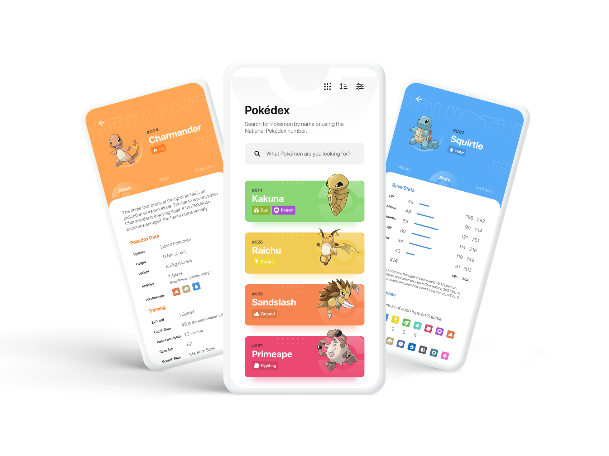

# Pokédex

 

Pokédex is a simple and beautiful way to explore the world of Pokémon. It brings every creature together in one place, so anyone can look up a Pokémon and instantly discover what makes it unique — wherever they are, whether on a phone, in a browser, or on a computer.

## Purpose

The goal of Pokédex is to be the friendliest and most reliable place to discover and learn about Pokémon. Whether you are a lifelong fan, a curious newcomer, or someone who just wants the right detail at the right moment, Pokédex turns a huge universe of information into something easy and enjoyable to explore.

You can browse the full collection at a glance, search by name or number, narrow things down by type or generation, and open any Pokémon to dive into its story — from its description and characteristics to its strengths and how it evolves.

Above all, Pokédex is designed to feel fast, clear, and welcoming, making it effortless for everyone to find and enjoy the Pokémon they care about.
