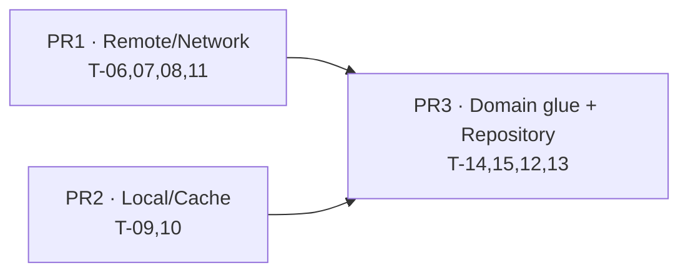
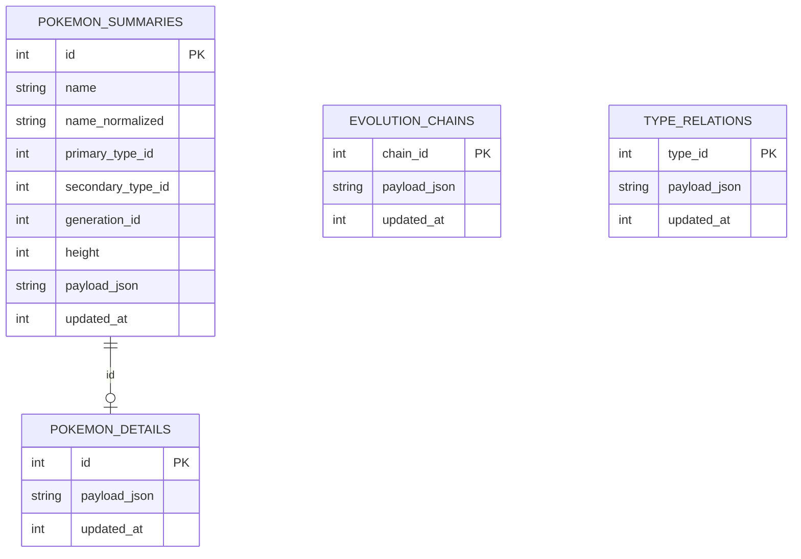

## Layer 1 — Infrastructure & Data (T-06…T-13)

## Overview

This plan delivers the **Data ring** of the Clean Architecture onion: everything that turns the
public PokéAPI plus a local SQLite cache into typed domain entities, behind a single cache-first
`PokemonRepository`. Concretely, backlog tasks **T-06…T-13** — a Dio HTTP client with hand-rolled
interceptors and an `ErrorMapper`, a Retrofit `PokeApiService`, faithful Freezed/`json_serializable`
DTOs, a Remote DataSource, a Drift database + DAOs (Local DataSource), DTO⇄Entity⇄row mappers, and
the `RepositoryImpl` orchestrating **cache-first / stale-while-revalidate** with a TTL.

Because the dependency DAG has one architectural back-edge — the mappers (T-12) consume domain
**entities** (T-14) and the repository impl (T-13) consumes the domain **repository interface**
(T-15) — this epic also writes those two domain _enabler_ contracts up front, exactly as the
backlog's Agile-Master note (L20-22) prescribes. The rest of the domain (use cases T-16, DI/routing
T-17) stays in Camada 2.

The output is a **fully cache-first, offline-resilient, 100%-mapper-tested data layer** with no UI
and no DI wiring yet (those land in T-17/Camada 2). It is delivered in **3 PRs against
`epic/data-layer`**, mirroring the foundation epic's proven 3-PR cadence.

## Problem Statement / Motivation

Every UI feature (list, search, filter, sort, generations, detail) transitively depends on a working
repository that serves typed entities resiliently. Without this layer, the presentation epic would
have nothing to bind to. The two highest-leverage correctness concerns are:

1. **Codegen toolchain stability.** Two _new_ generators land this epic — `retrofit_generator`
   (PR1) and `drift_dev` (PR2). Both ride the `source_gen`/`analyzer` fork that already forced
   `freezed`/`riverpod_generator` onto exact pins (see _Toolchain decisions_, memory
   `analyzer9-toolchain`). A naive add drags the whole codegen set onto `-dev` prereleases.
2. **Mapper + cache correctness.** The DTO→Entity mappers (especially the **RN-10 weakness math**)
   and the cache-first decision machine are the highest bug-risk surfaces (Principle 11). They get
   **100% test coverage** with real PokéAPI fixtures.

## Proposed Solution

### Slice into 3 PRs along the DAG seams

The _Remote_ and _Local_ halves are genuinely independent (one talks to Dio, the other to Drift; no
shared types until the repository). The third slice introduces the domain enablers and converges
remote + local in the repository — the only place the two stacks meet. Each slice =
`feature/data-layer-partN` → `epic/data-layer`, with the 5-agent review committed under
`docs/reviews/` as `docs(review):` (per the established per-slice flow, memory `review-reports-committed`).

| PR      | Tasks                  | Branch               | Why this seam                                                                    |
| ------- | ---------------------- | -------------------- | -------------------------------------------------------------------------------- |
| **PR1** | T-06, T-07, T-08, T-11 | `feature/data-part1` | Remote/Network stack (Dio + Retrofit + DTOs + RemoteDataSource) — self-contained |
| **PR2** | T-09, T-10             | `feature/data-part2` | Local/Cache stack (Drift DB + DAOs) — independent of PR1; parallelizable         |
| **PR3** | T-14, T-15, T-12, T-13 | `feature/data-part3` | Domain enablers + mappers + RepositoryImpl — converges PR1 + PR2                 |

> **Rationale:** PR1 and PR2 share no types and can proceed in parallel; PR3 depends on both.
> Alternatives rejected (per brainstorm): a 2-PR "all infra then glue" split bundles Dio + Drift
> into one oversized review; a 4+-PR granular split multiplies CI runs and per-slice review overhead
> for little gain at this size.



### Resolved dependency pins (locked by plan-time research, 2026-05-25)

The brainstorm's open question "confirm exact resolvable pins via a real dependency resolution" is
answered below from pub.dev dependency metadata. **The executor MUST still run a real `pub get` and
commit the resulting `pubspec.lock`** — these are the evidence-based targets, the lock is the proof.

| Package                | Pin (pubspec)    | PR  | Why                                                                                                                                                     |
| ---------------------- | ---------------- | --- | ------------------------------------------------------------------------------------------------------------------------------------------------------- |
| `dio`                  | `^5.9.0`         | PR1 | Runtime HTTP. Required by retrofit 4.9.x.                                                                                                               |
| `retrofit`             | `^4.9.2`         | PR1 | Runtime annotations.                                                                                                                                    |
| `retrofit_generator`   | `10.2.6` (exact) | PR1 | dev. Accepts `analyzer >=8.4.1 <14`, `source_gen ^4` → **safe on analyzer 9**. Exact per house guardrail (brainstorm); a caret would also be safe here. |
| `drift`                | `2.31.0` (exact) | PR2 | Runtime. Matched to `drift_dev 2.31.0`.                                                                                                                 |
| `drift_dev`            | `2.31.0` (exact) | PR2 | dev. **Load-bearing exact pin** — `2.32.0` jumps to `analyzer ^10`, which would drag freezed/riverpod_generator onto `-dev`.                            |
| `drift_flutter`        | `0.2.8` (exact)  | PR2 | Platform connection helper; transitively pins `sqlite3_flutter_libs ^0.5.24`, `sqlite3 ^2.4.6`.                                                         |
| `sqlite3_flutter_libs` | `^0.5.24`        | PR2 | Native SQLite. **Do NOT use `0.6.0+eol`** — it is an EOL tombstone package, not the 0.5.x line.                                                         |
| `connectivity_plus`    | `^7.1.1`         | PR3 | Proactive offline detection. v7 API returns `List<ConnectivityResult>`.                                                                                 |

> **No `dio_smart_retry`** — retry/backoff/429 are **hand-rolled interceptors** (user decision,
> 2026-05-25): no new dependency, full control, and it showcases engineering for the PRD's
> evaluator personas (Tech Recruiter / Software Engineer).
> **No `intl`** — `#NNN` is `padLeft(3,'0')`, m/kg is `value/10`; locale formatting is a
> presentation concern deferred to the UI epic.

### Target folder structure (created incrementally per slice; YAGNI on scaffolding)

```text
lib/
├── core/
│   ├── error/                              # (exists) result.dart, failure.dart — stays dio/drift-free
│   ├── pokemon/pokemon_type_id.dart        # (exists) shared enum — domain consumes from here, no migration
│   ├── network/                            # PR1
│   │   ├── dio_client.dart                 # Dio factory (base URL, timeouts, interceptors)
│   │   ├── error_mapper.dart               # DioException/FormatException → Failure  (imports dio → NOT in core/error)
│   │   └── interceptors/
│   │       ├── retry_interceptor.dart      # exponential backoff (TE-06/07)
│   │       ├── rate_limit_interceptor.dart # honors 429 Retry-After (TE-08)
│   │       └── logging_interceptor.dart
│   └── database/                           # PR2
│       ├── app_database.dart               # @DriftDatabase, AppDatabase, tables
│       ├── cache_policy.dart               # kPokemonCacheTtl (7d), kStaticDataTtl (type relations)
│       └── connection/
│           ├── connection.dart             # conditional export
│           ├── native.dart                 # NativeDatabase (mobile/desktop)
│           └── web.dart                    # WASM (drift_flutter / WasmDatabase)
└── features/
    └── pokemon/                            # shared cross-feature data + domain (supersedes §3 per-feature data/)
        ├── domain/                         # PR3 — pure Dart, no framework imports
        │   ├── entities/                   # pokemon.dart, pokemon_detail.dart, evolution_chain.dart, …
        │   └── repositories/pokemon_repository.dart   # abstract interface (T-15)
        └── data/                           # PR1 (dtos, remote ds) + PR2 (local ds) + PR3 (mappers, repo impl)
            ├── datasources/
            │   ├── pokemon_remote_data_source.dart    # PR1: wraps PokeApiService
            │   └── pokemon_local_data_source.dart     # PR2: Drift DAO(s)
            ├── dtos/                                   # PR1
            ├── services/poke_api_service.dart          # PR1: Retrofit @RestApi
            ├── mappers/                                 # PR3
            └── repositories/pokemon_repository_impl.dart  # PR3
```

> **Placement decision — `ErrorMapper` in `core/network/`, not `core/error/`:** the mapper imports
> `package:dio`. `core/error/` is a leaf that the **dio-free domain** depends on; putting a
> dio-importing file there would leak the HTTP dependency into the domain's transitive imports.
> `core/network/` is the correct home.

### Architectural reconciliations (brainstorm supersedes Tech Spec — recorded here)

These deltas are deliberate; the plan is the reconciliation record so a reviewer isn't surprised.

| Topic                 | Tech Spec (superseded)                             | This plan (per brainstorm + research)                                                                                                                                                                                                          |
| --------------------- | -------------------------------------------------- | ---------------------------------------------------------------------------------------------------------------------------------------------------------------------------------------------------------------------------------------------- |
| Feature layout        | §3: `data/` split under `pokemon_list`/`_detail`   | One **shared `features/pokemon/`** — a single repository serves both list and detail.                                                                                                                                                          |
| Evolution model       | §8.2: flat `List<EvolutionStage>`                  | Recursive **tree** `EvolutionChain{ EvolutionNode root }` — the API _is_ a tree (Eevee branches).                                                                                                                                              |
| Encounters endpoint   | §7.2: omitted                                      | **Added** `GET /pokemon/{id}/encounters` → `LocationEntry` (Location is a displayed field, RF-34).                                                                                                                                             |
| `generationId`        | implied per-Pokémon fetch                          | Derived from a **local National-Dex id-range constant** (the `/pokemon` list omits generation).                                                                                                                                                |
| Local DataSource type | §8.4: returns domain `PokemonDetail?`              | Returns **Drift row data**; the **repository** owns DTO/row→Entity mapping (centralizes 100%-tested mappers, keeps cache layer domain-free).                                                                                                   |
| Stale-flag signaling  | §6 diagram: "Ok(entity) + flag stale"              | **Deferred to UI epic** (user decision): repo returns plain `Result<T>`; on net-fail-with-cache returns `Ok(staleCache)`; the offline/stale banner is derived later via `connectivity_plus` + the cache stream.                                |
| Repository interface  | §8.3: `filter(...)` / `search(...)`, no sort param | Adds `{SortCriteria sort}` to `filter`/`watchCachedSummaries` so filter+sort compose in one cache query (RN-08); `watchCachedSummaries` returns `Stream<List<Pokemon>>` (no `Result` — a stream of cache state, not a fallible one-shot call). |

---

## PR1 — Remote / Network (T-06, T-07, T-08, T-11) · `feat(network)` / `feat(data)`

### T-06 · Dio client + interceptors + ErrorMapper (`feat(network)`)

**Approach:** a `Dio` factory with base URL + timeouts and three hand-rolled interceptors. The
`ErrorMapper` is a **pure function** (`Failure mapError(Object error)`), trivially unit-testable.

**Files:**

- `lib/core/network/dio_client.dart`: `Dio` with `BaseOptions(baseUrl: 'https://pokeapi.co/api/v2/',
connectTimeout: Duration(seconds: 10), receiveTimeout: Duration(seconds: 15))`; attaches the three
  interceptors below. (Provider wiring `@Riverpod(keepAlive: true)` is **T-17/Camada 2**, not here —
  PR1 ships a plain factory + a free function so it's testable without Riverpod.)
- `lib/core/network/interceptors/retry_interceptor.dart`: retry **only** transient errors
  (`connectionTimeout`, `receiveTimeout`, `sendTimeout`, `connectionError`, 5xx `badResponse`),
  **max 3**, exponential backoff (e.g. 300ms·2ⁿ). Never retry 4xx (except 429, handled below) or parse errors.
- `lib/core/network/interceptors/rate_limit_interceptor.dart`: on 429, honor `Retry-After` header
  (seconds or HTTP-date); back off and retry transparently (TE-08), bounded by the retry cap.
- `lib/core/network/interceptors/logging_interceptor.dart`: request/response logging (`responseBody: false`).
- `lib/core/network/error_mapper.dart`: `Failure mapError(Object e)` covering **all 8**
  `DioExceptionType` values + `FormatException`:

  | Source                                                            | Failure                             | TE       |
  | ----------------------------------------------------------------- | ----------------------------------- | -------- |
  | `connectionError`                                                 | `NetworkFailure`                    | TE-01/02 |
  | `connectionTimeout` / `receiveTimeout` / `sendTimeout`            | `TimeoutFailure`                    | TE-06    |
  | `badResponse` 404                                                 | `NotFoundFailure`                   | TE-03    |
  | `badResponse` 429                                                 | `RateLimitFailure`                  | TE-08    |
  | `badResponse` 5xx                                                 | `ServerFailure`                     | TE-07    |
  | `badResponse` other 4xx / `badCertificate` / `cancel` / `unknown` | `ServerFailure` (generic catch-all) | TE-07    |
  | `FormatException` / deserialization                               | `ParsingFailure`                    | TE-09    |

  > **Catch-all = `ServerFailure`, not `NetworkFailure`.** `cancel` (client-initiated abort),
  > `badCertificate`, `unknown`, and non-404/429 4xx collapse to one generic `ServerFailure` — mapping
  > them to `NetworkFailure` would mislabel them as "you're offline" (TE-01/02). Tests still enumerate
  > **all 8** `DioExceptionType` values explicitly (several asserting the same `ServerFailure`) so
  > coverage is honest and any future remap is a loud test change.

- **Edit `lib/core/error/failure.dart`:** add `implements Exception` to the sealed `Failure` so
  datasources can `throw` a mapped failure idiomatically (satisfies `only_throw_errors`). Additive,
  non-breaking; existing `==`/`hashCode` and tests unaffected.

**Tests** (`test/core/network/`): one test per `DioExceptionType` (and per status code 404/429/500/503)
→ asserts the exact `Failure` subtype; retry interceptor retries transient N times then gives up;
429 honors `Retry-After`; non-transient errors are _not_ retried.

**Acceptance (backlog T-06):**

- [ ] Connect/receive timeouts configured (TE-06).
- [ ] Retry w/ exponential backoff for transient failures (TE-06/07); 4xx (non-429) not retried.
- [ ] 429 respects backoff and does not surface an error to the caller when retry succeeds (TE-08).
- [ ] Each `DioExceptionType` + `FormatException` maps to the correct `Failure` (unit tests).

### T-07 · Retrofit `PokeApiService` (`feat(network)`)

**Approach:** a `@RestApi(baseUrl: 'https://pokeapi.co/api/v2/')` abstract service. Retrofit calls
`.fromJson` on the Freezed return types automatically (default `Parser.JsonSerializable`).

**File:** `lib/features/pokemon/data/services/poke_api_service.dart`

```dart
@RestApi(baseUrl: 'https://pokeapi.co/api/v2/')
abstract class PokeApiService {
  factory PokeApiService(Dio dio, {String? baseUrl}) = _PokeApiService;

  @GET('/pokemon')
  Future<PokemonListResponseDto> getPokemonList(
      @Query('limit') int limit, @Query('offset') int offset);   // RN-14
  @GET('/pokemon/{id}')
  Future<PokemonDto> getPokemon(@Path('id') int id);
  @GET('/pokemon-species/{id}')
  Future<PokemonSpeciesDto> getSpecies(@Path('id') int id);
  @GET('/evolution-chain/{id}')
  Future<EvolutionChainDto> getEvolutionChain(@Path('id') int id);
  @GET('/type/{id}')
  Future<TypeDto> getType(@Path('id') int id);
  @GET('/pokemon/{id}/encounters')
  Future<List<LocationAreaEncounterDto>> getEncounters(@Path('id') int id);  // top-level JSON ARRAY
}
```

> **`/encounters` returns a top-level JSON array** (confirmed live) — the return type is
> `List<LocationAreaEncounterDto>`, not a wrapper object.

**Tests:** codegen produces `_PokeApiService` without errors; a smoke test constructing the service
over a `Dio` with a `DioAdapter`/mock confirms each endpoint hits the expected path + query.

**Acceptance (backlog T-07):** all 6 endpoints implemented; `retrofit_generator` runs clean;
`limit`/`offset` pagination supported (RN-14).

### T-08 · DTOs — Freezed + json_serializable (`feat(data)`)

**Approach:** faithful, full-shape DTOs for every consumed endpoint (brainstorm: "faithful external
contract"). Set `json_serializable` **`field_rename: snake`** globally in `build.yaml` so DTOs stay
clean; use explicit `@JsonKey(name: 'official-artwork')` for the **hyphenated** sprite key (snake
rename won't convert hyphens). All DTOs immutable (Freezed) and tolerant of missing fields (TE-10) —
model optional fields as nullable.

> **`field_rename: snake` is repo-global** (first `build.yaml` in the project). It also applies to the
> **domain entities'** `toJson`/`fromJson` used for the cache `payloadJson` (T-12/T-14). This is
> **safe and intentional**: the cache round-trip is symmetric (the same generated code encodes and
> decodes), so a domain entity emitting snake*case JSON into `payloadJson` is \_not* a leak — reviewers
> should read it as deliberate.

**Files** (`lib/features/pokemon/data/dtos/`):

- `named_api_resource_dto.dart` — `{ String name; String url }` (reused everywhere; `int? idFromUrl`
  helper for parsing trailing-id URLs like `/evolution-chain/67/`).
- `pokemon_list_response_dto.dart` — `{ int count; String? next; String? previous; List<NamedApiResourceDto> results }`.
- `pokemon_dto.dart` — `{ id, name, height, weight, int? baseExperience, List<PokemonTypeSlotDto> types,
List<PokemonStatDto> stats, List<PokemonAbilityDto> abilities, PokemonSpritesDto sprites }`
  - `PokemonTypeSlotDto { int slot; NamedApiResourceDto type }`
  - `PokemonStatDto { int baseStat; int effort; NamedApiResourceDto stat }`
  - `PokemonAbilityDto { NamedApiResourceDto ability; bool isHidden; int slot }`
  - `PokemonSpritesDto { OtherSpritesDto? other }` → `OtherSpritesDto { @JsonKey(name:'official-artwork') OfficialArtworkDto? officialArtwork }` → `OfficialArtworkDto { String? frontDefault }`
- `pokemon_species_dto.dart` — `{ id, name, int genderRate, int captureRate, int baseHappiness,
int hatchCounter, NamedApiResourceDto growthRate, List<NamedApiResourceDto> eggGroups,
NamedApiResourceDto generation, NamedApiResourceDto evolutionChain (the {url}),
List<FlavorTextEntryDto> flavorTextEntries, List<GenusDto> genera }`
  - `FlavorTextEntryDto { String flavorText; NamedApiResourceDto language; NamedApiResourceDto version }`
  - `GenusDto { String genus; NamedApiResourceDto language }`
- `evolution_chain_dto.dart` — `{ int id; ChainLinkDto chain }`
  - `ChainLinkDto { NamedApiResourceDto species; List<EvolutionDetailDto> evolutionDetails;
List<ChainLinkDto> evolvesTo; bool isBaby }` (**recursive**)
  - `EvolutionDetailDto { int? minLevel; NamedApiResourceDto trigger; NamedApiResourceDto? item;
NamedApiResourceDto? heldItem; int? minHappiness; String? timeOfDay; NamedApiResourceDto? location;
NamedApiResourceDto? knownMove; String? gender }` (all evolution triggers nullable — TE-10)
- `type_dto.dart` — `{ int id; String name; DamageRelationsDto damageRelations }`
  - `DamageRelationsDto { List<NamedApiResourceDto> doubleDamageFrom, halfDamageFrom, noDamageFrom,
doubleDamageTo, halfDamageTo, noDamageTo }`
- `location_area_encounter_dto.dart` — `{ NamedApiResourceDto locationArea; List<VersionEncounterDetailDto> versionDetails }`
  - `VersionEncounterDetailDto { NamedApiResourceDto version; int maxChance; List<EncounterDetailDto> encounterDetails }`
  - `EncounterDetailDto { int chance; int minLevel; int maxLevel; NamedApiResourceDto method }`

**Tests** (`test/features/pokemon/data/dtos/`): `fromJson` round-trip against **real PokéAPI fixtures**
in `test/fixtures/` — Bulbasaur (#1, dual-type), Pikachu (#25, single-type), Eevee (#133, branching
evolution); plus `pokemon_species_*`, `evolution_chain_67` (Eevee), `type_*`, `encounters_*`. Include
one fixture with missing optional fields to prove `fromJson` doesn't throw (TE-10). Fixtures loaded
via `File('test/fixtures/x.json').readAsStringSync()` (pure-Dart unit tests).

**Acceptance (backlog T-08):** `fromJson` covers all Annex B fields; DTOs immutable + missing-field
tolerant (TE-10); deserialization tests with real sample payloads.

### T-11 · Remote DataSource (`feat(data)`)

**Approach:** `PokemonRemoteDataSource` (abstract + impl) wraps `PokeApiService`. Each method
`try`s the service call and on `DioException`/`FormatException` **throws the mapped `Failure`** (via
`mapError`). The domain never sees a `DioException`.

**File:** `lib/features/pokemon/data/datasources/pokemon_remote_data_source.dart`

```dart
abstract interface class PokemonRemoteDataSource {
  Future<PokemonListResponseDto> fetchPage({required int limit, required int offset});
  Future<PokemonDto> fetchPokemon(int id);
  Future<PokemonSpeciesDto> fetchSpecies(int id);
  Future<EvolutionChainDto> fetchEvolutionChain(int id);
  Future<TypeDto> fetchType(int id);
  Future<List<LocationAreaEncounterDto>> fetchEncounters(int id);
}
// impl: try { return await _service.x(); } on DioException catch (e) { throw mapError(e); }
//                                          on FormatException catch (e) { throw mapError(e); }
```

**Tests:** mock `PokeApiService` (mocktail) — each method returns the DTO on success and **throws the
correct `Failure`** when the service throws a `DioException` of each type.

**Acceptance (backlog T-11):** methods for page/detail/species/evolution/type/encounters; errors
converted via `ErrorMapper` (T-06); tests with a mocked `PokeApiService`.

**PR1 housekeeping:** run `dart run build_runner build` (retrofit + freezed + json codegen); commit
the resolved `pubspec.lock`; `dart format`; `dart analyze --fatal-infos --fatal-warnings` (local) — CI
runs `flutter analyze`.

---

## PR2 — Local / Cache (T-09, T-10) · `feat(cache)`

### T-09 · Drift database, platform connections, cache tables

**Approach:** standard (monolithic) Drift generation with `part 'app_database.g.dart'` (emits
`*.g.dart`, already git-ignored). Four cache tables, each with `updatedAt` (epoch ms) for TTL. The
**`name_normalized` column** on `PokemonSummaries` resolves the RN-07 open question SQL-natively.

**Files:**

- `lib/core/database/app_database.dart` — `@DriftDatabase(tables: [...], daos: [PokemonDao])`,
  `schemaVersion = 1`, versioned initial migration. Tables:

  ```dart
  class PokemonSummaries extends Table {
    IntColumn get id => integer()();                      // National Dex id (PK, NOT autoincrement)
    TextColumn get name => text()();
    TextColumn get nameNormalized => text()();            // lowercase + diacritics-stripped (RN-07)
    IntColumn get primaryTypeId => integer()();
    IntColumn get secondaryTypeId => integer().nullable()();
    IntColumn get generationId => integer()();
    IntColumn get height => integer()();
    IntColumn get weaknessMask => integer().withDefault(const Constant(0))(); // RF-15 (18-bit, set in PR3)
    TextColumn get payloadJson => text()();               // serialized Pokemon entity (opaque to PR2)
    IntColumn get updatedAt => integer()();               // epoch ms (TTL — RN-16)
    @override Set<Column> get primaryKey => {id};
  }
  // PokemonDetails { id PK, payloadJson, updatedAt }
  // EvolutionChains { chainId PK, payloadJson, updatedAt }
  // TypeRelations  { typeId PK, payloadJson, updatedAt }   // 18 static rows, long TTL
  ```

> **`payloadJson` is opaque TEXT in PR2.** The DAO never parses it — the content (a serialized
> `Pokemon`/`PokemonDetail` entity) is defined by the PR3 cache mappers (T-12), which don't exist yet.
> PR2 DAO tests use placeholder JSON; no cross-PR ordering problem. **`weaknessMask`** is likewise
> written by PR3 (computed from the cached `TypeRelations`); PR2 leaves it at its `0` default.

- `lib/core/database/cache_policy.dart` — `const kPokemonCacheTtl = Duration(days: 7);` (RN-16) and
  `const kStaticDataTtl = Duration(days: 365);` (TypeRelations are static — must NOT expire on the
  7-day clock). Single named constants (Principle 10).
- `lib/core/database/connection/native.dart` — `NativeDatabase` (mobile/desktop).
- `lib/core/database/connection/web.dart` — WASM via `drift_flutter`'s `driftDatabase(name:, web:
DriftWebOptions(sqlite3Wasm:, driftWorker:))`; degrade path to in-memory when no
  IndexedDB/OPFS (inspect chosen implementation; fall back to `WasmStorageImplementation.inMemory`).
- `lib/core/database/connection/connection.dart` — conditional export (native vs web).
- **Web assets** in `web/`: commit `sqlite3.wasm` + the drift web worker, **version-matched to the
  installed drift (2.31.0)** per `pubspec.lock`. **⚠ Verify the worker filename against the drift
  2.31.0 GitHub release** — sources disagree (`drift_worker.dart.js` per current docs vs
  `drift_worker.js` per project memory `analyzer9-toolchain`); use whatever the 2.31.0 release ships.
- **`.gitignore` + `analysis_options.yaml`:** add `*.drift.dart` to both (keep them 1:1, per memory
  invariant), even though `part`-mode emits `*.g.dart` — defensive against modular output. Confirm
  `web/sqlite3.wasm` and the worker are **not** ignored (they are committed assets).

**Acceptance (backlog T-09):** 4 tables with `updatedAt` (TTL — RN-16); connection works on
mobile/desktop **and** Web (WASM) — validated on a real web target; versioned initial migration.

### T-10 · Local DataSource (DAOs)

**Approach:** a `PokemonDao` (`@DriftAccessor`) exposing upsert/read, the search/filter/sort query,
and a reactive `watchSummaries` stream. The DAO returns **Drift row data** (e.g.
`PokemonSummary`); the repository (PR3) maps rows→entities.

**File:** `lib/features/pokemon/data/datasources/pokemon_local_data_source.dart`
(abstract interface) + the Drift `PokemonDao` it delegates to.

- **Upserts:** `upsertSummaries(List<...>)`, `upsertDetail`, `upsertEvolutionChain`, `upsertTypeRelation`
  (all `insertOnConflictUpdate`).
- **Reads:** `readSummary(id)`, `readDetail(id)`, `readEvolutionChain(chainId)`, `readTypeRelation(typeId)`
  — return nullable rows (cache miss = `null`).
- **Query (RN-06/07/08, RF-14…RF-24):** `querySummaries({String? query, PokemonFilter? filter,
int? generationId, required SortCriteria sort})`:
  - **Search disambiguation:** if `query` trimmed is all-digits (`^\d+$`) → numeric branch: strip
    leading zeros, match `id` (RN-06, so `1`/`01`/`001` all find `#001`). Else name branch: normalize
    the query (lowercase + diacritics-strip) and `nameNormalized LIKE '%' || :q || '%'` (RN-07,
    case/accent-insensitive, partial).
  - **Filter (all SQL):** `primaryTypeId`/`secondaryTypeId` ∈ `filter.types` (RF-14); `generationId ==
:gen`; height bucket (Short/Medium/Tall thresholds, RF-16). Combined = intersection (RN-08).
  - **Weakness filter (RF-15, SHOULD) is SQL-native via a precomputed mask:** the DAO filters
    `weaknessMask & :queryMask != 0`. `weaknessMask` is computed by the **repository** at summary
    upsert from the Pokémon's type ids + the **fetched `/type` damage relations** (the `TypeRelations`
    cache — _not_ a hardcoded chart; RN-01 makes the API the source of truth). The 18 static type
    relations are pre-warmed once (see T-13), so the mask is always computable. This keeps weakness
    filtering SQL-native (RN-08) with no per-row type fetch.
  - **Sort:** `numberAsc`/`numberDesc` → `id`; `nameAsc`/`nameDesc` → `name` (RF-20…RF-23).
  - **Zero results → empty list, never a Failure** (TE-04/05 are UI empty states).
- **Reactive:** `Stream<List<PokemonSummary>> watchSummaries({filter/sort args})` via `.watch()`.

**Tests** (`test/features/pokemon/data/datasources/`): in-memory DB
(`AppDatabase(DatabaseConnection(NativeDatabase.memory(), closeStreamsSynchronously: true))`),
closed in `tearDown`. Cover: upsert→read round-trip; search by name (case/accent/partial) and by
number (with/without leading zeros); each filter + combined intersection (incl. zero-result → empty);
all 4 sorts; `watchSummaries` emits on insert/update (`expectLater(..., emitsInOrder([...]))`).

**Acceptance (backlog T-10):** name (case/accent/partial) + number (leading-zeros) search (RN-06/07);
type/height filter + 4 sorts over cache (RF-14…RF-24); reactive summaries stream; in-memory DB tests.

**PR2 housekeeping:** `build_runner` (drift codegen); commit `pubspec.lock` delta; format/analyze.

---

## PR3 — Domain glue + Repository (T-14, T-15, T-12, T-13) · `feat(domain)` / `feat(data)`

### T-14 · Domain entities (Freezed, pure Dart)

**Files** (`lib/features/pokemon/domain/entities/`) — **no** framework/infra imports (Principle 8);
only `freezed_annotation` + `core/pokemon/pokemon_type_id.dart` + `core/error`:

- `pokemon.dart` — `{ int id; String name; List<PokemonTypeId> types; String imageUrl; int generationId }` (RF-01).
- `pokemon_detail.dart` — `{ Pokemon summary; String description; String genus; double heightMeters;
double weightKg; List<Ability> abilities; List<PokemonTypeId> weaknesses; Training training;
Breeding breeding; List<LocationEntry> locations; StatSet baseStats;
Map<PokemonTypeId,double> typeDefenses }`.
- `ability.dart` — `{ String name; bool isHidden }`.
- `training.dart` — `{ String evYield; int catchRate; int baseFriendship; int? baseExp; String growthRate }`.
- `breeding.dart` — `{ Gender gender; List<String> eggGroups; int eggCycles }`; `Gender { bool isGenderless;
double? femalePercent; double? malePercent }` (RN-11).
- `stat_set.dart` — `StatValue { int base; int min; int max }`; `StatSet { StatValue hp, attack, defense,
specialAttack, specialDefense, speed; int get total }` (RF-35…37, Min/Max RN-12).
- `evolution_chain.dart` — `EvolutionChain { EvolutionNode root }`; `EvolutionNode { EvolutionStage stage;
List<EvolutionNode> evolvesTo }`; `EvolutionStage { int id; String name; String imageUrl; String? condition }` (RN-13).
- `location_entry.dart` — `{ String area; List<String> versions }` (RF-34).
- `pokemon_page.dart` — `{ List<Pokemon> items; bool hasMore }`.
- `pokemon_filter.dart` — `{ Set<PokemonTypeId> types; Set<PokemonTypeId> weaknesses; HeightCategory? height }`;
  `enum HeightCategory { short, medium, tall }`.
- `sort_criteria.dart` — `enum SortCriteria { numberAsc, numberDesc, nameAsc, nameDesc }`.

> **`PokemonTypeId`** is **reused from `core/pokemon/`** (foundation) — no migration (the foundation
> plan deliberately placed it in `core/` so domain could consume it without a presentation back-edge).

**Acceptance (backlog T-14):** immutable entities covering all displayed fields (RF-29…43); no
framework imports; vocabulary aligned to Annex B.

### T-15 · Repository interface

**File:** `lib/features/pokemon/domain/repositories/pokemon_repository.dart`

```dart
abstract interface class PokemonRepository {
  Future<Result<PokemonPage>>   getPokemonList({required int limit, required int offset});
  Future<Result<PokemonDetail>> getPokemonDetail(int id);
  Future<Result<EvolutionChain>> getEvolutionChain(int id);
  Future<Result<List<Pokemon>>> search(String query);
  Future<Result<List<Pokemon>>> filter(PokemonFilter filter, {SortCriteria sort});
  Stream<List<Pokemon>>         watchCachedSummaries({PokemonFilter? filter, SortCriteria sort});
}
```

> **`getEvolutionChain` has a named consumer** — `GetEvolutionChain` (T-16) + the Evolution tab
> (T-26, RF-40-43); it's part of the documented §8.3 contract, not speculative. `getPokemonDetail`
> also composes evolution internally; both share the one evolution mapper.

**Acceptance (backlog T-15):** paginated list/detail/evolution/search/filter return `Result<T>`;
reactive summaries stream declared; no concrete-impl dependency (DIP).

### T-12 · Mappers (DTO→Entity, Entity↔cache row) — **100% coverage**

**Approach:** **pure top-level functions** (VGV convention, easiest to test), grouped by concept.
These are the highest bug-risk surfaces — **100% line coverage required** (Principle 11).

**Files** (`lib/features/pokemon/data/mappers/`): `pokemon_mapper.dart`, `pokemon_detail_mapper.dart`,
`evolution_mapper.dart`, `type_effectiveness.dart`, `cache_mapper.dart` (entity↔row), plus a
`generation_ranges.dart` constant. Business rules to encode:

- **Number `#NNN` (RN-03):** presentation-only (`id.toString().padLeft(3,'0')`) — UI epic; the entity
  stores the raw `int id`.
- **Type order (RN-05):** `types` sorted by `slot` (primary first); primary drives card/header color (RN-04, UI).
- **`generationId` (RN-15) — `generation_ranges.dart`:** map National-Dex id → generation via ranges:
  I 1–151, II 152–251, III 252–386, IV 387–493, V 494–649, VI 650–721, VII 722–809, VIII 810–905,
  IX 906–1025. **Out-of-range ids (forms ≥ 10000) → `kUnknownGenerationId` (named `const`, value 0)** —
  graceful (TE-10), no magic number (Principle 10); such ids never appear in the Gen-I MVP list anyway.
- **Gender (RN-11):** `gender_rate == -1` → `isGenderless: true`; else `femalePercent = genderRate/8*100`,
  `malePercent = 100 - female`.
- **Min/Max @ level 100 (RN-12)** — canonical Gen-III+ formulas:
  - HP: `min = 2·base + 110`, `max = 2·base + 204`.
  - Other: `min = ((2·base + 5) · 0.9).floor()`, `max = ((2·base + 99) · 1.1).floor()`.
  - (min = 0 IV/EV + hindering nature ×0.9; max = 31 IV + 252 EV + beneficial nature ×1.1.)
- **Weaknesses + Type Defenses (RN-10) — `type_effectiveness.dart` (highest risk):** for each of the
  18 attacking types, `multiplier = Π over the defender's types of factor(attacker → defType)`, where
  `factor = 2` if attacker ∈ `defType.double_damage_from`, `0.5` if ∈ `half_damage_from`, `0` if ∈
  `no_damage_from`, else `1`. Dual-type ⇒ values ∈ {0, 0.25, 0.5, 1, 2, 4}. **Weaknesses** = attacking
  types with `multiplier ≥ 2`. **`typeDefenses`** map = all 18 (or all `≠ 1`) multipliers (RF-39).
  Input = the 1–2 `TypeDto.damageRelations` for the Pokémon's own types. Also exposes
  `weaknessMask(typeIds, relations) → int` (18-bit; one bit per attacking type with `multiplier ≥ 2`)
  — the same computation, reused by the repository to populate `PokemonSummaries.weaknessMask` (RF-15).
- **Evolution tree (RN-13):** recurse `ChainLinkDto` → `EvolutionNode`; derive each `condition` string
  from `evolutionDetails[0]` (level / item / trade / happiness / time — first non-null wins, else `null`).
  Handle: single-node (no evolution), branching (`evolvesTo.length > 1`, e.g. Eevee), baby stages.
- **Location (RF-34):** `LocationAreaEncounterDto[]` → `List<LocationEntry>` = `{ area:
locationArea.name, versions: distinct versionDetails[].version.name }`.
- **Description/genus:** pick English `flavor_text_entries`/`genera`; sanitize `\f`/`\n`/soft-hyphen → space.
- **Cache mappers:** `Pokemon` → `PokemonSummariesCompanion` (incl. `nameNormalized`, primary/secondary
  type ids, generationId) and row → `Pokemon`/`PokemonDetail` via `payloadJson` (jsonEncode/Decode of
  the entity's `toJson`).

**Tests** (`test/features/pokemon/data/mappers/`): one group per mapper, fixture-driven, **assert
every field individually**. Dedicated cases: Bulbasaur (dual-type weakness math: Grass/Poison →
4× Psychic), a 0× immunity (e.g. Ground immune to Electric), Eevee (branching tree), a no-evolution
Pokémon, genderless (gender_rate −1), and an out-of-range form id → gen 0. **Coverage = 100%.**

**Acceptance (backlog T-12):** `#NNN`/type-color rules; gender + Min/Max; weaknesses/type-defenses
combine both types; **mapper coverage = 100%**.

### T-13 · RepositoryImpl — cache-first / stale-while-revalidate

**File:** `lib/features/pokemon/data/repositories/pokemon_repository_impl.dart`. Constructor injects
`PokemonRemoteDataSource`, `PokemonLocalDataSource`, `Connectivity` (connectivity_plus), and a
`clock`/`now` function (injectable for TTL tests). Returns `Result<T>`; **inline SWR per method**
(no generic helper — rule of three).

**`getPokemonDetail(id)` decision machine** (composes 5 endpoints; see edge-case rules below):

```
read cached detail row
 ├─ row present & parseable & fresh (now-updatedAt ≤ kPokemonCacheTtl)
 │     → return Ok(cached);  if online: unawaited(_revalidateDetail(id))   // background, swallow errors
 ├─ row present & parseable & stale
 │     → try network compose:
 │          success → upsert + return Ok(fresh)
 │          failure → return Ok(staleCached)                                // TE-02 (stale; flag deferred to UI epic)
 ├─ row present but UNPARSEABLE (corrupt)
 │     → online: treat as miss (fall through to network);  offline: return Err(CacheFailure)  // TE-01
 └─ no row (cold miss)
       → online: compose → upsert (if complete) → Ok ; network failure → Err(mappedFailure)   // TE-01/03/06/07
       → offline: Err(NetworkFailure)                                                          // TE-01
```

**5-endpoint composition (`/pokemon` + `/pokemon-species` + `/evolution-chain` + `/type×N` +
`/encounters`) — collect-and-degrade, NOT `Future.wait` fail-fast:**

- **`/pokemon` is mandatory** — its failure fails the whole call (→ `Err`, unless valid cache exists).
- **Others are degradable (TE-10):** on individual failure, that section is empty/placeholder
  (`description ''`, `locations []`, `weaknesses []`, single-node evolution, empty `typeDefenses`).
- **`/type` reads from the `TypeRelations` cache first** (18 static rows, `kStaticDataTtl`); only fetch
  - upsert on miss. Reused across all Pokémon (a clear earned keep).
- **Cache the composed detail only when complete** (all 5 succeeded). If degraded, return it to the
  caller but **skip the upsert** so the next open retries the failed parts (avoids freezing a partial
  detail for 7 days).

**`getPokemonList` / pagination (RN-14) — N+1 composition:** the `/pokemon?limit&offset` list returns
only `{name, url}`, so the card data (types RF-01/02, height, generationId) is **not** in the page
response. The repository therefore: (1) fetches the page and extracts ids from the result urls;
(2) for each id, fetches `/pokemon/{id}` (bounded-parallel) to build a `Pokemon` summary; (3) computes
`weaknessMask` from the pre-warmed `TypeRelations`; (4) upserts each `PokemonSummaries` row.
**Pre-warm:** on the first list/filter, fetch the 18 `/type` relations once (`kStaticDataTtl`) so
`weaknessMask` is computable. `hasMore = response.next != null`. Cache-first: `watchCachedSummaries`
serves cached cards instantly while the page revalidates. Offset-past-end → empty `results` +
`next == null` → `Ok(PokemonPage([], hasMore: false))` (not an error). Offline → `Err(NetworkFailure)`;
cached summaries remain visible (TE-02). This per-id fan-out is the well-known PokéAPI N+1 — accepted
for MVP (each summary cached after first load).

**`search`/`filter`/`watchCachedSummaries`:** delegate to the local DAO (offline-capable, RN-08);
map rows→entities. `watchCachedSummaries` maps the DAO stream.

**Background revalidation:** `unawaited(...)` with an internal `try/catch` that **swallows + logs**
(the caller already has data; staleness surfacing is the UI epic's job). Skip it when
`connectivity` reports offline (avoid pointless DioExceptions).

**Tests** (`test/features/pokemon/data/repositories/`): **fake** datasources + a **fake Connectivity**
(`StreamController<List<ConnectivityResult>>`) + injected `now`. Cover **every branch**: fresh hit
(asserts background revalidate fired via a call counter); stale + net success; stale + net failure →
`Ok(stale)`; corrupt cache online → miss/network; corrupt cache offline → `Err(CacheFailure)`; cold
miss + success; cold miss + each network failure → correct `Err`; **partial composition** (species
fails → degraded `PokemonDetail`, not cached); `/type` cache reuse (second call doesn't refetch);
pagination `hasMore` true/false + offset-past-end empty; offline list → `Err` but stream still emits
cache. **No datasource exception escapes as a raw throw** — every path resolves to `Ok`/`Err` (the
repository catches `on Failure`). **Cache-policy branch coverage = 100%.**

**Acceptance (backlog T-13):** valid cache served first + background revalidation (RN-02); offline +
cache → stale served (TE-02), offline + no cache → `Failure` (TE-01); TTL expiry revalidates without
blocking (RN-16); **all decision branches tested** (hit/miss/stale/error + corrupt + partial).

**PR3 housekeeping:** `build_runner` (freezed for entities/DTOs); commit `pubspec.lock`
(connectivity_plus); format/analyze; verify the dependency-rule (no `dio`/`drift`/`retrofit` import
under `domain/`).

---

## Cache schema (ERD)



## Technical Considerations

- **Codegen order/CI:** generated code is git-ignored; CI must run `build_runner` **before**
  analyze/test (already true from foundation). Adding drift codegen in PR2 is the first time
  `build_runner` produces non-trivial output (PR1 adds retrofit + DTO output).
- **`drift_dev` exact pin is load-bearing** — `^2.31.0` would silently float to `2.32.0`
  (`analyzer ^10`) on a re-resolve and drag the codegen set onto `-dev`. Exact `2.31.0` makes any
  future fork a loud version-solve error.
- **Dependency rule enforcement:** `domain/` may import only `dart:core`, `freezed_annotation`,
  `core/error`, `core/pokemon`. A grep/test guard (or review) confirms no `dio`/`drift`/`retrofit`
  leak into `domain/`. `ErrorMapper` lives in `core/network/` precisely to keep `core/error/` dio-free.
- **Performance:** search/filter/sort run as SQL over `PokemonSummaries` for instant offline response
  (RN-08); `TypeRelations` caches the 18 static damage charts once, reused across every detail.
- **Security:** none in scope — public read-only API, no secrets, no PII (RNF-09).

## Edge cases & flow completeness (from flow-analysis)

- **Corrupt cache row** (unparseable `payload_json`) → treat as miss online; `CacheFailure` offline.
- **Partial 5-endpoint detail** → mandatory `/pokemon` vs degradable rest; collect-and-degrade; cache
  only when complete.
- **Background revalidation failure** → swallowed + logged; served cache untouched.
- **Pagination** → `hasMore = next != null`; offset-past-end = empty page, not error.
- **Search disambiguation** → all-digits → id (leading-zeros stripped); else normalized-name LIKE.
- **Combined filters zero result** → empty list (TE-04/05 are UI states), never `Failure`.
- **Evolution edges** → no-evolution (single node), branching (Eevee), baby stages, null conditions.
- **TTL** → 7-day for Pokémon data, separate long TTL for static `TypeRelations`; clock-skew /
  device-time-change accepted as a known risk (epoch `updatedAt` is best-effort).
- **Connectivity ≠ reachability** → captive-portal/connected-but-no-internet still surfaces a network
  `Failure` from the actual request; auto-revalidate-on-reconnect orchestration is the UI epic's job.
- **Web WASM degrade-to-in-memory** → on a browser without IndexedDB/OPFS (e.g. private mode), the
  cache is in-memory only ⇒ TE-01 applies on cold offline web. **Accepted.**

## Acceptance Criteria (phase-level rollup)

- [ ] **PR1 merged:** Dio client + 3 interceptors + `ErrorMapper` (all `DioExceptionType` mapped);
      Retrofit service (6 endpoints) generates clean; faithful DTOs with real-fixture round-trip
      tests; `PokemonRemoteDataSource` throws mapped `Failure`s; `pubspec.lock` committed.
- [ ] **PR2 merged:** Drift `AppDatabase` (4 tables, TTL columns, `name_normalized`); native + WASM
      connections validated on a real web target; `PokemonDao` search/filter/sort + reactive stream;
      in-memory DB tests; `*.drift.dart` added to ignore/analysis globs.
- [ ] **PR3 merged:** domain entities (pure Dart) + `PokemonRepository` interface; mappers with the
      RN-10/11/12/13/15 rules at **100% coverage**; `RepositoryImpl` cache-first/SWR with **all
      decision branches tested** (incl. corrupt + partial); `connectivity_plus` wired.
- [ ] All 3 PRs green in CI before merge into `epic/data-layer`; epic PR targets `develop` (memory `git-flow`).

## Success Metrics

- Mappers + cache policy at 100% coverage; data/domain ≥ 80% overall (Tech Spec §13, Principle 11).
- Codegen set stays on **stable** (`pubspec.lock` shows no `-dev` except the unavoidable
  `riverpod_analyzer_utils 1.0.0-dev.9`); `drift_dev 2.31.0`, `analyzer 9.x`.
- Zero analyzer warnings/infos; `dart format` clean.
- A cold offline open (after one online warm-up) serves cached list + detail without a blank screen.

## Dependencies & Risks

- **DAG:** PR1 ∥ PR2 → PR3. T-12 needs T-08+T-14; T-13 needs T-10+T-11+T-12+T-15.
- **Risk — drift web worker filename ambiguity** → verify against the drift 2.31.0 release asset (PR2
  open question); degrade-to-in-memory path is the safety net.
- **Risk — `drift_dev` re-resolve to 2.32** → exact pin + committed lock + the analyzer-fork note.
- **Risk — weakness math (RN-10)** → highest bug risk; pinned algorithm + dedicated dual-type/immunity
  fixtures at 100% coverage.
- **Risk — PokéAPI shape drift / partial data** → faithful nullable DTOs + TE-10 degrade path + the
  missing-field fixture test.

## Local workflow reminders (execution)

- **Hook-blocked:** `flutter test` → use the very_good MCP test tool (pass/fail only; bisect to
  localize). `flutter create`/platform-add → user `!` bang (not needed this epic).
- **Run freely:** `flutter pub get`, `dart run build_runner build` (no `--delete-conflicting-outputs`
  — removed in build_runner 2.4), `dart format`, `dart analyze --fatal-infos --fatal-warnings`
  (local; `flutter analyze` crashes on this host — CI's `flutter analyze` is source of truth).
- **Per slice:** run the full local suite before the PR; commit the 5-agent review under
  `docs/reviews/` as `docs(review):` (memory `review-reports-committed`).

## References & Research

- **Source brainstorm:** `docs/brainstorm/2026-05-25-data-layer-brainstorm-doc.md`
- **Backlog:** `docs/project/04-backlog.md` — T-06 (L155), T-07 (L165), T-08 (L174), T-09 (L183),
  T-10 (L192), T-11 (L202), T-12 (L211), T-13 (L221), T-14 (L235), T-15 (L244); DAG (L36-77).
- **Tech Spec:** `docs/project/02-tech-spec.md` — cache §6 (L226-327), network §7 (L330-406),
  contracts §8 (L409-510), state §5.1 (L168-180), tests §13 (L699-715), deps §15 (L734-745).
- **PRD:** `docs/project/01-prd.md` — RF (L135-230), RN (L233-256), TE (L356-372), endpoints §10.1
  (L483-492), Annex B field mapping (L600-625).
- **Institutional learnings (memory):** analyzer-9/stable-codegen fork + `flutter analyze` host crash
  - build_runner 2.4 + drift-web notes (`analyzer9-toolchain`); GitFlow epic→develop, CI gates
    `epic/**` (`git-flow`); faithful-external/lean-internal modeling (`abstraction-vs-fidelity`);
    YAGNI scaffolding + latest-stable-majors (`flutter-deps-scaffolding`); hook-blocked test + MCP tool
    (`vgv-cli-hooks`); review reports committed per slice (`review-reports-committed`).
- **Plan-time research (2026-05-25):** exact pins from pub.dev metadata (drift_dev 2.31 vs 2.32
  analyzer fork; retrofit_generator 10.2.6 safe; connectivity_plus 7 `List<ConnectivityResult>`);
  current Retrofit/Dio/Drift-WASM APIs; PokéAPI shapes (encounters = top-level array; evolution =
  recursive tree). VGV best practices: pure-function mappers, fakes-not-mocks for the repository,
  `test/fixtures/`, `@Riverpod(keepAlive:true)` for infra singletons (applied in T-17).
- **/plan decisions (this doc):** retry/429 = hand-rolled interceptors (no `dio_smart_retry`);
  stale-flag deferred to UI epic (plain `Result<T>`, `Ok(staleCache)` on net-fail-with-cache);
  `ErrorMapper` in `core/network/`; `name_normalized` column for RN-07; `generationId` from id-range
  constant with gen-0 fallback; local DataSource returns rows (repo owns mapping).

### Technical-review findings incorporated (2026-05-25)

Three review agents ran on this plan. **Plan-splitting: no split** — the 3-PR slicing sits on the two
cleanest DAG seams (remote∥local independence, then convergence). PR3 is largest (18 pts) but its
mappers (T-12) and `RepositoryImpl` (T-13) are the tightest-coupled pieces in the plan — a reviewer
can't verify mapper outputs without seeing how the repository consumes them, so splitting there would
trade correctness-reviewability for a smaller diff. PR1's DTOs + client are mutually validating
(the DTOs are the ground truth the service contract is checked against). **No blockers** from the VGV
or simplicity reviews. Applied fixes:

- **Weakness-filter mechanics pinned** (was the critical gap): SQL-native `weaknessMask & :mask != 0`;
  the mask is computed in PR3 from the **fetched `TypeRelations`** (RN-01, not a hardcoded chart) and
  stored on `PokemonSummaries`; the 18 type relations are pre-warmed once in `getPokemonList`.
- **`getPokemonList` N+1 composition spelled out** — the list endpoint lacks types/height, so the
  repository fans out `/pokemon/{id}` per page item to build summaries (resolves the `payloadJson`
  cross-PR timing question: PR2 treats `payloadJson`/`weaknessMask` as opaque; PR3 defines content).
- **ErrorMapper catch-all fixed** — `cancel`/`badCertificate`/`unknown`/other-4xx → generic
  `ServerFailure` (not `NetworkFailure`, which would mislabel them "offline"); tests still enumerate
  all 8 `DioExceptionType` values for honest coverage.
- **`field_rename: snake` scope clarified** — it intentionally applies to domain-entity cache JSON
  (symmetric round-trip, not a leak).
- **Repository-interface deviations from §8.3 documented** in the reconciliation table (sort param;
  `watchCachedSummaries` returns a plain `Stream`).
- **`kUnknownGenerationId` named constant** replaces the magic `0` (Principle 10).
- **"No raw datasource throw escapes the repository"** added as an explicit T-13 test guarantee.
- **`getEvolutionChain` named consumer** (T-16/T-26) recorded, so it doesn't read as YAGNI.
- **Kept (with rationale):** the `PokemonRemoteDataSource` interface (DIP + enables the repository's
  fake-based tests; matches Tech Spec §8.4) over inlining; fetching/caching `/type` over a hardcoded
  chart (RN-01 — the API is the source of truth).
