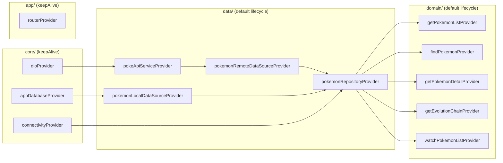

## Layer 2 — Domain (T-15 revision + T-16 + T-17)

## Overview

This plan delivers the **Domain ring** of the Clean Architecture onion: the intent vocabulary the
Presentation epic (T-19+) will consume, plus the composition root that wires the whole app graph
together for the first time. Concretely, the remaining backlog scope:

- **T-16 Use Cases** — five class-per-intent units with `call(...)`, pass-through over the
  repository (no business logic added beyond what the repo already enforces).
- **T-17 DI + Routing** — full `@riverpod` provider graph (Dio → datasources → repo → use cases →
  router) and a `go_router` config with the two MVP routes (`/` and `/pokemon/:id`) behind minimal
  `Scaffold` placeholders that the UI epic replaces.

The epic also ships a **small, retroactive revision to T-15** along one axis of the repo's read
surface: `search(query)` + `filter(filter, sort:)` collapse into a single
`findPokemon({query, filter, sort})` riding the DAO's already-combined query
(`PokemonLocalDataSource.querySummaries`). `getPokemonList` and `watchCachedSummaries` stay
untouched — each owns a distinct intent the unified `findPokemon` doesn't subsume.

The output is a **booting, end-to-end-wired app** with no real UI yet, ~6 story points, delivered
as **a single PR** `feature/domain` → `epic/domain-layer`.

## Problem Statement / Motivation

The presentation epic cannot start until the domain layer is in place: ViewModels need
constructor-injectable use cases, and `MaterialApp.router` needs a routing graph. Without this PR,
T-19/T-20 have nothing to bind to.

Two correctness concerns drive the shape:

1. **Composition root correctness.** This is the first PR that wires `Dio`, `AppDatabase`, and
   `Connectivity` into a real `ProviderScope`. A missing `keepAlive: true` on a resource-holding
   provider would silently leak sockets / DB handles on every rebuild; a missing dispose on the
   router would reset navigation history. Both are easy to get wrong and hard to detect from unit
   tests alone — hence the boot widget test.
2. **Interface stability.** `PokemonRepository` is consumed by **only one caller today** (its own
   impl). The T-15 revision is therefore free to ship now and would become expensive the moment
   the UI epic starts importing the search/filter methods. Bundling it with the use cases (which
   _would_ be the new callers) lets one PR collapse the cost.

## Proposed Solution

### Ship as a single PR (no DAG seams to split along)

At ~6 story points, this work has no natural seam separating "pure-Dart use cases" from "Flutter
provider graph + router" that justifies double the CI runs and review overhead. The PR shape
mirrors the data-layer's **PR3 "convergence"** — own contracts + composition root in one slice —
at a smaller size.

| PR      | Tasks                       | Branch           | Why one slice                                                                                          |
| ------- | --------------------------- | ---------------- | ------------------------------------------------------------------------------------------------------ |
| **PR1** | T-15 (revision), T-16, T-17 | `feature/domain` | Use cases without DI = dead code until DI lands; DI without use cases ships an empty graph. One slice. |

> **Alternatives rejected (per brainstorm):** a 2-PR split (use cases then DI/router) ships dead
> code; a 3-PR split (use cases, providers, router) over-fragments a 6-pt epic. The data-layer was
> 36 pts and warranted 3 PRs — this is not that.

### Five use cases, one per intent

| Use case            | Signature                                                                                                | Repo method called     | UC/RF backlog reference        |
| ------------------- | -------------------------------------------------------------------------------------------------------- | ---------------------- | ------------------------------ |
| `GetPokemonList`    | `Future<Result<PokemonPage>> call({required int limit, required int offset})`                            | `getPokemonList`       | UC-01, RF-03 (scroll-infinito) |
| `FindPokemon`       | `Future<Result<List<Pokemon>>> call({String? query, PokemonFilter? filter, required SortCriteria sort})` | `findPokemon` _(new)_  | UC-02…UC-05, RN-06/07/08       |
| `GetPokemonDetail`  | `Future<Result<PokemonDetail>> call(int id)`                                                             | `getPokemonDetail`     | UC-06                          |
| `GetEvolutionChain` | `Future<Result<EvolutionChain>> call(int id)`                                                            | `getEvolutionChain`    | UC-07 (detail evolutions)      |
| `WatchPokemonList`  | `Stream<List<Pokemon>> call({required SortCriteria sort, PokemonFilter? filter})`                        | `watchCachedSummaries` | Reactive list updates          |

Each is a class with one `call(...)` method, repo via constructor, **no domain-only business
logic** beyond what the repository already enforces (Princípio 7 / YAGNI). The asymmetry on
`WatchPokemonList` (stream, no `Result`) is intentional: a stream of cache state isn't a fallible
one-shot operation — the impl drops corrupt rows rather than poisoning the stream.

> **Note on `FindPokemon` consolidation:** the backlog wording listed `SearchPokemon` +
> `FilterPokemon` (one of which would intersect by hand). The DAO already exposes a combined query;
> this collapse is a deliberate refinement of T-16, not a deviation. RN-08 (combination) is now
> expressed in one place instead of split + intersected.

### T-15 retroactive revision — `findPokemon(...)` replaces `search()` + `filter()`

The `PokemonRepository` interface gains one combined method; `search()` + `filter()` are removed.
`getPokemonList` and `watchCachedSummaries` are untouched.

```dart
// lib/features/pokemon/domain/repositories/pokemon_repository.dart

abstract interface class PokemonRepository {
  Future<Result<PokemonPage>> getPokemonList({required int limit, required int offset});
  Future<Result<PokemonDetail>> getPokemonDetail(int id);
  Future<Result<EvolutionChain>> getEvolutionChain(int id);

  /// Reads cached summaries by intersecting `query`, `filter`, and `sort`
  /// (RN-06/07/08). Replaces the prior `search()` + `filter()` split.
  Future<Result<List<Pokemon>>> findPokemon({
    String? query,
    PokemonFilter? filter,
    required SortCriteria sort,
  });

  Stream<List<Pokemon>> watchCachedSummaries({
    required SortCriteria sort,
    PokemonFilter? filter,
  });
}
```

`PokemonRepositoryImpl.findPokemon(...)` is a one-line delegation:

```dart
@override
Future<Result<List<Pokemon>>> findPokemon({
  String? query,
  PokemonFilter? filter,
  required SortCriteria sort,
}) => _readSummaries(
  _local.querySummaries(sort: sort, query: query, filter: filter),
);
```

The existing `_readSummaries` helper is unchanged. Tech Spec §8.3 is updated in the same PR.

### Full `@riverpod` provider graph, co-located with the wrapped type



- **`keepAlive: true`** for resource-holders: `dioProvider`, `appDatabaseProvider`,
  `connectivityProvider`, `routerProvider`. Disposing any of them on rebuild would close sockets,
  the DB handle, or navigation history.
- **Default codegen lifecycle** for stateless wrappers (service, datasources, repo, use cases).
  These are cheap to recreate and have no resources to leak.
- **Co-location** matches the established convention: providers live next to the wrapped class.
  `dioProvider` ⇒ `lib/core/network/dio_client.dart`, `pokemonRepositoryProvider` ⇒
  `lib/features/pokemon/data/repositories/pokemon_repository_impl.dart`, etc.

### Routing with `go_router`

```dart
// lib/app/router/app_router.dart
@Riverpod(keepAlive: true)
GoRouter router(Ref ref) {
  return GoRouter(
    routes: [
      GoRoute(
        path: '/',
        builder: (context, state) => const PokemonListScreen(),
      ),
      GoRoute(
        path: '/pokemon/:id',
        builder: (context, state) => PokemonDetailScreen(
          id: int.parse(state.pathParameters['id']!),
        ),
      ),
    ],
  );
}
```

Two routes; deep links work on web out of the box (Vercel SPA rewrites already scoped at T-31).
Placeholders are minimal `Scaffold` with an `AppBar` showing the route name/id — ~10 lines per
screen, no ViewModel, no provider reads beyond what the route gives.

### App-entry rewire

```dart
// lib/main.dart
void main() {
  runApp(const ProviderScope(child: PokedexApp()));
}

// lib/app/app.dart
class PokedexApp extends ConsumerWidget {
  const PokedexApp({super.key});
  @override
  Widget build(BuildContext context, WidgetRef ref) {
    return MaterialApp.router(
      title: 'Pokédex',
      theme: AppTheme.light,
      routerConfig: ref.watch(routerProvider),
    );
  }
}
```

The theme wiring from the foundation epic is preserved verbatim.

## Files to Create / Modify

### `pubspec.yaml` (1 dep added)

- [ ] Add `go_router: ^16.x` (resolve the exact minor at plan-execution time — see _Pubspec
      validation_ below). `go_router_builder` is **not** added — we don't need typed routes at MVP.
- [ ] Run `flutter pub get`; commit `pubspec.lock`.
- [ ] Run `dart run build_runner build --delete-conflicting-outputs`; confirm green.

### Domain layer — new files

```
lib/features/pokemon/domain/usecases/
├── get_pokemon_list.dart           # class GetPokemonList { call({limit, offset}) }
├── find_pokemon.dart                # class FindPokemon { call({query?, filter?, sort}) }
├── get_pokemon_detail.dart         # class GetPokemonDetail { call(id) }
├── get_evolution_chain.dart        # class GetEvolutionChain { call(id) }
└── watch_pokemon_list.dart          # class WatchPokemonList { call({sort, filter?}) }
```

### Domain layer — modified

- [ ] `lib/features/pokemon/domain/repositories/pokemon_repository.dart` — remove `search()` and
      `filter()`; add `findPokemon({query?, filter?, sort})`.

### Data layer — modified (T-15 revision impl)

- [ ] `lib/features/pokemon/data/repositories/pokemon_repository_impl.dart` — remove `search()` +
      `filter()` overrides; add `findPokemon(...)` (one-line `_readSummaries(...)` delegation).

### Providers — new files (co-located)

```
lib/core/network/dio_client.dart                                # + dioProvider (@Riverpod keepAlive)
lib/core/database/app_database.dart                             # + appDatabaseProvider (@Riverpod keepAlive)
lib/core/network/connectivity_provider.dart                     # NEW — connectivityProvider (@Riverpod keepAlive)
lib/features/pokemon/data/services/poke_api_service.dart        # + pokeApiServiceProvider
lib/features/pokemon/data/datasources/pokemon_remote_data_source.dart   # + pokemonRemoteDataSourceProvider
lib/features/pokemon/data/datasources/pokemon_dao.dart                  # + pokemonLocalDataSourceProvider
lib/features/pokemon/data/repositories/pokemon_repository_impl.dart     # + pokemonRepositoryProvider
lib/features/pokemon/domain/usecases/<each>.dart                # + <each>Provider
```

> **Datasource provider co-location (verified against the repo).** Convention: providers live next
> to the _wrapped_ concrete type, not next to the interface. Verified locations:
>
> - `PokemonRemoteDataSourceImpl` is in `pokemon_remote_data_source.dart` alongside the interface
>   (`pokemon_remote_data_source.dart:37`) → provider goes there.
> - `PokemonLocalDataSource` is implemented by `PokemonDao` in
>   `pokemon_dao.dart` (`pokemon_dao.dart:26`) — a _different file_ from the interface →
>   `pokemonLocalDataSourceProvider` goes in `pokemon_dao.dart`, returning the abstract type so
>   the repo provider's static dependency remains the interface.

### Routing — new

- [ ] `lib/app/router/app_router.dart` — `routerProvider` (`@Riverpod(keepAlive: true)`) and the two
      routes.

### Presentation placeholders — new

```
lib/features/pokemon/presentation/pages/
├── pokemon_list_screen.dart        # Scaffold + AppBar('Pokédex') + ListTile linking to /pokemon/1
└── pokemon_detail_screen.dart      # Scaffold + AppBar('#$id'), Center(Text('Pokémon #$id'))
```

The list placeholder renders a single `ListTile` linking to `/pokemon/1` so manual smoke testing
doesn't require typing a URL.

### App entry — modified

- [ ] `lib/main.dart` — wrap `PokedexApp` in `ProviderScope`.
- [ ] `lib/app/app.dart` — `PokedexApp` becomes `ConsumerWidget`; `MaterialApp` ⇒
      `MaterialApp.router(routerConfig: ref.watch(routerProvider))`. Theme wiring unchanged.

### Tech Spec — modified

- [ ] `docs/project/02-tech-spec.md` §8.3 — update repo snippet to show `findPokemon(...)` replacing
      `search()` + `filter()`. **No other §8.3 changes.**

## Pubspec validation — `go_router` pin (resolves brainstorm Open Question 1)

The codebase is pinned to the analyzer-9 stable codegen line (`freezed`, `riverpod_generator`,
`drift_dev`, `retrofit_generator`). `go_router` is the **only** new dep this PR, and it carries
**no codegen** (we are skipping `go_router_builder`), so it does not interact with the
`source_gen`/`analyzer` fork.

**Plan-time target:** `go_router: ^16.x` (latest stable as of 2026-05).

**Validation at execution time** (mandatory before any source edits):

```bash
flutter pub add go_router
flutter pub get                          # must succeed without forcing -dev prereleases
dart run build_runner build --delete-conflicting-outputs   # must stay green
```

If the resolution drags any pinned codegen package onto a `-dev` build, **stop** and pin
`go_router` to the highest minor that resolves cleanly. The pinned set is load-bearing
(memory `analyzer9-toolchain`).

## Architecture Notes

- **`PokemonTypeId` stays at `lib/core/pokemon/`** (cross-cutting: data DTOs + domain entities +
  `PokemonTypeTheme`). Settled in the foundation epic; no change here.
- **No domain-side connectivity port.** `PokemonRepositoryImpl` keeps taking `Connectivity`
  directly — one impl, YAGNI (Princípio 8 / `[[feedback_abstraction-vs-fidelity]]`).

### Use case constructors take the interface, not the impl

```dart
class GetPokemonList {
  const GetPokemonList(this._repo);
  final PokemonRepository _repo;
  Future<Result<PokemonPage>> call({required int limit, required int offset}) =>
      _repo.getPokemonList(limit: limit, offset: offset);
}
```

The provider for each use case reads `ref.watch(pokemonRepositoryProvider)` — the wiring
substitutes the impl, but the use case's static type is always the interface (DIP).

## Test Plan

Coverage gate ≥ 80% (Princípio 11 / VGV gate). All repo mocks via `mocktail`, matching the
data-layer epic's convention.

### Use case unit tests (5 files)

```
test/features/pokemon/domain/usecases/
├── get_pokemon_list_test.dart       # Ok pass-through; Err pass-through
├── find_pokemon_test.dart            # delegates with (query, filter, sort) verbatim; Ok / Err
├── get_pokemon_detail_test.dart     # Ok / Err
├── get_evolution_chain_test.dart    # Ok / Err
└── watch_pokemon_list_test.dart     # see explicit assertions below
```

Each `Future<Result<T>>` test sets up a `MockPokemonRepository`, calls `call(...)`, and asserts
the use case forwarded its inputs verbatim and returned the repo's result unchanged. Two cases
per (Ok, Err) suffice — the use cases are pass-throughs and don't deserve combinatorial matrices.

**`watch_pokemon_list_test.dart` — explicit assertions** (a stream pass-through needs more than
one bullet):

- [ ] Initial-emission propagation: when the mocked repo stream emits a non-empty list, the use
      case's stream emits the same list.
- [ ] Subsequent-emission propagation: a second emission from the repo stream surfaces on the
      use case stream in order.
- [ ] **Type contract:** the use case's `call(...)` returns `Stream<List<Pokemon>>` and **not**
      `Stream<Result<List<Pokemon>>>` — verified by the variable's static type in the test (a
      `Stream<Result<…>> stream = useCase(...)` line would refuse to compile).

### Repository impl — refresh existing `search`/`filter` block to `findPokemon`

```
test/features/pokemon/data/repositories/pokemon_repository_impl_test.dart
```

The current `group('search / filter / watch (cache-backed)')` block at line 498 covers
`search()`, `filter()`, and the corrupt-row case. Reshape into one parametric `findPokemon` block:

- [ ] `findPokemon` with only `sort` (both `query` and `filter` null) → forwards `sort` alone; rows
      mapped to entities in order. _(This is the "show me everything ordered" case the watch stream
      also serves.)_
- [ ] `findPokemon` with only `query` → forwards `query` + `sort`, no filter; rows mapped.
- [ ] `findPokemon` with only `filter` → forwards `filter` + `sort`; rows ordered.
- [ ] `findPokemon` with `query + filter` (RN-08 intersection) → forwards all three.
- [ ] `findPokemon` with corrupt row → `Err(CacheFailure())`.

`watchCachedSummaries` block stays untouched.

### Boot/router widget test (deep-link smoke)

```
test/app/app_boot_test.dart                            # already exists; expand
```

- [ ] Existing boot test stays green after the `ProviderScope` + `MaterialApp.router` rewire.
- [ ] **New test:** pump `PokedexApp` inside `ProviderScope` with `routerProvider` **overridden**
      to return a `GoRouter(initialLocation: '/pokemon/25', routes: <same two routes>)`. Assert
      `PokemonDetailScreen` renders with the parsed `id == 25`. The override is required (not
      conditional): the default `routerProvider` initialises at `/`, so without the override the
      test would land on the list placeholder, not the detail.

### Provider graph — `keepAlive` contract test (not a non-null check)

A `ProviderContainer` test focused on the _one thing_ the boot widget test can't verify on its
own: that resource-holding providers actually survive a downstream rebuild — i.e. their
`keepAlive: true` is doing its job. A pure non-null assertion would only test that codegen
produced output, which `dart analyze` already catches.

```
test/app/provider_graph_test.dart                      # NEW
```

- [ ] Override `connectivityProvider` with a fake to avoid platform calls.
- [ ] Read each of `dioProvider`, `appDatabaseProvider`, `connectivityProvider`, `routerProvider`
      once; capture the four returned instances by identity (`identical`).
- [ ] Call `container.refresh(pokemonRepositoryProvider)` (a downstream consumer of all four).
- [ ] Re-read the same four providers; assert `identical(before, after)` for each. A failing
      `identical` check means the provider was disposed and recreated — the exact resource-leak
      class the risk register names.
- [ ] Sanity check: read each use case provider once, assert correct runtime type
      (`expect(container.read(getPokemonListProvider), isA<GetPokemonList>())`). This catches the
      _one_ failure mode `dart analyze` doesn't — a provider returning the wrong type from a
      mis-typed codegen annotation.

## Acceptance Criteria

- [ ] `flutter pub get` resolves cleanly; `pubspec.lock` committed; no pinned codegen package
      slides to a `-dev` build.
- [ ] `dart run build_runner build --delete-conflicting-outputs` is green.
- [ ] `dart analyze` is green; `dart format` is clean (local override: see memory
      `analyzer9-toolchain` — `flutter analyze` crashes locally, use `dart analyze`).
- [ ] All five use case test files green; the repo impl `findPokemon` matrix green; the boot/deep-
      link widget test green; provider graph test green.
- [ ] Coverage ≥ 80% on the domain layer (`lcov` report).
- [ ] `flutter run` (mobile or web) boots; the list placeholder shows; tapping the smoke `ListTile`
      navigates to `/pokemon/1`; the detail placeholder shows `#1`.
- [ ] Manual deep-link smoke (`flutter run -d chrome` + browser URL `/pokemon/25`) lands on the
      detail placeholder with `id == 25`.
- [ ] `PokemonRepository` interface no longer exposes `search()` or `filter()`; Tech Spec §8.3
      reflects the new surface.
- [ ] 5-agent review run (`/review`) and outputs committed under
      `docs/reviews/2026-05-26-domain-layer/` as `docs(review):` (per memory
      `[[review-reports-committed]]`).

## Risks & Mitigations

| Risk                                                                                                   | Likelihood | Mitigation                                                                                                                                                                                                                         |
| ------------------------------------------------------------------------------------------------------ | ---------- | ---------------------------------------------------------------------------------------------------------------------------------------------------------------------------------------------------------------------------------- |
| `go_router` resolution drags pinned codegen onto `-dev` builds.                                        | Low        | Skip `go_router_builder` (no codegen); validate `pub get` + `build_runner` _before_ any source edits; pin a lower minor if the latest doesn't resolve cleanly.                                                                     |
| Missing `keepAlive: true` on `Connectivity` / `AppDatabase` / `Dio` / router silently leaks resources. | Medium     | Explicit `@Riverpod(keepAlive: true)` on all four; checklist item in PR description; provider graph test asserts each is reachable from a single container without rebuild thrash.                                                 |
| `MaterialApp.router` rewire breaks the existing `app_boot_test`.                                       | Medium     | Update the boot test in the same PR; assert `MaterialApp` is replaced by `MaterialApp.router` and `routerProvider` is the source. The existing test is the canary, not collateral.                                                 |
| Use cases over-abstract (one wrapper class per repo method = ceremony).                                | Low        | Brainstorm + this plan explicitly accept the ceremony cost: T-16's AC literally says "class with `call(...)`". The five-class shape is the agreed convention, and pass-through is the right behaviour today (Princípio 7 / YAGNI). |
| Search/filter tests in the data-layer break before `findPokemon` tests land.                           | Low        | Both moves land in **the same commit** (or two adjacent commits in the same PR). Order: interface change → impl change → tests refreshed → use cases land.                                                                         |

## Resolved Open Questions

1. **`go_router` version pin** — target `^16.x`, validate at execution time per the _Pubspec
   validation_ section above. No `go_router_builder`. **Record the resolved minor in the PR
   description** so future readers don't have to grep `pubspec.lock`.

## Execution Order (within the single PR)

1. **Add `go_router` + pub get** (validate the pinned set holds).
2. **T-15 revision** — interface change in
   `lib/features/pokemon/domain/repositories/pokemon_repository.dart`, then the matching impl
   change in `lib/features/pokemon/data/repositories/pokemon_repository_impl.dart`, then refresh
   the impl test. App should be green here (no use cases yet, so nothing else calls the new
   method).
3. **Use cases** — five files under `lib/features/pokemon/domain/usecases/`, each with its unit
   test alongside.
4. **Provider graph** — bottom-up: `dioProvider`, `appDatabaseProvider`, `connectivityProvider`,
   `pokeApiServiceProvider`, datasource providers, `pokemonRepositoryProvider`, then the five
   use case providers. Run `build_runner` after each batch to surface codegen errors early.
5. **Router + placeholders** — `app_router.dart`, two placeholder screens.
6. **App entry rewire** — `main.dart`, `app.dart`. Update `app_boot_test`. Add provider graph test
   - deep-link widget test.
7. **Tech Spec update** — `docs/project/02-tech-spec.md` §8.3 snippet.
8. **Manual smoke** — `flutter run` on mobile or web; tap the smoke `ListTile`; navigate back;
   type `/pokemon/25` in the browser bar (web only).
9. **`/review`** — run the 5-agent review, commit outputs as `docs(review):` under
   `docs/reviews/2026-05-26-domain-layer/`.

## Conventional commits (suggested)

The PR will fan out into ~6 functional commits + 2 docs commits as work lands:

- `refactor(domain): collapse search/filter into findPokemon` — T-15 revision (interface + impl +
  test refresh).
- `feat(domain): add five use cases (T-16)` — the five `usecases/` files + tests.
- `feat(core): add Riverpod providers for the full data + domain graph` — every provider in one
  commit (Dio/AppDatabase/Connectivity + service/datasources/repo + 5 use case providers). The
  split between core-level and feature-level providers is not a meaningful seam — both are codegen
  additions; merging them saves a CI run.
- `feat(core): add go_router + routerProvider with two MVP routes (T-17)` — router + placeholders
  - pubspec + lockfile.
- `feat(core): wire ProviderScope + MaterialApp.router into PokedexApp` — `main.dart` + `app.dart`
  - boot/router/graph tests.
- `docs(spec): update §8.3 repo snippet for findPokemon`.
- `docs(review): commit 5-agent review of feature/domain` — review outputs (post-`/review`).

## Out of Scope (deferred to UI epic T-19+)

- Real `PokemonListScreen` / `PokemonDetailScreen` implementations (lists, search bar, filter
  chips, detail tabs).
- ViewModels / state classes consuming the use cases.
- Generation switcher routing.
- Pull-to-refresh and scroll-infinito wiring.
- Vercel SPA rewrites (T-31).
- Typed routes via `go_router_builder`.
