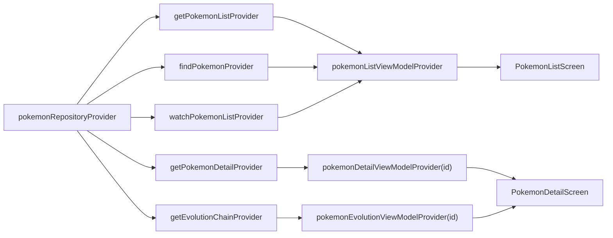

# Implementation Plan — Layer 3: Presentation / UI (T-18 … T-28)

## Overview

This plan ships the **Presentation ring** of the Clean Architecture onion for
Pokédex — the only layer that touches `BuildContext`, Flutter SDK widgets, and
`MaterialApp.router`. It consumes the five use case providers shipped by the
domain epic (`getPokemonListProvider`, `findPokemonProvider`,
`watchPokemonListProvider`, `getPokemonDetailProvider`,
`getEvolutionChainProvider`) and the theme/tokens from foundation
(`PokemonTypeTheme`, `app_colors`, `app_typography`, `app_theme`), and turns
them into the **two MVP screens** (`PokemonListScreen`, `PokemonDetailScreen`)
plus the shared **Design System kit** and three **discovery sheets** (Filters,
Sort, Generations).

Scope: T-18 through T-28 — **11 tasks, 42 story points** (biggest epic in the
backlog). Architecture: **MVVM literal to Tech Spec §5.2** — each screen owns
one Freezed state class, one `@riverpod` `AsyncNotifier` ViewModel, and a
`ConsumerWidget` View that renders state + dispatches intents only.

Branch flow per [[project_git-flow]]: each PR lands on
`feature/presentation-partN` → `epic/presentation-layer` → `develop` → `main`.

## Problem Statement / Motivation

The domain epic (PR #10) shipped use cases, DI graph, and the
`PokemonListScreen` / `PokemonDetailScreen` placeholders. The placeholders
exist only to keep the deep-link smoke test green (`context.go('/pokemon/1')`)
— **no real UI, no ViewModels, no Design System**. This epic replaces the
placeholders with production screens that satisfy:

- **PRD UC-01..UC-08**: list browse, search, filters, sort, generation,
  detail, evolution navigation, pull-to-refresh.
- **PRD RF-01..RF-46 + TE-01..TE-11**: the full user-facing visual + state
  contract, including offline banners and empty states.
- **PRD RN-04, RN-08, RN-09, RN-13, RN-14**: type-driven color, filter
  intersection, default sort, evolution rendering, page size of 24.
- **Tech Spec §5 / §9 / §10 / §11**: MVVM contract, breakpoints, theming,
  Figma MCP fidelity validation.
- **Princípio 11 / VGV ≥ 80%** test coverage gate.

Without this epic the app is two empty placeholders behind a router. With it,
the MVP ships.

## Proposed Solution

### Slice into 4 PRs along the natural seam (foundation → first screen → second screen → convergence)

| PR  | Branch                          | Scope                          | Tasks                       | Points | Reviewer load          |
| --- | ------------------------------- | ------------------------------ | --------------------------- | ------ | ---------------------- |
| 1   | `feature/presentation-part1`    | Design System kit + domain rev | T-18 (+ T-15 follow-up)     | ~6     | Pure components, low   |
| 2   | `feature/presentation-part2`    | Home + discovery sheets        | T-19, T-20, T-21, T-22, T-23 | ~18    | One VM, complex flows  |
| 3   | `feature/presentation-part3`    | Detail tabs                    | T-24, T-25, T-26            | ~11    | One VM + lazy provider |
| 4   | `feature/presentation-part4`    | Errors + responsive            | T-27, T-28                  | ~10–11 | Cross-cutting, polish  |

Two alternatives weighed and rejected:

- **3-PR mirror of the data-layer cadence** (DS+Home-shell+Detail-About →
  Home-discovery+Detail-tabs → polish) keeps the cadence but mixes Home and
  Detail work in PR2, forcing reviewers to context-switch between two screens.
- **2-PR split** (Home E2E → Detail E2E + polish) cuts CI overhead but each
  PR lands ~20 pt — past the threshold where thorough review degrades.
- **5-PR split** (DS → list shell → discovery → detail → polish) was
  over-sliced for a layer with only two screens, ships a barely-usable list
  in PR2, and multiplies CI/review overhead for marginal clarity gain.

### Architecture — Tech Spec §5.2 ratified verbatim

The Tech Spec sketches a single `PokemonListViewModel` holding the full Home
state (`items`, `offset`, `hasMore`, `isLoadingMore`, `isRefreshing`, `query`,
`filter`, `sort`, `generationId`, `refreshError`) in one Freezed
`PokemonListState`. **Ratified verbatim** because RN-08 (combine query +
filter + sort) intersects trivially in one place via the existing
`findPokemon` use case, AsyncValue maps 1:1 to the PRD state machine (§5.1),
and the discovery-mode split (below) puts all the routing logic in one
cohesive controller instead of scattered across coordinating notifiers.

`AsyncValue<T>` → PRD state machine mapping (Tech Spec §5.1):

| PRD state          | Riverpod representation                            |
| ------------------ | -------------------------------------------------- |
| `Loading`          | `AsyncLoading`                                     |
| `Loaded`           | `AsyncData(state)`                                 |
| `Empty`            | `AsyncData(state.copyWith(items: []))`             |
| `Error`            | `AsyncError(failure, stack)`                       |
| `Refreshing`       | `AsyncData` + `state.isRefreshing == true`         |
| `StaleWithError`   | `AsyncData(cache) + state.refreshError != null`    |

ViewModels translate `Result<T>` at the boundary: `Ok(value)` → state
mutation; `Err(failure)` → `throw failure` → Riverpod turns into
`AsyncError`. This translation is mechanical and lives in one place per VM.

### Browse vs Discovery mode + `watchPokemonList` bridge

The one substantive opinion beyond the spec. The Home VM has a derived
`isDiscovery` flag:

```dart
bool get isDiscovery =>
    state.query.isNotEmpty ||
    state.filter != null ||
    state.sort != SortCriteria.numberAsc ||
    state.generationId != null;
```

**Browse mode** (`isDiscovery == false`):
- `build()` fires `getPokemonList(limit: 24, offset: 0)` for the first page
- AND subscribes to `watchPokemonList(sort: sort, filter: null)`
- The stream re-emits on every cache change; each emission **replaces
  `state.items` AND sets `state.offset = items.length`** so the next
  `loadMore()` paginates network from past the stream's window
- `state.hasMore` only flips to `false` when a `getPokemonList` response
  signals exhaustion — the stream never sets it (the stream sees cache, not
  the network end)
- `loadMore()` calls `getPokemonList(limit: 24, offset: state.offset)`

**Discovery mode** (`isDiscovery == true`):
- Cancel the stream subscription
- Fire a single `findPokemon(query: state.query, filter: composedFilter,
  sort: state.sort)` against the cache
- Set `hasMore = false`; disable the scroll-end detector

**Switching back to browse** (intent clears all discovery state): re-subscribe
to the stream; its next emission resyncs items + offset.

**Why this is worth the moving parts**: RF-11 says discovery responds
instantly from cache (RN-08 confirms search/filter/sort happen on the cache);
RN-02 says revalidation happens in background and surfaces to the UI (TE-02
"dados salvos" banner). The watch stream is the *only* way the UI sees a
revalidation without a manual refresh. Without this bridge, the
`watchPokemonList` use case (shipped at domain layer for exactly this
purpose) becomes dead code.

### DS components take primitive params, not domain entities

Components under `lib/core/ui/components/` (`PokemonCard`, `TypeBadge`,
`StatBar`, `SectionHeader`, `SearchField`, `AppBottomSheet`) **must not
import** from `package:pokedex/features/pokemon/domain/...`. They accept
primitive parameters (`int id`, `String name`, `PokemonTypeId primaryType`,
…) — `PokemonTypeId` is allowed because it already lives at
`lib/core/pokemon/` for exactly this cross-cutting reason.

**Why**: the foundation epic avoided upward dependencies (core → features)
when carving `PokemonTypeId` out to `core/pokemon/` so the theme could
reference it. The DS kit honors the same rule. Feature widgets in
`features/pokemon/presentation/widgets/` are **thin adapters** — they take a
`Pokemon` entity and pass primitives to the DS component, adding
entity-aware behavior (`onTap → context.go('/pokemon/${p.id}')`) that the
pure DS components don't carry.

### Discovery sheets are stateless presentational widgets

`FiltersSheet`, `SortSheet`, `GenerationsSheet` take their current selection
+ an `onChanged` (or return-via-Navigator-pop) callback as parameters. The
Home View opens them via `showModalBottomSheet` and routes the result back
into the ViewModel intent. Sheets do not own Riverpod state.

### Retroactive domain revision — `generationId` joins `PokemonFilter`

Verified in code: `PokemonFilter` (`lib/features/pokemon/domain/entities/
pokemon_filter.dart:25-29`) carries `{types, weaknesses, height}` only;
`findPokemon({required sort, query, filter})` and `watchPokemonList({required
sort, filter})` have no generation parameter. The DAO
(`lib/features/pokemon/data/datasources/pokemon_dao.dart:67-123`) does **NOT**
filter on `generation_id` even though the column exists in the schema
(`lib/core/database/app_database.dart:27`).

PR1's groundwork step:
1. Extend `PokemonFilter` with `int? generationId`.
2. Rerun `dart run build_runner build --delete-conflicting-outputs` to
   refresh `pokemon_filter.freezed.dart`.
3. Add a WHERE branch in `pokemon_dao.dart::_summaryQuery` for
   `filter.generationId` (just before the existing `height` predicate).
4. Update Tech Spec §8 entity snippet (mirror the T-15 revision pattern the
   domain epic already established).
5. Add/refresh a `find_pokemon_test.dart` case covering the generationId
   axis (intersection with types + weaknesses).

This is a small retroactive revision in the spirit of the domain epic's T-15
revision — **same PR carries the domain change AND the DS components so
neither ships in isolation**.

### Resolved flow-analysis decisions (8 blockers + 9 refines incorporated)

Surfaced by `user-flow-analysis-agent` and resolved here so the per-PR ACs
have concrete answers, not punts.

#### Blockers — resolved

1. **Browse → discovery flip — what shows during the flip?**
   On entering discovery, emit
   `state = const AsyncLoading<PokemonListState>().copyWithPrevious(state)`
   before calling `findPokemon`. `copyWithPrevious` preserves the user's
   `query`, `sort`, `filter`, `generationId` inputs so the search field /
   chips never flash empty during the flip; only `state.items` is treated as
   stale and the skeleton renders during the sub-second cache query. (PR2 — AC.)

2. **Pull-to-refresh in discovery mode**
   Refresh **re-runs both `getPokemonList(limit: 24, offset: 0)`** (to fill
   cache from network) **then `findPokemon(...)`** (to re-apply discovery
   filter over the freshened cache). User expectation of "refresh = ask
   network" wins; coordination lives in the VM. (PR2 — AC.)

3. **Scroll position preservation on stream emission**
   `PokemonListScreen` uses a single `ScrollController`; stream emissions
   replace `state.items` and bump `state.offset`, but **never reset
   `controller.position.pixels`**. AC: a widget test scrolls to page 3,
   fires a stream emission with 1 new item prepended, and asserts the
   scroll offset has not jumped. (PR2 — AC + widget test.)

4. **Detail × offline × no-cache**
   `PokemonDetailScreen` renders `OfflineErrorWidget` with a "Voltar" CTA
   to `context.pop()` (returns to list) when `AsyncError` carries
   `OfflineFailure` AND no stale cache is available. (PR3 — AC + widget
   test.)

5. **EvolutionChain renders branching, not flat list**
   The shipped entity (`lib/features/pokemon/domain/entities/
evolution_chain.dart`) is **recursive** (`EvolutionNode.evolvesTo:
List<EvolutionNode>`) — the domain epic revised the Tech Spec §8.2
   sketch to faithfully represent the PokéAPI's branching shape (Eevee).
   The Evolution tab renders via a recursive widget (`_EvolutionBranch`)
   composing `EvolutionStage` cards horizontally + branching downward.
   (PR3 — AC + widget test with branching Eevee fixture.)

6. **Partial-generation backfill (RN-15) needs a distinct empty state**
   When `state.generationId != null && state.items.isEmpty`, render
   `EmptyGenerationWidget` ("Dados incompletos para esta geração — tente
   atualizar") with a Retry CTA that calls the refresh intent. Distinct
   from `EmptySearchResultsWidget` (TE-04) and `EmptyFilterWidget`
   (TE-05). (PR2 + PR4 — PR2 wires it conditionally, PR4 lands the widget.)

7. **5-rapid-flip leak test**
   PR2 AC: a `ProviderContainer` test fires 5 mode flips back-to-back
   (search('a') → search('') → search('b') → search('') → search('c'))
   and asserts a single live `StreamSubscription` at the end (introspected
   via a `BehaviorSubject`-style test seam) and zero duplicate items. (PR2.)

8. **Sheet → dialog on breakpoint flip while sheet is open**
   `ResponsiveLayout.showSheetOrDialog` does NOT preserve open state across
   resize. If a sheet is open and the breakpoint changes, the sheet stays;
   the user's next sheet invocation uses the new modality. AC: documented in
   `responsive_layout.dart` doc comment + unit test asserting the chooser
   reads breakpoint at *invocation* time, not via reactive listener. (PR4.)

#### Refines — resolved

1. **Browse → discovery → browse return gap**: handled by `AsyncLoading`
   emission on flip (blocker 1); same pattern on return.
2. **Rapid mode flips**: 300ms debounce is on `search()` *only*; the
   pending discovery transition is keyed off the debounced query, so
   `search('a')` → `search('')` within 300ms cancels the transition and
   stays in browse. (PR2 AC.)
3. **Evolution back-button**: stages tap `context.go('/pokemon/$id')`
   (replaces route, system-back returns to list — clean URL stack).
   (PR3 AC.)
4. **TE-02 banner persistence**: per-screen (list-only). Detail uses its
   own cache-stale state in the header. (PR4 widget contract.)
5. **Search input normalization**: VM trims whitespace, caps at 50 chars,
   passes through to `findPokemon` which handles RN-06 (numeric) and RN-07
   (accents) at the DAO. (PR2 AC.)
6. **AsyncLoading non-golden tests**: widget tests assert skeleton /
   spinner widget is present in `AsyncLoading` state (no golden, low
   flake). (PR1/PR2/PR3 ACs.)
7. **Evolution loading split**: Evolution tab uses
   `ref.watch(pokemonEvolutionChainProvider(id))` independently of the
   detail VM; About + Stats render real data while Evolution shows its
   own loading skeleton if slower. (PR3 AC.)
8. **TE-11 image-indisponível placeholder**: `PokemonCard` and detail
   header render `Icon(Icons.broken_image)` placeholder when
   `imageUrl.isEmpty` or `cached_network_image` errors. (PR1 + PR3 AC.)
9. **TE-08 (429) UI**: transparent — `RateLimitInterceptor` handles
   retries; if exhausted, the failure surfaces through the generic error
   widget (no dedicated UI). (PR4 — note only.)
10. **Mid-scroll breakpoint flip**: `ResponsiveLayout` rebuilds the grid
    with a new column count; the `ScrollController` is preserved
    (`PageStorageKey` per screen) and Flutter's `GridView.builder`
    re-anchors to the closest visible item. Documented; not a separate
    AC. (PR4.)

### Figma MCP — authenticate first, fetch per-screen at PR plan time

Run `/figma:figma-use` + authenticate before invoking the per-PR plan. Each
per-screen PR fetches its specific frame via `get_design_context`
([Tech Spec §11.1](../project/02-tech-spec.md#111-mapa-de-frames-figma--telas-flutter)):

| Frame                          | Node ID    | PR  |
| ------------------------------ | ---------- | --- |
| `Home`                         | `268:0`    | PR1 (Badge, SearchField), PR2 |
| `Home - All`                   | `268:1037` | PR2 |
| `Filters`                      | `268:63`   | PR1 (Badge), PR2 |
| `Filters - Scrolled`           | `268:1739` | PR2 |
| `Sort`                         | `268:176`  | PR2 |
| `Generation`                   | `268:248`  | PR2 |
| `Profile #1 - About`           | `268:320`  | PR3 |
| `Profile #1 - Stats`           | `268:378`  | PR1 (StatBar), PR3 |
| `Profile #1 - Evolution`       | `268:513`  | PR3 |

Per-PR routine:
1. `get_design_context(node-id)` → see the rendered code suggestion.
2. `get_variable_defs(node-id)` → confirm tokens match `app/theme/`.
3. Implement against `PokemonTypeTheme`.
4. `get_screenshot(node-id)` → reference image for the PR description
   (NOT a bitmap-compared golden — different rasterizer/fonts).

### Test strategy

| Surface              | Test idiom                                                  |
| -------------------- | ----------------------------------------------------------- |
| DS components (PR1)  | Flutter golden tests, self-baselined; parameter widget tests |
| ViewModels (PR2/PR3) | `ProviderContainer` + `mocktail`-mocked use case providers   |
| Screens (PR2/PR3)    | `ProviderScope(overrides: [...])` + widget tests per state   |
| Errors/empty (PR4)   | Widget tests parameterized per variant                       |
| Responsive (PR4)     | Golden test per breakpoint + master-detail golden            |

Goldens are self-baselined: first run generates `test/.../goldens/*.png`
via `--update-goldens`, CI compares subsequent runs against the committed
PNGs. Figma `get_screenshot` lives outside the test harness (linked in PR
description for designer fidelity review).

Deep-link smoke from the domain epic (`test/features/pokemon/presentation/
pokemon_list_screen_test.dart` and `..._detail_screen_test.dart`) must stay
green through every PR (the placeholder behavior they assert will be
preserved as the screens are filled in).

## PR1 — `feature/presentation-part1` — T-18 Design System + domain revision (~6 pt)

**Branch**: `feature/presentation-part1` → `epic/presentation-layer`
**Conventional commit prefix**: `feat(ui)` (DS) + `refactor(domain)` (filter rev)

### Pubspec validation (resolves brainstorm Open Question 1)

Verify at PR1 implementation start — **DO NOT pin until verified**:

- `cached_network_image` (artwork caching for card + detail header). Required
  for RF-01 imagery + offline-cached artwork.
- `flutter_svg` — only if Figma `get_design_context(268:0)` confirms type
  icons export as SVG, not raster glyphs in a font. Skip if not needed.

**Constraint (binding, per [[project_analyzer9-toolchain]])**: any new dep
must NOT pull `analyzer ^10` or `analyzer ^12` transitively. Verify with:

```bash
flutter pub add cached_network_image
dart pub deps --style=tree | grep -i analyzer
# Must show analyzer 9.x; if 10+ appears, downgrade cached_network_image to
# the highest 9-compatible patch and pin exact (mirror drift/freezed pattern).
```

If pinning is needed, add a pubspec comment matching the existing drift /
freezed / retrofit_generator pin notes.

### Domain revision (groundwork before DS components)

| File                                                                          | Change                                                                          |
| ----------------------------------------------------------------------------- | ------------------------------------------------------------------------------- |
| `lib/features/pokemon/domain/entities/pokemon_filter.dart`                    | Add `int? generationId` to factory                                              |
| `lib/features/pokemon/domain/entities/pokemon_filter.freezed.dart`            | Regenerated via build_runner                                                    |
| `lib/features/pokemon/data/datasources/pokemon_dao.dart`                      | Add WHERE branch on `t.generationId.equals(...)` after height predicate         |
| `test/features/pokemon/domain/usecases/find_pokemon_test.dart`                | Add test case combining generationId with types + height                        |
| `test/features/pokemon/data/datasources/pokemon_dao_test.dart`                | Add tests covering the new WHERE branch                                         |
| `docs/project/02-tech-spec.md`                                                | Update §8.2 `PokemonFilter` snippet                                             |

Mirrors the T-15 revision pattern the domain epic established (see
`docs/plan/2026-05-26-feat-domain-layer-plan.md#t-15-retroactive-revision`).

### Files added — DS components

All under `lib/core/ui/components/`:

| File                          | Responsibility                                          |
| ----------------------------- | ------------------------------------------------------- |
| `pokemon_card.dart`           | List card: #NNN, name, type badges, type-color bg, img |
| `type_badge.dart`             | One type pill: icon + label, themed via `PokemonTypeTheme` |
| `stat_bar.dart`               | Horizontal stat bar with value label, 0..max range     |
| `section_header.dart`         | Sheet/section title row                                |
| `search_field.dart`           | Default + filled text field per Figma `Text Field / Default` |
| `app_bottom_sheet.dart`       | Sheet shell — handle, title, content slot, primary CTA |

Each component:
- Takes primitive params (`int id`, `String name`, `PokemonTypeId primaryType`,
  `PokemonTypeId? secondaryType`, `String spriteUrl`, …).
- Does NOT import from `package:pokedex/features/pokemon/domain/...`.
- Reads colors via `PokemonTypeTheme.styleOf(...)`.
- Has a `const` constructor.

### Test surface — PR1

Under `test/core/ui/components/`. **One test file per component**, with
parametric widget tests AND the golden(s) co-located inside the same file
(separate `testGoldens(...)` group):

| File                                | Coverage                                                                                  |
| ----------------------------------- | ----------------------------------------------------------------------------------------- |
| `pokemon_card_test.dart`            | Parametric (3 type combos) + self-baselined golden vs Figma `268:0` card instance         |
| `type_badge_test.dart`              | 18 types × 2 sizes + goldens for 3 representative types                                   |
| `stat_bar_test.dart`                | Values 0/50/100/max + golden per value bucket                                             |
| `section_header_test.dart`          | Title + optional trailing CTA + one golden                                                |
| `search_field_test.dart`            | Default + filled state + one golden per                                                   |
| `app_bottom_sheet_test.dart`        | Header + content + one golden                                                             |

Domain-side test updates (under `test/features/pokemon/`):

| File                                            | Coverage                                                             |
| ----------------------------------------------- | -------------------------------------------------------------------- |
| `domain/usecases/find_pokemon_test.dart`        | Add `generationId` × types × height intersection case                 |
| `data/datasources/pokemon_dao_test.dart`        | Add WHERE-branch test (1 row matches generationId=1, 0 rows for gen 5) |

### CI gates — PR1

- `dart format --output=none --set-exit-if-changed .`
- `dart analyze` (per [[project_analyzer9-toolchain]])
- `flutter test` via the very-good-cli MCP wrapper (per [[feedback_vgv-cli-hooks]])
- `dart run build_runner build --delete-conflicting-outputs` resolves clean

### 5-agent review — PR1

`/review` → commit reports as `docs(review):` under
`docs/reviews/2026-05-XX-presentation-part1/` (per [[feedback_review-reports-committed]]).

### Acceptance criteria — PR1

- [ ] All 6 DS components implemented from Figma `get_design_context`
- [ ] Type colors driven by `PokemonTypeTheme` (RN-04); zero hardcoded
      `Color(0xFF…)` literals in component files
- [ ] Components take primitive params; no imports from `features/pokemon/
      domain/`
- [ ] **Lint guard** added: a `forbidden_imports` custom_lint rule (or a
      `test/core/ui/import_boundary_test.dart` that statically scans
      `lib/core/ui/**` for any `package:pokedex/features/**` imports and
      fails the build if found). Convention-only enforcement rots; this
      guards the layer boundary in CI.
- [ ] Golden test per component, self-baselined under
      `test/core/ui/components/goldens/`. **Each component has ONE test file**
      (e.g., `pokemon_card_test.dart`) containing both the parametric widget
      tests AND the `testGoldens(...)` group — NOT a separate `_golden_test.dart`.
- [ ] Parameter variation widget tests (TypeBadge × 18 types,
      StatBar × 4 buckets)
- [ ] `PokemonFilter.generationId` added; codegen clean; DAO WHERE branch added
- [ ] Tech Spec §8.2 updated for `PokemonFilter`
- [ ] All existing tests stay green (domain + data tests pass with new filter
      field as optional null)
- [ ] **Commit hygiene**: PR1 contains at least two distinct commits — one
      `refactor(domain): extend PokemonFilter with generationId` covering the
      domain + DAO + spec revision; one or more `feat(ui): …` for the DS
      components. Mirrors the T-15 revision split from the domain epic.
- [ ] PR description links Figma screenshots for Badge, Text Field, StatBar nodes

## PR2 — `feature/presentation-part2` — T-19/T-20/T-21/T-22/T-23 Home + discovery (~18 pt)

**Branch**: `feature/presentation-part2` → `epic/presentation-layer`
**Conventional commit prefix**: `feat(pokemon-list)`, `feat(filters)`, `feat(sort)`, `feat(generations)`

### Pubspec — likely no changes

Confirm `cached_network_image` landed in PR1; no new deps expected.

### Files added — state + ViewModel

| File                                                                            | Responsibility                                              |
| ------------------------------------------------------------------------------- | ----------------------------------------------------------- |
| `lib/features/pokemon/presentation/state/pokemon_list_state.dart`               | Freezed `PokemonListState` (Tech Spec §5.2 verbatim)        |
| `lib/features/pokemon/presentation/view_models/pokemon_list_view_model.dart`    | `@riverpod` `AsyncNotifier`: build, intents, stream bridge  |

`PokemonListState` shape (literal Tech Spec §5.2):

```dart
@freezed
abstract class PokemonListState with _$PokemonListState {
  const factory PokemonListState({
    @Default(<Pokemon>[]) List<Pokemon> items,
    @Default(0) int offset,
    @Default(true) bool hasMore,
    @Default(false) bool isLoadingMore,
    @Default(false) bool isRefreshing,
    @Default('') String query,
    PokemonFilter? filter,
    @Default(SortCriteria.numberAsc) SortCriteria sort,
    int? generationId,
    Failure? refreshError,
  }) = _PokemonListState;
}
```

ViewModel public surface:

```dart
@riverpod
class PokemonListViewModel extends _$PokemonListViewModel {
  static const _pageSize = 24; // RN-14

  @override
  Future<PokemonListState> build() async {
    // Disposal hook is the FIRST thing in build — fires on rebuild + on
    // provider invalidation. Guarantees no leaked timer or subscription.
    ref.onDispose(() {
      _debounce?.cancel();
      _streamSub?.cancel();
    });
    // browse-mode init: getPokemonList(0) + subscribe to watchPokemonList
    // (see _enterBrowse) — returns the initial PokemonListState.
  }

  Future<void> loadMore() async { /* UC-01; offset += pageSize */ }
  void search(String query) { /* 300ms debounce; RF-10 */ }
  void applyFilter(PokemonFilter? filter) { /* UC-03 */ }
  void changeSort(SortCriteria sort) { /* UC-04; default = numberAsc */ }
  void selectGeneration(int? id) { /* UC-05; null = clear */ }
  Future<void> refresh() async { /* UC-08 */ }

  // Private — intentionally not exposed via the generated notifier surface:
  Timer? _debounce;
  StreamSubscription<List<Pokemon>>? _streamSub;
  bool get _isDiscovery => /* derived from state */;
  void _enterDiscovery() {
    // copyWithPrevious preserves UI inputs (query/sort/filter/generationId)
    state = const AsyncLoading<PokemonListState>().copyWithPrevious(state);
    _streamSub?.cancel();
    // run findPokemon, then state = AsyncData(...)
  }
  void _enterBrowse() { /* resubscribe stream; first emission resyncs items+offset */ }
  PokemonFilter _composeFilter() =>
      (state.value?.filter ?? const PokemonFilter())
          .copyWith(generationId: state.value?.generationId);
}
```

**Intent signature constraint**: intent methods return only `void` or
`Future<void>`, and parameters use only primitives / domain entities — never
`Ref`, `AsyncValue`, or `ProviderSubscription`. Views dispatch intents; they
do not reach into Riverpod internals through the notifier.

### Files added — Home screen + adapter widgets

| File                                                                                   | Responsibility                                                     |
| -------------------------------------------------------------------------------------- | ------------------------------------------------------------------ |
| `lib/features/pokemon/presentation/pages/pokemon_list_screen.dart`                     | `ConsumerWidget` — replaces placeholder; wires VM + sheets         |
| `lib/features/pokemon/presentation/widgets/pokemon_card.dart`                          | Adapter: takes `Pokemon` entity, calls `core.PokemonCard(...)` + onTap |
| `lib/features/pokemon/presentation/widgets/sheets/filters_sheet.dart`                  | `FiltersSheet`: types, weaknesses, height; returns `PokemonFilter?` via pop |
| `lib/features/pokemon/presentation/widgets/sheets/sort_sheet.dart`                     | `SortSheet`: 4 radio options; returns `SortCriteria`               |
| `lib/features/pokemon/presentation/widgets/sheets/generations_sheet.dart`              | `GenerationsSheet`: grid of generation cards; returns `int?`       |

### Behaviors covered — PR2

- UC-01 paginated browse (RN-14: pageSize = 24)
- UC-02 search with 300ms debounce (RF-10)
- UC-03 filter intersection (RN-08)
- UC-04 sort change (4 criteria, RF-20…RF-23)
- UC-05 generation filter (RF-25…RF-28)
- UC-08 pull-to-refresh (browse + discovery — see resolved blocker 2)
- RN-08 RN-09 RN-14 enforcement
- TE-04 empty search results
- TE-05 empty filter results
- TE-11 missing image placeholder on cards

### Test surface — PR2

| File                                                                                                 | Coverage                                                                                          |
| ---------------------------------------------------------------------------------------------------- | ------------------------------------------------------------------------------------------------- |
| `test/features/pokemon/presentation/view_models/pokemon_list_view_model_test.dart`                   | Browse init; loadMore; debounce; discovery flip (items cleared); refresh in discovery; mode flip; stream re-sync; refreshError surfacing; 5-rapid-flip leak test |
| `test/features/pokemon/presentation/pages/pokemon_list_screen_test.dart`                             | Happy path (cards render from state); skeleton in `AsyncLoading`; scroll-position preservation on stream emission; deep-link smoke survives  |
| `test/features/pokemon/presentation/widgets/sheets/filters_sheet_test.dart`                          | Multi-select types; height single-select; clear-all CTA; Navigator.pop returns filter; golden     |
| `test/features/pokemon/presentation/widgets/sheets/sort_sheet_test.dart`                             | 4 options; active highlighted; pop returns SortCriteria; golden                                   |
| `test/features/pokemon/presentation/widgets/sheets/generations_sheet_test.dart`                      | Grid renders; active highlighted; pop returns int?; golden                                        |
| `test/features/pokemon/presentation/widgets/pokemon_card_test.dart`                                  | Adapter passes correct primitives to core; tap fires `context.go('/pokemon/$id')`                 |

ViewModel test highlights (`pokemon_list_view_model_test.dart`):

```dart
// 5-rapid-flip leak test (resolves flow-analysis blocker 7)
test('rapid mode flips do not leak stream subscriptions', () async {
  // Use a real StreamController so we can introspect hasListener — no static
  // counters on the mock class (would race across parallel tests).
  final cacheController = StreamController<List<Pokemon>>.broadcast();
  final mockWatch = MockWatchPokemonList();
  when(() => mockWatch.call(sort: any(named: 'sort'), filter: any(named: 'filter')))
      .thenAnswer((_) => cacheController.stream);

  final container = ProviderContainer(overrides: [
    findPokemonProvider.overrideWithValue(MockFindPokemon()),
    getPokemonListProvider.overrideWithValue(MockGetPokemonList()),
    watchPokemonListProvider.overrideWithValue(mockWatch),
  ]);
  addTearDown(container.dispose);
  addTearDown(cacheController.close);

  final vm = container.read(pokemonListViewModelProvider.notifier);
  await container.read(pokemonListViewModelProvider.future);

  vm.search('a'); vm.search(''); vm.search('b'); vm.search(''); vm.search('c');
  await Future<void>.delayed(const Duration(milliseconds: 350));

  // Behavior, not mock internals: stream has exactly one listener at the end.
  expect(cacheController.hasListener, isTrue);
  // Debounce collapsed the rapid 'a/b/c' input into at most 1 findPokemon call.
  verify(() => container.read(findPokemonProvider).call(
        sort: any(named: 'sort'),
        query: any(named: 'query'),
        filter: any(named: 'filter'),
      )).called(lessThanOrEqualTo(1));
});

// Scroll-position preservation (resolves flow-analysis blocker 3)
testWidgets('stream emission preserves scroll offset', (tester) async {
  final controller = ScrollController();
  // pump screen wired with controller; emit 2 pages (48 items); scroll to ~3rd
  // page (offset 1500 px); fire stream emission appending 1 item at position 0.
  await tester.pumpWidget(/* ... */);
  controller.jumpTo(1500);
  await tester.pumpAndSettle();
  final beforePixels = controller.position.pixels;

  cacheController.add(/* new 25-item snapshot */);
  await tester.pumpAndSettle();

  expect(controller.position.pixels, closeTo(beforePixels, 1.0));
});
```

### CI gates — PR2

Same as PR1 + the very-good-cli test runner per [[feedback_vgv-cli-hooks]].

### 5-agent review — PR2

`/review` → `docs(review):` under `docs/reviews/2026-05-XX-presentation-part2/`.

### Acceptance criteria — PR2

- [ ] `PokemonListScreen` replaces the domain-epic placeholder; deep-link
      smoke remains green
- [ ] **Intent signature constraint**: all VM intent methods return only
      `void` or `Future<void>`; parameters are primitives or domain entities;
      no `Ref`, `AsyncValue`, or `ProviderSubscription` leak into the View
- [ ] **Adapter import alias**: `features/pokemon/presentation/widgets/
      pokemon_card.dart` imports the DS component as
      `import 'package:pokedex/core/ui/components/pokemon_card.dart' as core;`
      and calls `core.PokemonCard(...)` — disambiguates the namespace collision
- [ ] `_composeFilter()` covered by a VM unit test: confirms
      `state.filter ?? PokemonFilter()` merged with `state.generationId`
      produces the right wire shape (covers the PR1 groundwork × PR2 wiring
      seam)
- [ ] List renders cards with #NNN, name, badges, type-color bg, image (RF-01/02)
- [ ] Scroll-end triggers `loadMore()` (RF-03 / RN-14)
- [ ] First-load skeleton via `AsyncLoading` widget test (RF-07)
- [ ] Pull-to-refresh in browse calls `getPokemonList(0)` + resets `offset`/`hasMore`
- [ ] Pull-to-refresh in discovery calls `getPokemonList(0)` THEN `findPokemon` (resolved blocker 2)
- [ ] Search debounces 300ms (RF-10); numeric query handles leading zeros via DAO (RN-06)
- [ ] Search VM trims whitespace + caps at 50 chars (resolved refine 5)
- [ ] Filters combine as intersection with sort (RN-08); active filter count badge in sheet header
- [ ] Sort default = numberAsc (RN-09); 4 criteria reorder correctly
- [ ] Generations sheet lists Gen 1; selecting wires `generationId` to `PokemonFilter` via VM compose (PR1 groundwork)
- [ ] Browse → discovery flip clears items + emits AsyncLoading (resolved blocker 1)
- [ ] Browse return resubscribes stream and resyncs items + offset
- [ ] Stream emission preserves scroll position (resolved blocker 3) — widget test
- [ ] 5-rapid-flip leak test passes (resolved blocker 7)
- [ ] TE-04 (empty search), TE-05 (empty filter) rendered
- [ ] TE-11 placeholder shown on cards with missing/failing image (resolved refine 8)
- [ ] Fidelity validated against Figma screenshots of `268:0`, `268:1037`,
      `268:63`, `268:176`, `268:248` (linked in PR description)
- [ ] All goldens self-baselined under `test/features/pokemon/presentation/goldens/`

## PR3 — `feature/presentation-part3` — T-24/T-25/T-26 Detail tabs (~11 pt)

**Branch**: `feature/presentation-part3` → `epic/presentation-layer`
**Conventional commit prefix**: `feat(detail)`

### Pubspec — likely no changes

`TabBar` / `TabBarView` ship with Flutter SDK.

### Files added — state + ViewModels

| File                                                                                       | Responsibility                                                          |
| ------------------------------------------------------------------------------------------ | ----------------------------------------------------------------------- |
| `lib/features/pokemon/presentation/state/pokemon_detail_state.dart`                        | Freezed wrapper: `{PokemonDetail detail, Failure? refreshError}` — confirm at PR3 plan time whether the second field earns its keep; if not, drop the Freezed class and use `AsyncValue<PokemonDetail>` directly |
| `lib/features/pokemon/presentation/view_models/pokemon_detail_view_model.dart`             | `@riverpod` `AsyncNotifier` with positional `build(int id)` param (Riverpod 3.x family syntax — see snippet below); loads `getPokemonDetail(id)` |
| `lib/features/pokemon/presentation/view_models/pokemon_evolution_view_model.dart`          | **Conditionally added**: only if the Evolution tab needs intent surface beyond `ref.watch(getEvolutionChainProvider(id))`. At PR3 plan time, confirm — if the tab is read-only over the use case provider, **drop this file** and watch the domain provider directly from `evolution_tab.dart` |

Riverpod 3.x family syntax (positional build parameter, NOT the deprecated
`.family` modifier):

```dart
@riverpod
class PokemonDetailViewModel extends _$PokemonDetailViewModel {
  @override
  Future<PokemonDetailState> build(int id) async {
    final result = await ref.read(getPokemonDetailProvider).call(id);
    return switch (result) {
      Ok(:final value) => PokemonDetailState(detail: value),
      Err(:final failure) => throw failure,
    };
  }

  Future<void> refresh() async { /* re-runs getPokemonDetail; surfaces refreshError */ }
}

// Consumed as: ref.watch(pokemonDetailViewModelProvider(id))
```

### Files added — screen + tab widgets

| File                                                                                       | Responsibility                                            |
| ------------------------------------------------------------------------------------------ | --------------------------------------------------------- |
| `lib/features/pokemon/presentation/pages/pokemon_detail_screen.dart`                       | `ConsumerWidget` w/ `DefaultTabController`; header + tabs |
| `lib/features/pokemon/presentation/widgets/detail/detail_header.dart`                      | Artwork, #NNN, name, badges; bg colored by primary type   |
| `lib/features/pokemon/presentation/widgets/detail/about_tab.dart`                          | Description, Pokédex Data, Training, Breeding, Location   |
| `lib/features/pokemon/presentation/widgets/detail/stats_tab.dart`                          | StatBar per stat + Total + Min/Max + Type Defenses        |
| `lib/features/pokemon/presentation/widgets/detail/evolution_tab.dart`                      | Recursive `_EvolutionBranch` widget; handles branching    |

`evolution_tab.dart` recursive widget (resolves blocker 5):

```dart
class _EvolutionBranch extends StatelessWidget {
  const _EvolutionBranch({required this.node});
  final EvolutionNode node;

  @override
  Widget build(BuildContext context) {
    if (node.evolvesTo.isEmpty) {
      return _StageCard(stage: node.stage);
    }
    return Column(children: [
      _StageCard(stage: node.stage),
      // Render branches horizontally if multiple, vertically if single
      if (node.evolvesTo.length == 1)
        _EvolutionBranch(node: node.evolvesTo.first)
      else
        Row(children: [
          for (final child in node.evolvesTo) _EvolutionBranch(node: child),
        ]),
    ]);
  }
}
```

### Behaviors covered — PR3

- UC-06 detail load (cache-first per repository)
- UC-07 evolution stage tap → `context.go('/pokemon/$id')` (resolved refine 3)
- RF-29 type-colored header (RN-04)
- RF-31..34 about sections
- RF-35..39 stats + Type Defenses
- RF-40..43 evolution chain with branching (Eevee)
- TE-10 missing-field "—" rendering
- RF-43 / RN-13 no-evolution message
- TE-11 missing-image placeholder on header artwork
- Detail × offline × no-cache → TE-01 + back affordance (resolved blocker 4)

### Test surface — PR3

| File                                                                                                       | Coverage                                                                                                            |
| ---------------------------------------------------------------------------------------------------------- | ------------------------------------------------------------------------------------------------------------------- |
| `test/features/pokemon/presentation/view_models/pokemon_detail_view_model_test.dart`                       | Success / failure / refresh; family keying isolation (vm(1) and vm(4) hold independent state)                       |
| `test/features/pokemon/presentation/view_models/pokemon_evolution_view_model_test.dart`                    | Lazy load; no-evolution returns empty `evolvesTo`; branching Eevee fixture                                          |
| `test/features/pokemon/presentation/pages/pokemon_detail_screen_test.dart`                                 | Renders tabs; tab switching; deep-link smoke; offline-no-cache shows OfflineErrorWidget + back CTA                  |
| `test/features/pokemon/presentation/widgets/detail/detail_header_test.dart`                                | Header colored by primary type; TE-11 placeholder on missing image; golden                                          |
| `test/features/pokemon/presentation/widgets/detail/about_tab_test.dart`                                    | All sections render; TE-10 "—" for missing fields; golden                                                            |
| `test/features/pokemon/presentation/widgets/detail/stats_tab_test.dart`                                    | 6 stats + Total + Min/Max columns + Type Defenses; golden                                                           |
| `test/features/pokemon/presentation/widgets/detail/evolution_tab_test.dart`                                | Linear chain (Bulbasaur → Ivysaur → Venusaur); branching chain (Eevee, from fixture); no-evolution case; stage tap fires `context.go` |
| `test/features/pokemon/presentation/fixtures/eevee_evolution_chain.dart`                                   | Hand-crafted `EvolutionChain` fixture exposing the Eevee 8-branch tree for use in the recursive-rendering test (avoids depending on network/cache for the worst-case branching shape) |

### CI gates — PR3

Same as PR1 + the very-good-cli test runner.

### 5-agent review — PR3

`/review` → `docs(review):` under `docs/reviews/2026-05-XX-presentation-part3/`.

### Acceptance criteria — PR3

- [ ] `PokemonDetailScreen` replaces the placeholder; deep-link smoke remains green
- [ ] Header bg colored by primary type via `PokemonTypeTheme` (RF-29/RN-04)
- [ ] About tab renders Pokédex Data, Training, Breeding, Location (RF-31..34)
- [ ] Stats tab renders 6 stats with `StatBar`, Total, Min/Max @ level 100, Type Defenses (RF-35..39)
- [ ] Evolution tab renders recursive branching (Eevee fixture covered) (resolved blocker 5)
- [ ] Tapping evolution stage fires `context.go('/pokemon/$id')` (resolved refine 3)
- [ ] No-evolution Pokémon shows informative message (RF-43 / RN-13)
- [ ] Missing fields render "—" without breaking layout (TE-10)
- [ ] Detail × offline × no-cache shows `OfflineErrorWidget` + back-to-list CTA (resolved blocker 4)
- [ ] Evolution tab uses separate provider; loads lazily; shows own skeleton (resolved refine 7)
- [ ] TE-11 placeholder on header artwork (resolved refine 8)
- [ ] Fidelity validated against Figma screenshots of `268:320`, `268:378`, `268:513`
- [ ] All goldens self-baselined; existing deep-link smoke green

## PR4 — `feature/presentation-part4` — T-27 errors + T-28 responsive (~10–11 pt)

**Branch**: `feature/presentation-part4` → `epic/presentation-layer`
**Conventional commit prefix**: `feat(ui)`

> Backlog sums T-27 (3pt) + T-28 (5pt) = 8pt. PR4 also rewires PR2's
> bottom-sheet call sites through `ResponsiveLayout` and reshapes the router
> for master-detail on expanded breakpoints. Realistic sizing: **10–11 pt**.
> Flagged here so the PR doesn't slip without explanation.

### Pubspec — no changes expected

### Files added — error/empty widgets

All under `lib/core/ui/states/`:

| File                              | Responsibility                          | TE code           |
| --------------------------------- | --------------------------------------- | ----------------- |
| `offline_error_widget.dart`       | "Você está offline" + Retry             | TE-01             |
| `stale_cache_banner.dart`         | "Dados salvos" banner (list-only)       | TE-02             |
| `empty_search_widget.dart`        | "Nenhum Pokémon encontrado para …"     | TE-04             |
| `empty_filter_widget.dart`        | "Nenhum resultado para filtros"        | TE-05             |
| `empty_generation_widget.dart`    | "Dados incompletos para esta geração"  | RN-15 (resolved blocker 6) |
| `generic_error_widget.dart`       | Fallback w/ Retry                       | TE-03/06/07/09    |

All widgets are pure presentational: take data via ctor params, surface
`onRetry` callbacks. No Riverpod imports.

### Files added — responsive layout

Under `lib/app/layout/`. The location follows Tech Spec §9.1's framing of
responsiveness as an app-level concern (the breakpoints govern how the whole
app composes, not a reusable UI primitive). If at PR4 plan time the trio is
purely presentational and feature-agnostic, consider moving to
`lib/core/ui/layout/` — but `lib/app/` is the default since the scaffold
wires routes.

| File                          | Responsibility                                                          |
| ----------------------------- | ----------------------------------------------------------------------- |
| `breakpoints.dart`            | `compact < 600 < medium < 1024 < expanded` constants (Tech Spec §9.1)   |
| `responsive_layout.dart`      | Helper widget + `showSheetOrDialog(...)` chooser (sheet vs dialog)      |
| `master_detail_scaffold.dart` | Detail-in-panel on expanded breakpoint (RF-46)                          |

### Files modified — PR4

| File                                                                                       | Modification                                                                       |
| ------------------------------------------------------------------------------------------ | ---------------------------------------------------------------------------------- |
| `lib/features/pokemon/presentation/pages/pokemon_list_screen.dart`                         | Rewire sheet calls through `ResponsiveLayout.showSheetOrDialog`; render error/empty states; grid column count from `ResponsiveLayout.gridColumns` |
| `lib/features/pokemon/presentation/pages/pokemon_detail_screen.dart`                       | Wrap in `MasterDetailScaffold` when expanded (RF-46)                              |
| `lib/app/router/app_router.dart`                                                           | **Default approach: NO router rewrite.** `MasterDetailScaffold` wraps the existing routes — the list route stays `/`, the detail route stays `/pokemon/:id`, and on expanded the scaffold shows both panels reading from the route state. Only add a `ShellRoute` if PR4 plan-time finds that the wrap approach can't satisfy RF-46 (e.g., needs cross-route state). Touching the router is the riskiest change in the epic — defer to a measured need. |

### Test surface — PR4

| File                                                                          | Coverage                                                                                              |
| ----------------------------------------------------------------------------- | ----------------------------------------------------------------------------------------------------- |
| `test/app/layout/breakpoints_test.dart`                                       | Edge values: 599 → compact, 600 → medium, 1023 → medium, 1024 → expanded                              |
| `test/app/layout/responsive_layout_test.dart`                                 | Chooser reads breakpoint at invocation, not via listener (resolved blocker 8); sheet vs dialog selection |
| `test/core/ui/states/offline_error_widget_test.dart`                          | Renders message + Retry CTA fires callback; golden                                                    |
| `test/core/ui/states/stale_cache_banner_test.dart`                            | Renders message; golden                                                                                |
| `test/core/ui/states/empty_search_widget_test.dart`                           | Renders term in message; clear CTA fires callback; golden                                              |
| `test/core/ui/states/empty_filter_widget_test.dart`                           | Renders message; clear-all CTA; golden                                                                 |
| `test/core/ui/states/empty_generation_widget_test.dart`                       | Renders generation label; retry CTA; golden (resolved blocker 6)                                       |
| `test/core/ui/states/generic_error_widget_test.dart`                          | Renders failure message; Retry CTA; golden                                                             |
| `test/features/pokemon/presentation/pages/pokemon_list_screen_test.dart`      | Updated: assert per-state widget rendering (offline, empty-search, empty-filter, empty-generation, stale-banner) |
| `test/features/pokemon/presentation/pages/pokemon_list_screen_responsive_test.dart` | Golden per breakpoint: compact 1-col, medium 2-col, expanded 3-col                              |
| `test/features/pokemon/presentation/pages/pokemon_detail_screen_responsive_test.dart` | Master-detail golden on expanded                                                                  |

### CI gates — PR4

Same as PR1 + the very-good-cli test runner.

### 5-agent review — PR4

`/review` → `docs(review):` under `docs/reviews/2026-05-XX-presentation-part4/`.

### Acceptance criteria — PR4

- [ ] All 6 error/empty widgets implemented under `lib/core/ui/states/`
- [ ] Offline (no cache) renders `OfflineErrorWidget` + Retry (TE-01)
- [ ] Stale-cache banner shows on list when offline with cache (TE-02), per-screen (resolved refine 4)
- [ ] No blank error screens — every error path renders a widget (PRD §8.1)
- [ ] Empty-generation widget distinct from empty-search and empty-filter (resolved blocker 6 / RN-15)
- [ ] `ResponsiveLayout` chooses sheet vs dialog by breakpoint
- [ ] Sheet/dialog chooser reads breakpoint at invocation (resolved blocker 8)
- [ ] Home list column count adapts: 1 (compact) / 2 (medium) / 3 (expanded)
- [ ] Detail screen renders in master-detail panel on expanded (RF-46)
- [ ] Golden tests per breakpoint for Home + Detail
- [ ] All prior tests green; deep-link smoke green; no regression in PR2/PR3 acceptance

## Target folder structure (created incrementally per PR, YAGNI on scaffolding)

```
lib/
  app/
    app.dart                                    # existing (rev'd PR4 if master-detail)
    layout/                                     # PR4 NEW
      breakpoints.dart
      responsive_layout.dart
      master_detail_scaffold.dart
    router/
      app_router.dart                           # existing (rev'd PR4 if needed)
    theme/                                       # existing (foundation epic)
  core/
    pokemon/pokemon_type_id.dart                 # existing (foundation epic)
    ui/                                          # PR1 NEW (subtree)
      components/
        pokemon_card.dart                        # PR1
        type_badge.dart                          # PR1
        stat_bar.dart                            # PR1
        section_header.dart                      # PR1
        search_field.dart                        # PR1
        app_bottom_sheet.dart                    # PR1
      states/                                    # PR4 NEW
        offline_error_widget.dart                # PR4
        stale_cache_banner.dart                  # PR4
        empty_search_widget.dart                 # PR4
        empty_filter_widget.dart                 # PR4
        empty_generation_widget.dart             # PR4
        generic_error_widget.dart                # PR4
  features/pokemon/
    data/                                        # existing (data epic)
    domain/                                      # existing (domain epic)
      entities/pokemon_filter.dart               # PR1 (rev: + generationId)
    presentation/
      state/                                     # PR2/PR3 NEW
        pokemon_list_state.dart                  # PR2
        pokemon_detail_state.dart                # PR3
      view_models/                               # PR2/PR3 NEW
        pokemon_list_view_model.dart             # PR2
        pokemon_detail_view_model.dart           # PR3
        pokemon_evolution_view_model.dart        # PR3
      pages/
        pokemon_list_screen.dart                 # PR2 (replaces placeholder)
        pokemon_detail_screen.dart               # PR3 (replaces placeholder)
      widgets/                                   # PR2/PR3 NEW
        pokemon_card.dart                        # PR2 (adapter)
        sheets/
          filters_sheet.dart                     # PR2
          sort_sheet.dart                        # PR2
          generations_sheet.dart                 # PR2
        detail/
          detail_header.dart                     # PR3
          about_tab.dart                         # PR3
          stats_tab.dart                         # PR3
          evolution_tab.dart                     # PR3
```

## Provider graph (cumulative after this epic)



## Architecture Notes

### ViewModels depend on use cases, not repositories

`PokemonListViewModel.build()` calls `ref.read(getPokemonListProvider)(...)` —
NEVER `ref.read(pokemonRepositoryProvider)`. The use case layer is the only
abstraction the VM may reach for. This is enforced by lint via existing
import rules and verified in code review.

### State immutability + intent-only mutation

`copyWith` is the only way to derive new state. `state = state.copyWith(...)`
is wrapped in `state.whenData(...)` or `state = AsyncData(...)` per intent.
Direct mutation of any field on a `PokemonListState` instance is impossible
(Freezed enforces).

### Debounce is private to the VM, not a separate notifier

`Timer? _debounce` lives as a private VM field, cancelled in `ref.onDispose`
and on each `search()` call. No separate `searchDebounceProvider` — that
would split the single source of truth.

### Stream subscription lifecycle

`StreamSubscription<List<Pokemon>>? _streamSub` lives as a private VM field.
Torn down in: `ref.onDispose`, every flip to discovery mode, every call to
`refresh()` (before resubscribing if back in browse). The 5-rapid-flip leak
test (PR2 AC) is the safety net.

### `@riverpod` codegen vs `@Riverpod(keepAlive: true)`

`PokemonListViewModel` uses plain `@riverpod` (not `keepAlive`) so navigating
away and back rebuilds — appropriate for the Home screen since fresh state
on entry is desirable. `PokemonDetailViewModel` is `family`-keyed by `id` so
navigating between pokémon doesn't leak state. `pokemonEvolutionViewModel`
likewise.

## Risks & Mitigations

| Risk                                                                              | Mitigation                                                                                                       |
| --------------------------------------------------------------------------------- | ---------------------------------------------------------------------------------------------------------------- |
| `cached_network_image` pulls analyzer-10+ and breaks the codegen pin              | Verify at PR1 implementation start via `dart pub deps`; pin exact if needed                                       |
| Stream-bridge race condition under rapid mode flips                               | PR2 5-rapid-flip leak test as AC; tear down sub in `ref.onDispose` AND on every flip                              |
| Golden tests flake on different fonts or rasterizer across CI                     | Self-baselined goldens with `--update-goldens`; CI runs a single fixed Flutter version per [[project_analyzer9-toolchain]] |
| Figma fidelity drift between PR1 (components) and PR2/PR3 (screens) review        | Each PR links its Figma `get_screenshot` in the PR description for designer eyeball; per-PR `/review` includes fidelity reviewer |
| PR4 scope creep — responsive + errors + master-detail in one PR                   | Sized at 10–11pt up front; if it crosses 14pt during implementation, split master-detail into PR5                  |
| Domain revision (T-15 follow-up for generationId) breaks data-layer tests         | PR1 includes the DAO test update; pubspec smoke + analyzer + tests must all be green before PR1 merges            |

## Open Questions (deferred to per-PR plan time)

These do not block the plan but require resolution at the PR's `/plan` step:

1. **`cached_network_image` version pin** — see PR1 Pubspec validation. Resolve at PR1 start.
2. **SVG vs PNG type icons** — confirm via Figma `get_design_context(268:0)` at PR1 start; add `flutter_svg` only if needed.
3. **Tab implementation strategy for Detail** — stock `TabBar` + `TabBarView` vs custom segmented control. Confirm against `get_screenshot(268:320)` at PR3 start.
4. **Header artwork source** — PokéAPI `sprites.other['official-artwork'].front_default` vs another sprite. Confirm against frame `268:320` at PR3 start; `PokemonDetail` entity already carries sprite URLs via the mapper.
5. **Master-detail router shape** — does PR4 add a shell route, or wrap the existing routes? Confirm at PR4 plan time.

## Acceptance criteria (epic-level rollup)

- [ ] All 11 backlog tasks (T-18..T-28) shipped and ACs satisfied
- [ ] 4 PRs merged into `epic/presentation-layer` in order; each with `/review` reports committed under `docs/reviews/2026-05-XX-presentation-partN/`
- [ ] `docs/project/02-tech-spec.md` updated for the `PokemonFilter.generationId` revision (PR1)
- [ ] `MemorymdR(reference_project-docs)` index entries unchanged (no new doc locations introduced)
- [ ] CI green on `epic/presentation-layer` after each PR merge
- [ ] All 5 use case providers continue to satisfy domain-epic boot test
- [ ] Manual smoke: browse → search → filter → sort → generation → clear; pull-to-refresh in both modes; tap card → detail → tabs → tap evolution stage → new detail; airplane mode → see banner + stale data; web (chrome) renders at compact / medium / expanded; deep link `/pokemon/25` works fresh and from cache
- [ ] No blank error screens in any state (PRD §8.1)
- [ ] ≥ 80% test coverage across `lib/features/pokemon/presentation/` and `lib/core/ui/` (Princípio 11 / VGV gate)

## Out of Scope (deferred to later epics or follow-up)

- **T-29** Integration / E2E tests (Quality & Release phase)
- **T-30** Accessibility audit (separate `feat(a11y)` follow-up after T-19/T-24 land)
- **T-31** Web deploy to Vercel (Release phase)
- **T-32** Project docs / changelog (Release phase)
- Animation polish beyond what the Figma frames specify
- Analytics instrumentation (out of MVP scope)
- Dark mode (PRD does not specify; Tech Spec §10.1 specifies light tokens only)

## References

- **Brainstorm:** [`docs/brainstorm/2026-05-26-presentation-layer-brainstorm-doc.md`](../brainstorm/2026-05-26-presentation-layer-brainstorm-doc.md)
- **PRD:** [`docs/project/01-prd.md`](../project/01-prd.md) — UC-01..UC-08, RN-04/08/09/13/14/15, TE-01..TE-11, RF-01..RF-46
- **Tech Spec:** [`docs/project/02-tech-spec.md`](../project/02-tech-spec.md) — §5 (state machine), §8 (entities), §9 (navigation/responsive), §10 (theme), §11 (Figma MCP)
- **Backlog:** [`docs/project/04-backlog.md`](../project/04-backlog.md) — T-18..T-28
- **Prior epic plan (data layer):** [`docs/plan/2026-05-25-feat-infrastructure-data-layer-plan.md`](2026-05-25-feat-infrastructure-data-layer-plan.md) — multi-PR slice pattern reference
- **Prior epic plan (domain layer):** [`docs/plan/2026-05-26-feat-domain-layer-plan.md`](2026-05-26-feat-domain-layer-plan.md) — `@riverpod` use case provider pattern + retroactive revision pattern (T-15)
- **Memory:** `feedback_review-vs-plan`, `feedback_review-reports-committed`, `project_git-flow`, `project_analyzer9-toolchain`, `feedback_vgv-cli-hooks`, `feedback_abstraction-vs-fidelity`
- **Figma MCP frames:** `268:0` (Home), `268:1037` (Home-scrolled), `268:63` (Filters), `268:176` (Sort), `268:248` (Generations), `268:320` (Detail-About), `268:378` (Detail-Stats), `268:513` (Detail-Evolution)

## Technical-review findings incorporated (2026-05-26)

A three-agent technical review (`code-simplicity-review-agent`,
`vgv-review-agent`, `plan-splitting-agent`) ran on this plan immediately
after authoring. Verdicts:

- **Plan splitting**: ✅ no splits needed. Current 4-PR cadence is correct.
- **Code simplicity**: 0 blockers, 4 suggests, 4 notes.
- **VGV standards**: 0 blockers, 6 fixes, 6 suggests.

The following findings were incorporated directly into this plan before
build start:

| Finding                                                                                           | Location in plan                              |
| ------------------------------------------------------------------------------------------------- | --------------------------------------------- |
| Blocker 1 wording — preserve UI inputs via `AsyncLoading.copyWithPrevious(state)` on flip          | §Resolved blockers — Browse → discovery flip  |
| VM snippet wires `ref.onDispose` explicitly + adds intent-signature constraint                     | §Files added — state + ViewModel, PR2         |
| Leak test reseamed — uses real `StreamController.hasListener` instead of static mock counter       | §ViewModel test highlights, PR2               |
| Scroll-preservation test concretized — `controller.position.pixels` + `closeTo` tolerance          | §ViewModel test highlights, PR2               |
| PR1 lint guard for `lib/core/ui/**` → `package:pokedex/features/**` import boundary               | §Acceptance criteria — PR1                    |
| PR1 commit hygiene — split `refactor(domain)` from `feat(ui)` commits                             | §Acceptance criteria — PR1                    |
| PR1 test files collapse paired widget + golden into one file per component                         | §Test surface — PR1                           |
| PR2 ACs — intent-signature constraint, adapter import alias, `_composeFilter()` unit test          | §Acceptance criteria — PR2                    |
| PR3 — Riverpod 3.x family syntax (positional `build(int id)`) pinned                               | §Files added — state + ViewModels, PR3        |
| PR3 — Evolution VM file marked **conditional** (drop if no extra state vs domain use case)         | §Files added — state + ViewModels, PR3        |
| PR3 — `pokemon_detail_state.dart` marked **confirm at plan time** (collapse if 2-field stays so)   | §Files added — state + ViewModels, PR3        |
| PR3 — Eevee evolution chain fixture added to file table                                            | §Test surface — PR3                           |
| PR4 — Router rewrite marked **NO by default**; only if `MasterDetailScaffold` wrap insufficient    | §Files modified — PR4                         |
| PR4 — `lib/app/layout/` location justified vs alternative `lib/core/ui/layout/`                    | §Files added — responsive layout              |

Findings not applied (deferred to PR plan time or judgment-dependent):

- `section_header.dart` proportionality (PR1, [note]): defer decision until
  Figma `get_design_context` shows whether the title row is a real component
  or just styled text.
- Static golden proliferation cost (cross-cutting, [note]): accepted
  consciously; consider grouping PR4 breakpoint goldens under
  `goldens/responsive/` at implementation time.

## Execution order (sequential, one PR at a time)

1. **PR1** — Design System + domain revision → review → merge into `epic/presentation-layer`
2. **PR2** — Home + discovery → review → merge into `epic/presentation-layer`
3. **PR3** — Detail tabs → review → merge into `epic/presentation-layer`
4. **PR4** — Errors + responsive → review → merge into `epic/presentation-layer`
5. Open epic PR `epic/presentation-layer` → `develop`; full epic review; merge
6. `develop` → `main` PR for the MVP release (after T-29..T-32 land)
