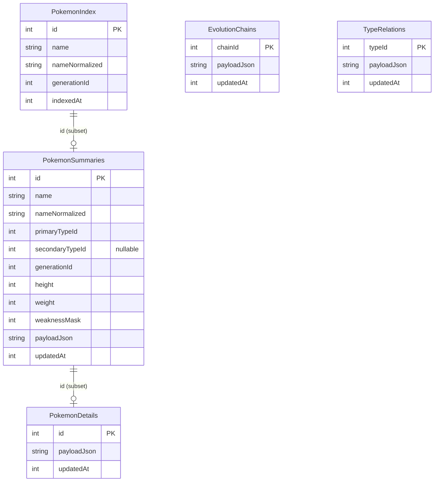

# Implementation Plan — Full Database Coverage (Search · Generations · Sort · Filters)

## Overview

Lift the four discovery surfaces (Search, Generations sheet, Sort sheet,
Filters sheet) off the paginated subset of Pokémon and onto the **entire
PokeAPI catalogue** (1025 entries today, growing) by introducing a single
lightweight global index — one `GET /pokemon?limit=100000` call → ~1300 rows
of `id + name + nameNormalized + generationId` persisted to a new Drift table
`PokemonIndex` (30-day TTL). Search, Sort, the Generations sheet's tile set,
and the Filters sheet's NumberRange bounds read from this index directly;
Type/Weakness/Height/Weight filters become progressively complete via a paced
background detail backfill (~8 concurrent, exponential backoff) that hydrates
every Pokémon into the existing `PokemonDetails` / `PokemonSummaries`
tables. Search results render as **skeleton cards** for non-hydrated rows
(id + name + sprite-url-derivable-from-id) and tap into the existing detail
flow.

A new **`IndexCoordinatorProvider`** (`{idle, loading, ready, stale, failed}`
state machine) sequences the index fetch after page-0 returns, exposes
`ready`/`stale`/`failed` to sheets, and gates the backfill on
`index.ready && online && listVM.isIdle`. The current hardcoded
`_kNumberRangeMax = 898` and the Generations sheet's `_starters` map are
**not deleted** — they become named **`IndexFallbacks`** used when the user
is offline and the index has never loaded (graceful degrade per the existing
`OfflineErrorWidget` / `StaleCacheBanner` pattern).

Branch flow per [[project_git-flow]]: the user opted to stay on the current
`feature/presentation-part4` branch for this plan (see "Branch placement"
under Risk Analysis). When PR time comes, slicing this 30-ish-point feature
will need extra care — see "Slicing" below.

## Problem Statement

The data layer's notion of "the world" today is bounded by what the user has
scrolled through. The brainstorm captured four sibling user-visible failures:

- **Search** (`pokemon_dao.dart:103-105`) only finds Pokémon already
  hydrated into `PokemonSummaries`. A user typing `"garchomp"` (#445, Gen IV)
  on first launch gets zero hits until they have scrolled past page 18.
- **Generations sheet** (`generations_sheet.dart:33-55`) renders eight
  hardcoded tiles for Gens I–VIII with `const _starters` IDs. Gen IX (rows
  906–1025, already supported by `generation_ranges.dart:17`) never reaches
  the UI. The "featured Pokémon" per tile is a const map that cannot vary.
- **Sort sheet** (`sort_sheet.dart`) orders only the hydrated subset, so
  "Smallest number first" appears stable but truncates at the user's most
  recent scroll position.
- **Filters NumberRange** (`filters_sheet.dart:19-29`) is hardcoded
  `1..898` — already misaligned with the range mapper's `1..1025` ceiling,
  and silently bakes in a future bug each time PokeAPI publishes a
  generation.

The brainstorm settled the design (single global index, paced detail
backfill, dynamic ceilings, skeleton search results, fresh-per-open random
trio). What this plan settles is the **execution surface**: state machines,
file layout, migration, edge-case handling, PR slicing, and tests.

## Proposed Solution

### Architecture — Two cache layers, one coordinator

```
┌─────────────────────────────────────────────────────────────────────┐
│ PRESENTATION                                                        │
│  PokemonListScreen ──reads── PokemonListViewModel                   │
│  Search/Sort/Filters/Generations sheets ──read── indexCoordinator   │
│                                            ──read── backfillStatus  │
└────────────────────────────┬────────────────────────────────────────┘
                             │ findPokemon / listGenerations / bounds
┌────────────────────────────▼────────────────────────────────────────┐
│ DOMAIN                                                              │
│  PokemonRepository (interface)                                      │
│  use cases:                                                         │
│    - findPokemon (extended: reads index, not summaries)             │
│    - listGenerations (new)                                          │
│    - getCatalogueBounds (new)                                       │
│    - refreshIndex (new)                                             │
└────────────────────────────┬────────────────────────────────────────┘
                             │
┌────────────────────────────▼────────────────────────────────────────┐
│ DATA                                                                │
│  PokemonRepositoryImpl                                              │
│   ├─ PokeApiService.getPokemonIndex(limit=100000)        ── NEW    │
│   ├─ PokemonDao (extended)                                          │
│   │    ├─ upsertIndex / readIndexBounds / listGenerationIds  ── NEW│
│   │    ├─ queryIndex / watchIndex (skeleton-aware)            ── NEW│
│   │    └─ existing summaries/details/evolution/types queries        │
│   ├─ IndexCoordinator (idle→loading→ready/stale/failed) ── NEW      │
│   └─ BackfillCoordinator (paced detail hydration)        ── NEW     │
│                                                                     │
│  AppDatabase (schemaVersion 2 → 3, additive: PokemonIndex)          │
└─────────────────────────────────────────────────────────────────────┘
```

### Data model — `PokemonIndex` as a sibling of `PokemonSummaries`

```dart
@DataClassName('PokemonIndexRow')
class PokemonIndex extends Table {
  IntColumn get id => integer()();                  // National Dex id (PK)
  TextColumn get name => text()();                  // raw lowercase name
  TextColumn get nameNormalized => text()();        // accent-stripped
  IntColumn get generationId => integer()();        // 0 for "unknown"
  IntColumn get indexedAt => integer()();           // epoch ms for TTL
  @override Set<Column<Object>> get primaryKey => {id};
}
```

Why a separate table rather than an `is_index_only` flag on `PokemonSummaries`:

- **Two TTLs, two failure modes.** Index refreshes every 30 days
  (`kPokemonIndexTtl`); summaries/details refresh every 7 days
  (`kPokemonCacheTtl`). One column can't carry both clocks cleanly.
- **Filter predicates stay unchanged.** Current DAO filter SQL
  (`pokemon_dao.dart:108-138`) reads `primaryTypeId`, `secondaryTypeId`,
  `weaknessMask`, `height`, `weight` — all on `PokemonSummaries`. If we
  added an `is_index_only` flag, every existing predicate would need a
  `WHERE is_index_only = 0` guard against NULLs in the type/weight columns.
  A separate table avoids that: filter predicates continue to operate on
  `PokemonSummaries` as today.
- **Index ⊇ Summaries** is enforced by writes, not schema: when the
  repository hydrates a summary, it also upserts the corresponding index
  row (in case the index hasn't loaded yet). When the index loads, it
  doesn't touch summaries.

ERD:



### `IndexCoordinatorProvider` — the state machine

```dart
enum IndexStatus { idle, loading, ready, stale, failed }

@freezed
class IndexState with _$IndexState {
  const factory IndexState({
    required IndexStatus status,
    int? minId, int? maxId, int? totalCount,
    Set<int>? generationIds,
    Failure? lastError,
  }) = _IndexState;
  factory IndexState.idle() => const IndexState(status: IndexStatus.idle);
}

@Riverpod(keepAlive: true)
class IndexCoordinator extends _$IndexCoordinator {
  @override Future<IndexState> build() async {
    final hydrated = await ref.read(pokemonRepositoryProvider).readIndexState();
    if (hydrated.status == IndexStatus.idle) {
      // Don't fire here — wait for the list VM to signal page-0 returned to
      // avoid competing with its 24-detail fan-out on the same connection.
      return hydrated;
    }
    return hydrated;
  }

  Future<void> loadIfNeeded() async { /* idle/stale/failed → fire fetch */ }
  Future<void> refresh() async { /* force-refresh on user pull */ }
}
```

State transitions:

| From    | Trigger                                       | To       |
|---------|-----------------------------------------------|----------|
| idle    | `loadIfNeeded()` + online                     | loading  |
| idle    | `loadIfNeeded()` + offline (no cached index)  | failed   |
| loading | fetch success                                 | ready    |
| loading | fetch failure                                 | failed   |
| ready   | TTL expiry (lazy, on next `loadIfNeeded()`)   | stale    |
| stale   | `refresh()` success                           | ready    |
| stale   | `refresh()` failure                           | stale    | <!-- keep serving -->
| failed  | `refresh()` success                           | ready    |

Sheets read `IndexCoordinator` as a synchronous `AsyncValue` and pick UI per
status (see "Per-surface offline matrix" below).

### `BackfillCoordinator` — paced detail hydration

```dart
@Riverpod(keepAlive: true)
class BackfillCoordinator extends _$BackfillCoordinator {
  static const _concurrent = kIsWeb ? 4 : 8;     // web throttles harder
  static const _backoffBase = Duration(seconds: 2);
  static const _maxConsecutiveErrors = 5;        // halt session after N

  @override Stream<BackfillProgress> build() async* {
    // Wait for: index.ready + connectivity.online + listVM.idle
    // Then drain (PokemonIndex - PokemonSummaries) at _concurrent in flight.
    // Pause on offline; resume on reconnect (idempotent via summary updatedAt).
    // On _maxConsecutiveErrors 429s/5xx in a row, halt for the session.
  }
}

@freezed
class BackfillProgress with _$BackfillProgress {
  const factory BackfillProgress({
    required int hydrated, required int total,
    required bool isRunning, required bool isHaltedThisSession,
  }) = _BackfillProgress;
}
```

The "X of Y" header in Filters reads this stream. The backfill writes into
the existing `PokemonSummaries` (and `PokemonDetails`) tables — no schema
changes; resume after app kill is automatic because the "what's left" query
is `SELECT id FROM pokemon_index WHERE id NOT IN (SELECT id FROM
pokemon_summaries)`. The same loop already exists informally inside
`PokemonRepositoryImpl.getPokemonList` (`pokemon_repository_impl.dart:70`)
which calls `_remote.fetchPokemon` per id; this extracts and parameterizes
that pattern.

### Sequencing — first launch, online

```
t=0    PokemonListScreen mounts
t=0    PokemonListViewModel.build() → fires getPokemonList(limit=24, offset=0)
       │
       │ (page-0 in flight: 24 fetchPokemon calls + 18 type-relation calls)
       ▼
t≈2s   page-0 returns; AsyncData(items: 24) emitted to UI
       │
       │ ViewModel calls indexCoordinator.loadIfNeeded()
       ▼
t≈2s   IndexCoordinator: idle → loading; fires /pokemon?limit=100000
       │
       │ (~200KB JSON; ~1s on broadband)
       ▼
t≈3s   IndexCoordinator: loading → ready; emits {minId:1, maxId:1025,
                                                 generationIds:{1..9}}
       │
       │ BackfillCoordinator wakes: index.ready ✓, online ✓, listVM.idle ✓
       ▼
t≈3s   Backfill starts draining remaining ~1276 ids at 8 concurrent
       │
       │ Filters sheet header now reads "Filtering across 24 of 1025 Pokémon"
       ▼
t→∞    Header progresses to "1025 of 1025"; backfill goes idle
```

If the user opens the Generations sheet before t≈3s, the sheet shows
**`IndexFallbacks`** (the 8 hardcoded gens) with a subtle "Loading full
catalogue…" hint; it switches to data-driven tiles when `IndexState.status`
becomes `ready`. Same pattern for the Filters NumberRange slider (disabled +
shimmer, then live) and for Search (falls back to `PokemonSummaries` search
until index ready).

### Per-surface offline matrix

| Surface | No index + offline | Index loaded + offline | Index loaded + online |
|---|---|---|---|
| **Search** | `findPokemon` over hydrated `PokemonSummaries`; empty-state copy reads "Search limited to N downloaded Pokémon" | Search the index; on tap, if detail not cached → inline `OfflineErrorWidget` on card | Search the index; tap → detail (cache-first, hydrates if needed) |
| **Generations** | `IndexFallbacks` (8 hardcoded gens, fixed starter trios), title hint "Showing offline gens" | Data-driven tiles from index; random 3 per tile | Data-driven tiles from index; random 3 per tile |
| **Sort** | Works (sort is presentation over whatever rows we have) | Works | Works |
| **Filters → NumberRange** | `IndexFallbacks` (`1..898`), slider enabled | Index min/max, slider enabled | Index min/max, slider enabled |
| **Filters → Types/Weaknesses/H/W** | Header reads "Filtering across N downloaded Pokémon (offline)" | Header reads "Filtering across X of Y Pokémon" | Header reads "Filtering across X of Y Pokémon" |

### Search results — skeleton cards

When the index returns a match whose detail isn't in `PokemonSummaries`:

```dart
class _SkeletonPokemonCard extends StatelessWidget {
  // id, name, derived sprite url
  // type chips replaced by ShimmerChips
  // tap → context.go('/pokemon/$id') → detail screen hydrates on demand
}
```

Sprite URL is derivable from id without any detail call:
`https://raw.githubusercontent.com/PokeAPI/sprites/master/sprites/pokemon/other/official-artwork/{id}.png`
(same convention already used in `generations_sheet.dart:206`). A 404 on the
sprite URL falls back to a generic placeholder (some PokeAPI alt-form ids
have no official artwork).

On tap failures:
- **404 from `getPokemonDetail`**: evict the row from `PokemonIndex`, show
  snackbar "This Pokémon is no longer available."
- **429**: snackbar "Too many requests, try again in a moment" — do NOT
  auto-retry (user is in foreground; backfill backoff handles ambient
  retries).
- **Offline**: navigate to detail screen anyway; existing detail VM handles
  `StaleWithError` / offline error states.
- **Rapid taps on 5+ skeletons in <1s**: only the last navigation wins;
  pending detail fetches for the others are cancelled via existing
  `_discoverySeq` pattern adapted to detail fetches.

### Generations sheet — data-driven tiles + random trio

```dart
@riverpod
Future<List<GenerationTile>> generationTiles(Ref ref) async {
  final state = await ref.watch(indexCoordinatorProvider.future);
  if (state.status == IndexStatus.ready || state.status == IndexStatus.stale) {
    return _buildTiles(state.generationIds!);
  }
  return _indexFallbackTiles; // 8 hardcoded gens
}

@riverpod
class GenerationSampleSeed extends _$GenerationSampleSeed {
  @override int build() => DateTime.now().microsecondsSinceEpoch;
  void reshuffle() => state = DateTime.now().microsecondsSinceEpoch;
}

@riverpod
Future<List<int>> generationSample(Ref ref, int generationId) async {
  final seed = ref.watch(generationSampleSeedProvider);
  final members = await ref.read(pokemonRepositoryProvider)
                          .listGenerationMembers(generationId);
  if (members.isEmpty) return const [];
  final rng = Random(seed ^ generationId);
  return _randomDistinct(members, min(3, members.length), rng);
}
```

The seed is stored in a separate provider so the sheet's `build()` calls
`generationSampleSeedProvider.notifier.reshuffle()` in its
`Navigator.push`-time-equivalent hook (`showSheetOrDialog`'s `onShow`
callback or, more simply, in the `GenerationsSheet`'s `initState`). Re-rolls
on close-and-reopen; frozen during a single open (no flicker on keyboard,
scroll, theme change). If a generation has < 3 members, render what's
available — don't pad with question marks. If `generationId == 0`
("unknown"), drop from the tile set (no label exists for it).

Rapid open/close throttle: if `reshuffle()` is called more than once per
second (debug/QA), it's a no-op. Cheap guard against animated-reopen jank.

### NumberRange — disabled-then-live

The slider renders disabled with a shimmer track until
`IndexCoordinator.status == ready || stale`. Once live, `min` and `max`
read from the index. A user who opens Filters before the index resolves
sees the slider's "Loading full catalogue…" tooltip instead of the
fallback `1..898` that would later silently expand. This avoids the bug
where a user sets `1..898`, the index lands, and their saved filter no
longer covers Gen IX.

### Slicing — three PRs

Given the user's choice to keep this on `feature/presentation-part4`, the
cleanest split is three commits-as-PRs against that branch (or three
distinct PRs into the upstream branch the user picks at merge time). All
slicing options keep the layer order intact: **data → domain → presentation**.

| PR  | Scope                                                            | Touches                                                                                  | Est. points |
|-----|------------------------------------------------------------------|------------------------------------------------------------------------------------------|-------------|
| 1   | Data layer: `PokemonIndex` table + DAO methods + Retrofit + repo | `app_database.dart`, `pokemon_dao.dart`, `poke_api_service.dart`, `pokemon_repository_impl.dart`, mappers | ~8          |
| 2   | Domain: 3 new use cases + extended `findPokemon` + coordinators  | `find_pokemon.dart` (extended), `list_generations.dart` (new), `get_catalogue_bounds.dart` (new), `refresh_index.dart` (new), `index_coordinator.dart` (new in data/presentation glue), `backfill_coordinator.dart` (new) | ~10         |
| 3   | Presentation: 4 sheets + skeleton search + offline matrix + tests | `filters_sheet.dart`, `generations_sheet.dart`, `sort_sheet.dart`, `search_field.dart` integration, `pokemon_list_view_model.dart`, `_SkeletonPokemonCard` (new), `IndexFallbacks` (new) | ~12         |

Two alternatives weighed and rejected:

- **2-PR split** (data+domain → presentation): each PR ~18 pt, past the
  threshold where thorough review degrades, and forces reviewers to switch
  between an architectural review and a UI/UX review in a single sitting.
- **5-PR split** (table → DAO → use cases → coordinators → sheets):
  over-sliced for a project where each layer is a single coherent change;
  multiplies CI overhead with no clarity gain because earlier PRs aren't
  usable on their own.

## Acceptance Criteria

### Functional Requirements

- [ ] `PokemonIndex` table exists; `AppDatabase.schemaVersion` is 3; the
      v2→v3 migration creates it without touching existing data.
- [ ] On first launch online, after page-0 returns, the app calls
      `/pokemon?limit=100000` exactly once and persists the response to
      `PokemonIndex`.
- [ ] `IndexCoordinator` transitions through `idle → loading → ready` on
      success and `idle → loading → failed` on network failure.
- [ ] After 30 days, the next `loadIfNeeded()` transitions
      `ready → stale → loading → ready` (refresh succeeds online) or
      `ready → stale` (refresh skipped or failed; previous data still
      served).
- [ ] `BackfillCoordinator` starts only after
      `IndexStatus.ready && online && listVM.isIdle` is satisfied.
- [ ] Backfill pauses when connectivity drops to `none` and resumes within
      2s of reconnect.
- [ ] Backfill halts for the session after 5 consecutive 429/5xx errors
      and exposes that state via `BackfillProgress.isHaltedThisSession`.
- [ ] Search returns every Pokémon in the index by name (case- and
      diacritic-insensitive) and by id (with leading-zero tolerance).
- [ ] Search results for non-hydrated rows render as `_SkeletonPokemonCard`
      with id, name, sprite, and shimmering type chips.
- [ ] Tapping a skeleton search result navigates to the detail screen and
      hydrates the row into `PokemonSummaries` / `PokemonDetails`.
- [ ] Skeleton tap that returns 404 evicts the row from `PokemonIndex`
      and shows a "This Pokémon is no longer available" snackbar.
- [ ] Generations sheet renders one tile per `DISTINCT generationId` in
      the index (so Gen IX appears automatically); `generationId == 0`
      ("unknown") is excluded.
- [ ] Each Generations tile shows 3 random distinct Pokémon sprites,
      frozen during a single sheet open, reshuffled on close-and-reopen.
- [ ] If a generation has < 3 members in the index, the tile renders what
      it has (no question-mark padding).
- [ ] NumberRange slider `min`/`max` reads from the index when
      `status ∈ {ready, stale}`; renders disabled with shimmer otherwise.
- [ ] Filters sheet header reads `"Filtering across X of Y Pokémon"` while
      backfill is running and `"Filtering across all Y Pokémon"` when
      `X == Y`.
- [ ] When offline with no cached index, each surface degrades per the
      "Per-surface offline matrix" table above.
- [ ] `IndexFallbacks` is a single named source for the offline defaults
      (`_starters` trios per gen, `_kNumberRangeMax = 898`); the old
      constants are removed from the sheets after refactor.

### Non-Functional Requirements

- [ ] Cold-start page-0-to-UI time does not regress (measured: first
      `AsyncData` emit ≤ same as `main` ± 100ms).
- [ ] Index fetch is single-flight (concurrent `loadIfNeeded()` calls
      coalesce, no duplicate requests).
- [ ] Web build uses `_concurrent = 4` for backfill; native uses `8`.
- [ ] Drift inserts during backfill are batched (~50 rows per
      transaction) on web to mitigate known IndexedDB bulk-insert latency
      ([[project_analyzer9-toolchain]]).
- [ ] No new lint or analyzer warning introduced
      ([[project_analyzer9-toolchain]] — use `dart analyze`, not
      `flutter analyze`).

### Quality Gates

- [ ] VGV ≥ 80% test coverage on all new code (Princípio 11).
- [ ] DAO unit tests for `upsertIndex`, `readIndexBounds`,
      `listGenerationIds`, `queryIndex`, `watchIndex` against an
      in-memory `AppDatabase.forTesting`.
- [ ] Repository tests for the new use cases and for the
      `IndexCoordinator` state machine (transitions, refresh, single-flight).
- [ ] `BackfillCoordinator` tests for: connectivity-pause, idempotent
      resume, 429-halt-after-N, web concurrency cap.
- [ ] Widget tests for each sheet against `index.ready`,
      `index.loading`, `index.failed`, and `index.stale` (`IndexFallbacks`
      visible only in `failed`-with-no-cache + offline).
- [ ] Widget test for `_SkeletonPokemonCard` rendering + tap-to-hydrate.
- [ ] Widget test for Generations sheet reshuffle on close-and-reopen.
- [ ] Golden test for the Filters sheet NumberRange in `loading`
      (shimmer) and `ready` (live) states.
- [ ] Migration test: v2 database with populated `PokemonSummaries`
      upgrades to v3 without data loss; `PokemonIndex` is empty afterward.

## Alternative Approaches Considered

- **Extend `PokemonSummaries` with an `is_index_only` flag**: cheaper
  schema change but every existing filter predicate would need a guard
  against null type/weight columns. Rejected for the cross-cutting risk to
  filter SQL that's already shipping.
- **Pre-fetch every detail on first launch** (no index, just brute-force
  pagination): ~1300 HTTP calls and ~10MB downloads before the app feels
  usable. Rejected in brainstorm.
- **PokeAPI `ETag`-based revalidation** instead of a 30-day TTL: turns the
  refresh into a free `304 Not Modified` most of the time. Deferred — the
  Dio client doesn't currently track ETags and this is an optimization,
  not a correctness fix. Worth a follow-up task once this feature ships.
- **Hide skeleton search results**: cleaner cards but defeats "use the
  entire database" intent for Search. Rejected in brainstorm.

## Dependencies & Prerequisites

- **None blocking.** All new code sits on top of the existing data layer
  (Drift v2, Retrofit, repository, connectivity).
- **Drift 2.31 is pinned** ([[project_analyzer9-toolchain]]) — schema
  bump to v3 is additive and within 2.31's capabilities (no new column
  types or features used).
- **Existing widgets reused**: `OfflineErrorWidget`,
  `StaleCacheBanner`, `EmptySearchWidget`, `EmptyFilterWidget`,
  `EmptyGenerationWidget`, `AppBottomSheet`, the shimmer skeleton from
  the list — no new error/empty primitives.

## Risk Analysis & Mitigation

### Index fetch races with page-0
**Risk:** the existing `PokemonListViewModel.build()` already fires 24
detail fetches in parallel via `getPokemonList`. If the index fetch fires
concurrently, both compete on the same connection pool and Dio's default
4-connection-per-host limit may serialize them — slow on cold start, with a
small risk of triggering 429s.
**Mitigation:** sequence the index fetch *after* page-0's `AsyncData`
emit (see "Sequencing" above). Costs ~1–2s of latency before the index
becomes available, but the sheets that need it aren't typically opened in
the first 2s anyway, and they have `IndexFallbacks` if they are.

### Drift web bulk-insert slowness
**Risk:** persisting ~1300 index rows in one shot on web may stall the
event loop for visible jank ([[project_analyzer9-toolchain]] notes
drift-web bulk-insert latency).
**Mitigation:** insert in batches of 100 inside a single transaction; if
that still janks (measure on first PR), drop to 50.

### Backfill battery/data leak on persistent 429
**Risk:** without a session-halt, a flaky network could keep retrying the
backfill indefinitely.
**Mitigation:** halt for the session after 5 consecutive 429/5xx errors
(tracked in `BackfillProgress.isHaltedThisSession`). Resumes only on next
cold start.

### Branch placement
**Risk:** keeping this on `feature/presentation-part4` mixes a presentation
slice with a multi-layer epic. PR review will be heavier than it should
be, and CI runs will recompile data-layer changes against presentation-only
diffs.
**Mitigation:** at PR time, consider one of: (a) split the
`feature/presentation-part4` branch into two PRs (presentation-only first,
then this feature against the same upstream), or (b) cherry-pick the
data/domain commits onto a fresh `epic/full-database-coverage` branch. The
user is aware (see brainstorm Key Decisions) and chose to keep them
together for now.

### Storage quota on Safari web
**Risk:** Safari prompts at 50MB. ~10MB total cache (index + summaries +
details + chains + types) is well under, but a returning user with stale
backfilled data plus a fresh backfill could double-write transiently.
**Mitigation:** backfill is idempotent — re-running on the same id is a
`INSERT … ON CONFLICT UPDATE`, not an extra row. Worst-case is one write
not two. No mitigation beyond awareness needed.

## Success Metrics

- **Catalogue completeness**: after first online launch with no
  pre-existing cache, a search for any Pokémon in the index returns within
  one second (whether hydrated or skeleton).
- **No regression on cold-start UX**: time-to-first-list-paint ≤ existing
  baseline + 100ms. Measure with the existing perf overlay.
- **Backfill completion**: on a steady broadband connection, the
  `indexing X/Y` indicator reaches `Y` within 5 minutes of first launch.
- **Test coverage**: ≥ 80% on all new files (Princípio 11).
- **Zero new analyzer warnings** (`dart analyze` per
  [[project_analyzer9-toolchain]]).

## Future Considerations

- **ETag-based index revalidation** to make 30-day refresh free.
- **Stat-based sorts** (HP / Attack / Speed) that read
  `PokemonIndex LEFT JOIN PokemonDetails` — naturally extensible from the
  Sort sheet's new query shape.
- **Generation grouping in the Sort sheet** (already a Tech Spec hint),
  now feasible because the index knows generation membership for every id.
- **Global backfill progress indicator** in the list screen header — open
  question in brainstorm; defer until a user complains that filter results
  "drift."

## Documentation Plan

- Update CLAUDE.md (or create one — currently absent) with the
  index/summaries split and the coordinator pattern, once the feature ships.
- Update `docs/architecture/` (if it exists) with the new ERD and
  coordinator state machine.
- Add a brief README comment block in `pokemon_dao.dart` distinguishing
  index-aware queries from summary-aware queries.

## References & Research

### Internal References

- Brainstorm: `docs/brainstorm/2026-05-27-full-database-coverage-brainstorm-doc.md`
- Existing schema and migration: `lib/core/database/app_database.dart:97-124`
- DAO filter SQL: `lib/features/pokemon/data/datasources/pokemon_dao.dart:86-143`
- Local data source interface:
  `lib/features/pokemon/data/datasources/pokemon_local_data_source.dart`
- Repository implementation: `lib/features/pokemon/data/repositories/pokemon_repository_impl.dart`
- Retrofit service: `lib/features/pokemon/data/services/poke_api_service.dart`
- Repository interface: `lib/features/pokemon/domain/repositories/pokemon_repository.dart`
- `findPokemon` use case: `lib/features/pokemon/domain/usecases/find_pokemon.dart`
- Generations sheet (constants + UI): `lib/features/pokemon/presentation/widgets/sheets/generations_sheet.dart:33-55, 206`
- Filters sheet (NumberRange constants): `lib/features/pokemon/presentation/widgets/sheets/filters_sheet.dart:19-29`
- Generation range mapper: `lib/features/pokemon/data/mappers/generation_ranges.dart:17`
- List ViewModel pagination model: `lib/features/pokemon/presentation/view_models/pokemon_list_view_model.dart`

### External References

- PokeAPI list endpoint:
  https://pokeapi.co/docs/v2#pokemon-section (paginated, supports
  arbitrary `limit`/`offset`)
- Official-artwork sprite URL convention:
  `https://raw.githubusercontent.com/PokeAPI/sprites/master/sprites/pokemon/other/official-artwork/{id}.png`
- Drift migrations: https://drift.simonbinder.eu/migrations/
  (additive schema bumps via `MigrationStrategy.onUpgrade`)

### Related Work

- Previous PRs on `feature/presentation-part4`: adaptive sheets,
  master-detail compact list, number-range filter, shimmer skeletons
  (commit `26e6286`).
- Brainstorm flagged open questions are addressed inline in this plan
  (sequencing, fallbacks, backfill lifecycle, slider-during-load).
