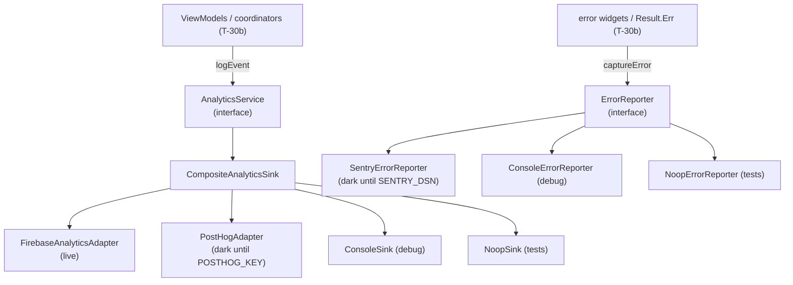
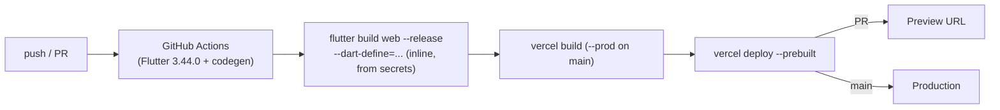
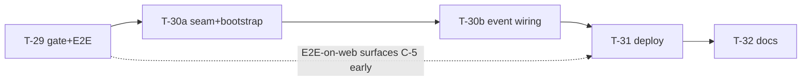

# feat: Quality & Release epic (T-29 · T-30 · T-31 · T-32)

> **Type:** enhancement (epic) · **Branch:** `epic/quality` · **Parts:** 5 independent PRs
> **Source brainstorm:** [`docs/brainstorm/2026-05-28-quality-and-release-brainstorm-doc.md`](../brainstorm/2026-05-28-quality-and-release-brainstorm-doc.md)
> **Backlog:** T-29…T-32 (`docs/project/04-backlog.md:384-420`) · **Detail level:** Extensive
> **Revised after `/plan-technical-review`** (2026-05-28): T-30 split into T-30a/T-30b; coverage-gate, dependency-pin, deploy-trigger, and bootstrap corrections applied.

## 1. Summary

The data, domain, and presentation layers are merged. This epic turns a
feature-complete app into a **shippable, observable, verifiably-tested,
documented** product — closing the MVP backlog. It ships as **five independent
PR parts off `epic/quality`**, in dependency order:

| Part | Task      | One-liner                                                              | Depends on               |
| ---- | --------- | ---------------------------------------------------------------------- | ------------------------ |
| 1    | **T-29**  | Test pyramid (E2E) + honest, enforced coverage gate                    | —                        |
| 2    | **T-30a** | Observability seam: interfaces, sinks, 3 adapters, `bootstrap()`, deps | T-29 (gate exists)       |
| 3    | **T-30b** | Wire the 9 PRD §12 events across the presentation layer                | T-30a                    |
| 4    | **T-31**  | GitHub-Actions-builds / Vercel-hosts-prebuilt web deploy               | T-28 ✓, **T-30b merged** |
| 5    | **T-32**  | README runbook + git-cliff CHANGELOG + ADRs                            | T-31                     |

**Net outcome:** a public, deep-linkable web URL behind a green CI that gates
format → analyze → enforced coverage floor → E2E flow; an instrumentation seam
shipping with Firebase on and two vendors a flag away; and docs that let a new
dev run the project in a day.

---

## 2. Research findings (resolved during planning)

### 2.1 Coverage is already healthy — T-29 is plumbing, not test-writing

Measured from the committed `coverage/lcov.info`:

| Bucket                      | Lines hit / total | Coverage     |
| --------------------------- | ----------------- | ------------ |
| Blended (current CI number) | 3337 / 4441       | **75.1%**    |
| **Hand-written only**       | 2282 / 2406       | **94.8%** ✅ |
| Generated only              | 1055 / 2035       | 51.8%        |

> **Conclusion:** excluding generated code lifts the measured floor to **94.8%**
> — a 14.8-point margin over the 80% gate. **No new unit tests are required** to
> pass the gate. The brainstorm's fallback (targeted unit tests on low-covered
> hand-written files) is **moot**.

The single hand-written outlier is `lib/core/database/app_database.dart` at
**18.9%** (10/53) — Drift's declarative table/schema DSL, exercised indirectly
through the DAO. Not a real gap; do **not** chase it.

### 2.2 Verified codebase facts

- **Generated code is git-ignored** (`*.g.dart`, `*.freezed.dart`, `*.drift.dart`,
  `*.mocks.dart`, `*.config.dart` — `.gitignore:47-52`) and **regenerated in CI**
  (`ci.yaml:38-39` runs `dart run build_runner build`). The lcov exclusion must
  strip **all five** globs (only the first two exist today; the rest are
  forward-safety, matching `.gitignore`).
- **No observability deps resolved yet** (no firebase/sentry/posthog in
  `pubspec.lock`). T-30 adds them.
- **All deploy/docs artifacts are greenfield**: no `vercel.json`, `build.sh`,
  `.firebaserc`, `firebase.json`, `lib/firebase_options.dart`, or `CHANGELOG.md`.
  → **T-31 includes first-time Vercel project setup** (N-4 resolved).
- **`main.dart` is a bare `runApp`** (`lib/main.dart`) — no guarded zone, no
  `FlutterError.onError`, no `PlatformDispatcher.onError`. T-30 owns a new
  `bootstrap()`.
- **Router has no `errorBuilder`** and uses `int.parse` (not `tryParse`) on the
  `/pokemon/:id` path param (`lib/app/router/app_router.dart`). The T-31 SPA
  rewrite makes malformed deep-links reachable → **new failure mode to handle**.
- **No `String.fromEnvironment` / `--dart-define` usage exists yet** — T-30
  introduces the flag surface from scratch.
- **Drift WASM assets committed** in `web/` (`drift_worker.js`, `sqlite3.wasm`).
- **Commit history is clean Conventional Commits** (feat 21, docs 22, refactor 8,
  fix 5, test 3, chore 3) → git-cliff CHANGELOG is feasible.

### 2.3 External-integration specifics (verified current, 2026)

| Dep                  | Latest stable                      | Key note                                                                                       |
| -------------------- | ---------------------------------- | ---------------------------------------------------------------------------------------------- |
| `firebase_core`      | `^4.9.0`                           | web supported                                                                                  |
| `firebase_analytics` | `^12.4.1`                          | `firebase_options.dart` via `flutterfire configure` **required** for web                       |
| `sentry_flutter`     | `9.20.0`                           | web supported; installs own `PlatformDispatcher.onError`; **empty DSN ⇒ effectively disabled** |
| `posthog_flutter`    | `5.25.1`                           | web wraps **PostHog JS** (snippet in `web/index.html`); Dart `setup()` path is mobile          |
| `git-cliff`          | action `orhun/git-cliff-action@v4` | `cliff.toml` + `git-cliff -o CHANGELOG.md`                                                     |

> ⚠️ **API correction (load-bearing):** the Flutter/Dart `FirebaseAnalytics.setConsent`
> takes **named booleans**, _not_ a `ConsentStatus`/`ConsentType` enum (those are
> native-SDK-only). Use:
>
> ```dart
> await analytics.setConsent(
>   adStorageConsentGranted: false,
>   adPersonalizationSignalsConsentGranted: false, // Consent Mode v2
>   adUserDataConsentGranted: false,               // Consent Mode v2
>   analyticsStorageConsentGranted: true,
> );
> ```

### 2.4 PRD §12 event call-site map (verified by tracing the presentation layer)

State management is **Riverpod 3 generators** (`@riverpod` AsyncNotifier classes +
Freezed state records). Each event maps to a concrete site:

| Event                 | Call site (`file` → method)                                         | Properties (RNF-09 safe)            |
| --------------------- | ------------------------------------------------------------------- | ----------------------------------- |
| `list_viewed`         | `pokemon_list_view_model.dart` `_enterBrowse()` / first data render | `origin` (cold/warm), `count`       |
| `search_performed`    | `pokemon_list_view_model.dart` `_enterDiscovery()` (after `Ok`)     | `result_count` — **never the term** |
| `filter_applied`      | `pokemon_list_view_model.dart` `applyFilter()`                      | type/weakness/height presence flags |
| `sort_changed`        | `pokemon_list_view_model.dart` `changeSort()`                       | `criteria` (enum name)              |
| `generation_selected` | `pokemon_list_view_model.dart` `selectGeneration()`                 | `generation` (int)                  |
| `pokemon_opened`      | `pokemon_card.dart` `onTap`                                         | `id`, `primary_type`                |
| `detail_tab_changed`  | `pokemon_detail_screen.dart` `_TabsState` tab listener              | `tab` (about/stats/evolution)       |
| `evolution_navigated` | `evolution_tab.dart` `_StageCard` `onTap`                           | `source_id`, `dest_id`              |
| `error_shown`         | error widgets + swallow points (see §4.3 table)                     | `te_code`, `screen`                 |

> Sites identified by method name (line numbers omitted — they shift the moment
> T-30b edits these files; method names are stable).

Failure→TE mapping lives in `lib/core/error/failure.dart` (sealed `Failure`:
`NetworkFailure`→TE-01, `CacheFailure`→TE-01/02, `TimeoutFailure`→TE-06,
`NotFoundFailure`→TE-03, `ServerFailure`→TE-07, `RateLimitFailure`→TE-08,
`ParsingFailure`→TE-09).

---

## 3. Pinned decisions

From the brainstorm's Open Questions + four planning-time confirmations:

| #   | Decision                                                                                                                                                                         | Rationale                                                                                                                                                                                          |
| --- | -------------------------------------------------------------------------------------------------------------------------------------------------------------------------------- | -------------------------------------------------------------------------------------------------------------------------------------------------------------------------------------------------- |
| D-1 | **Coverage gate: `lcov --remove` + awk/`lcov --summary` threshold.** Keep `flutter test --coverage`, strip the **4** generated globs, enforce ≥80% with a zero-dependency check. | Transparent, tool-agnostic; exclusion lives in CI, not source. **Do not** use `very_good test --min-coverage` here — it re-runs tests and re-measures _unfiltered_ coverage, defeating the filter. |
| D-2 | **E2E runs on headless Chrome (web), blocking, in the existing CI job.**                                                                                                         | Matches the Web deploy target; no Android-emulator boot cost; exercises the Drift-WASM path.                                                                                                       |
| D-3 | **Firebase: anonymize, no consent prompt.** Disable ad/ad-personalization/ad-user-data signals; analytics-storage on; anonymous aggregate events only.                           | RNF-09 (no PII) satisfied without out-of-scope consent UI.                                                                                                                                         |
| D-4 | **CHANGELOG: git-cliff** (`cliff.toml`, generated from full history).                                                                                                            | Config-driven, fits clean Conventional-Commit history; no release-PR machinery.                                                                                                                    |
| D-5 | **Observability lives in `lib/core/observability/`** — no package split.                                                                                                         | Consistent with single-package feature-first layout; YAGNI.                                                                                                                                        |
| D-6 | **Split interfaces** `AnalyticsService` + `ErrorReporter`.                                                                                                                       | Product analytics vs crash reporting are different concerns; a unified API leaks no-ops.                                                                                                           |
| D-7 | **Vendor selection: composite sink + `--dart-define`.** Debug defaults to ConsoleSink; Firebase ships on; Sentry/PostHog dark until keyed.                                       | "Configure all, use one" via a flag-flip, not a code change.                                                                                                                                       |
| D-8 | **T-31 includes first-time Vercel provisioning** (project + secrets).                                                                                                            | No Vercel artifacts exist in the repo.                                                                                                                                                             |
| D-9 | **COEP fallback to `credentialless`** if `require-corp` breaks artwork loading.                                                                                                  | Cross-origin sprite images must still render under cross-origin isolation (see C-5).                                                                                                               |

---

## 4. Authoritative tables (the plan's contract)

### 4.1 `--dart-define` flag surface

Single source of truth across local dev (README), CI build (T-31), and runtime
reads (T-30). **Empty/missing key ⇒ adapter stays dark AND logs a one-line
notice** (no silent no-op).

| Flag                | Type   | Default (no flag)          | Gates                                       | Value source (CI)                                          |
| ------------------- | ------ | -------------------------- | ------------------------------------------- | ---------------------------------------------------------- |
| `ANALYTICS_ENABLED` | bool   | `false`                    | master analytics switch                     | literal `true` in deploy workflow; unset (false) elsewhere |
| `SENTRY_DSN`        | string | `''` (dark)                | `SentryErrorReporter`                       | GH secret `SENTRY_DSN`                                     |
| `POSTHOG_KEY`       | string | `''` (dark)                | `PostHogAdapter`                            | GH secret `POSTHOG_KEY`                                    |
| `POSTHOG_HOST`      | string | `https://us.i.posthog.com` | PostHog endpoint                            | literal/secret                                             |
| `ENVIRONMENT`       | string | `development`              | tags events/errors (`preview`/`production`) | literal per workflow                                       |

> **Decision (revised):** pass flags **inline via `--dart-define`** in the
> workflow, sourced from GitHub secrets (which are masked in logs) and literals —
> **no `env/*.json` file tree** (YAGNI for a solo MVP; revisit if the team or
> environments grow). Read at runtime with `String.fromEnvironment(...)` /
> `bool.fromEnvironment('ANALYTICS_ENABLED')`.
>
> Note on `ANALYTICS_ENABLED`: a `fromEnvironment` default **cannot** vary by
> build mode in Dart. "On in release" is achieved by the **deploy workflow
> passing `--dart-define=ANALYTICS_ENABLED=true`**, not by a build-mode-aware
> default. Local debug runs omit the flag → `false` → ConsoleSink.

### 4.2 Build-mode × flags → active sinks (truth table)

| Context        | `ANALYTICS_ENABLED` | Keys present                        | Active sinks                                                   |
| -------------- | ------------------- | ----------------------------------- | -------------------------------------------------------------- |
| `flutter test` | any                 | any                                 | **NoopSink only** (no console spam, no network)                |
| debug run      | false               | none                                | ConsoleSink                                                    |
| debug run      | true                | Firebase                            | ConsoleSink + Firebase                                         |
| release/prod   | true                | Firebase (+Sentry/PostHog if keyed) | Firebase (+ keyed vendors); **no Console**                     |
| preview (PR)   | per matrix (§4.4)   | preview keys or none                | Console/Noop or preview-env vendors — **never prod analytics** |

### 4.3 `error_shown` ⇒ TE-code mapping (resolves C-3)

| User-visible state             | Site                                              | TE             | Emits `error_shown`?             |
| ------------------------------ | ------------------------------------------------- | -------------- | -------------------------------- |
| Full-screen offline/error      | `OfflineErrorWidget` / `GenericErrorWidget` build | TE-01/03/06/07 | **yes**                          |
| Stale-cache banner             | `StaleCacheBanner` (list refresh fail)            | TE-02          | **yes**                          |
| `loadMore` failure (swallowed) | `pokemon_list_view_model.dart` loadMore `Err`     | TE-01/08       | **yes** (was silently swallowed) |
| Empty search/filter/generation | empty-state widgets                               | —              | **no** (not an error)            |

### 4.4 Preview vs production environment matrix (resolves I-6)

| Setting                        | PR preview                        | `main` production |
| ------------------------------ | --------------------------------- | ----------------- |
| `ENVIRONMENT`                  | `preview`                         | `production`      |
| `ANALYTICS_ENABLED`            | `false` (or preview Firebase env) | `true`            |
| `SENTRY_DSN`                   | empty (dark)                      | prod DSN (secret) |
| `POSTHOG_KEY`                  | empty (dark)                      | prod key (secret) |
| `vercel.json` headers/rewrites | applied (catches C-5 early)       | applied           |

> **Rule:** previews must **not** emit to production analytics/crash projects.

---

## 5. Part 1 — T-29: Test pyramid & coverage gate

**Goal:** add the missing top of the pyramid (E2E for two critical flows) and
make coverage honest (exclude generated) and enforced (≥80% gate in CI).

**Commit prefix:** `test` · **PR:** `test: integration E2E + enforced coverage gate (T-29)`

### 5.1 Files

| Action | Path                                                                    | Purpose                                                                                                                          |
| ------ | ----------------------------------------------------------------------- | -------------------------------------------------------------------------------------------------------------------------------- |
| add    | `integration_test/app_test.dart`                                        | E2E: search→detail (UC-02/06) + pagination (UC-01)                                                                               |
| add    | `integration_test/helpers/e2e_harness.dart`                             | seeds in-memory Drift + mock Dio; disables backfill                                                                              |
| add    | `test_driver/integration_test.dart`                                     | the **literal standard** 2-line `integrationDriver()` entrypoint — required for `flutter drive` on web (do not add custom logic) |
| add    | `pubspec.yaml` → `dev_dependencies: integration_test: { sdk: flutter }` | E2E runner                                                                                                                       |
| modify | `.github/workflows/ci.yaml`                                             | lcov exclusion + ≥80% gate (test job) + **separate** E2E job                                                                     |

### 5.2 Coverage gate (CI step, after `flutter test --coverage`)

**Mechanism (corrected, per review):** filter, then check with a zero-dependency
step. **Do not** call `very_good test --min-coverage` — it re-runs the suite and
re-measures _unfiltered_ coverage, undoing the `lcov --remove`.

```bash
sudo apt-get install -y lcov
# strip generated code so the gate measures only what we author.
# 4 globs (not 5): *.mocks.dart is mockito codegen — this project uses mocktail,
# which generates nothing, so that glob is dead. *.drift.dart / *.config.dart are
# kept as forward-safety (real codegen outputs if those generators are added).
lcov --remove coverage/lcov.info \
  '*.g.dart' '*.freezed.dart' '*.drift.dart' '*.config.dart' \
  -o coverage/lcov.info --ignore-errors unused
# enforce the floor — deterministic, no global tool activation, reads the filtered lcov
awk -F: '/^LF:/{lf+=$2} /^LH:/{lh+=$2} END{p=100*lh/lf; printf "coverage: %.1f%%\n",p; exit (p<80)}' coverage/lcov.info
```

> Measured post-exclusion baseline today: **94.8%** — record in the PR
> description. (`very_good_cli` remains a fine _local_ convenience; it is just not
> the CI gate.)

### 5.3 E2E harness (resolves C-4 determinism)

- **Override the Drift database provider with an in-memory DB** via
  **`ProviderScope(overrides: [...])` wrapping `PokedexApp()`** in
  `app_test.dart` — the same override pattern the existing widget tests use
  (`AppDatabase.forTesting(...)` / `appDatabaseProvider` both exist and support
  this). In-memory sidesteps the `flutter drive` web-server _not_ emitting
  COOP/COEP (→ no `SharedArrayBuffer` → Drift would otherwise pick a degraded
  backend); the dependency on cross-origin isolation disappears entirely.
- **Mock the Dio client / seed the cache** with fixtures (reuse
  `test/fixtures/` + `test/features/pokemon/presentation/fixtures/`) so flows
  never hit live PokeAPI (no TE-08 flakiness, deterministic timing).
- **Disable/stub `backfillCoordinatorProvider`** (the Home screen kicks off
  `unawaited(_kickoffCatalogueCoverage())` on build — must not race the test).

> The **deep-link error-path E2E** (`/pokemon/<non-numeric>` /
> `/pokemon/<non-existent>` → TE-03) lives in **T-31**, alongside the
> `tryParse` + `errorBuilder` fix it verifies. Writing it here would test a
> not-yet-existing fix.

### 5.4 CI E2E step (headless Chrome) — **separate job**

Run E2E in its own job (or a step strictly _after_ the coverage gate has consumed
`lcov.info`). **Never** pass `--coverage` to `flutter drive` — it must not write
into the file the gate measures (keeps "E2E not in the gate" honest).

```yaml
e2e:
  runs-on: ubuntu-latest
  steps:
    - uses: actions/checkout@v4
    - uses: subosito/flutter-action@v2
      with: { channel: stable, flutter-version: 3.44.0 }
    - run: flutter pub get --enforce-lockfile
    - run: dart run build_runner build
    - uses: nanasess/setup-chromedriver@v2
    - run: chromedriver --port=4444 &
    - run: |
        flutter drive \
          --driver=test_driver/integration_test.dart \
          --target=integration_test/app_test.dart \
          -d web-server --browser-name chrome --headless
```

> Also switch the existing **test job** to `flutter pub get --enforce-lockfile`
> so the gate measures the locked graph.

### 5.5 Acceptance criteria

- [ ] `integration_test/app_test.dart` covers **search → open detail** (UC-02/06)
      and **pagination** (UC-01); both pass in CI on headless Chrome.
- [ ] E2E is **deterministic**: in-memory Drift override via `ProviderScope`,
      mocked/seeded data, no live PokeAPI, backfill coordinator stubbed;
      documented expected wall-clock.
- [ ] Pyramid respected: many unit, some widget/golden, **few** E2E.
- [ ] CI strips the **4 generated globs** from lcov and **fails below 80%** using
      the awk/`lcov --summary` check (not `very_good test`).
- [ ] Post-exclusion baseline (≥80%, measured 94.8%) recorded in PR description.
- [ ] E2E runs in a **separate job**; `flutter drive` is **not** run with
      `--coverage`; E2E coverage is **not** merged into the lcov gate.
- [ ] Both CI jobs use `flutter pub get --enforce-lockfile`.

---

## 6. Part 2 — T-30a: Observability seam, adapters & bootstrap

**Goal:** stand up the complete `lib/core/observability/` seam (split interfaces,
typed events, sinks, 3 adapters, providers) plus a `bootstrap()` with global
crash hooks and Firebase init. **Ships no event emissions yet** — the seam is
fully exercised by its own unit tests.

**Commit prefix:** `feat(core)` · **PR:** `feat(core): observability seam + bootstrap (T-30a)`

> **Split note:** T-30 was split into **T-30a (this part — seam + bootstrap)**
> and **T-30b (event wiring)** per the technical review. The boundary is
> compile-enforced: T-30a defines all 9 `AnalyticsEvent` constructors; T-30b only
> _calls_ them. Each part leaves the tree green.

### 6a.1 Architecture



### 6a.2 Files

| Action | Path                                                              | Purpose                                                                                |
| ------ | ----------------------------------------------------------------- | -------------------------------------------------------------------------------------- |
| add    | `lib/core/observability/analytics_service.dart`                   | `abstract AnalyticsService { void logEvent(AnalyticsEvent) }`                          |
| add    | `lib/core/observability/error_reporter.dart`                      | `abstract ErrorReporter { void captureError(Object, StackTrace?, {Failure?}) }`        |
| add    | `lib/core/observability/analytics_event.dart`                     | sealed `AnalyticsEvent` + all 9 constructors + RNF-09-safe property builders           |
| add    | `lib/core/observability/sinks/composite_analytics_sink.dart`      | fan-out to enabled adapters                                                            |
| add    | `lib/core/observability/sinks/console_sink.dart`                  | debug default                                                                          |
| add    | `lib/core/observability/sinks/noop_sink.dart`                     | test default                                                                           |
| add    | `lib/core/observability/adapters/firebase_analytics_adapter.dart` | live; consent-anonymized init                                                          |
| add    | `lib/core/observability/adapters/posthog_adapter.dart`            | dark until `POSTHOG_KEY`; **no-op on web for MVP** (see §6a.5)                         |
| add    | `lib/core/observability/adapters/sentry_error_reporter.dart`      | dark until `SENTRY_DSN`                                                                |
| add    | `lib/core/observability/observability_providers.dart`             | Riverpod providers + **inline `--dart-define` reads** (§4.1) — no separate config file |
| add    | `lib/bootstrap.dart`                                              | guarded zone + crash hooks + sink/Firebase init (resolves C-2)                         |
| modify | `lib/main.dart`                                                   | call `bootstrap(() => PokedexApp())`                                                   |
| add    | `lib/firebase_options.dart`                                       | via `flutterfire configure` (web target)                                               |
| add    | `pubspec.yaml`                                                    | firebase_core, firebase_analytics, sentry_flutter, posthog_flutter                     |

> **`observability_config.dart` merged into `observability_providers.dart`** (per
> review — five `String/bool.fromEnvironment` reads don't warrant a separate file
> whose only consumer is the providers). **No `web/index.html` change** and **no
> `env/*.json` tree** (see §6a.5 and §4.1).

### 6a.3 Dependency-resolution guardrail (resolves the analyzer-9 pin risk)

The new SDKs are **runtime** deps (they don't pull `analyzer`/`build_runner`/
`source_gen`), but adding 4 deps forces a full version-solve that _could_ lift the
**unpinned** `build_runner ^2.4.0` / `json_serializable ^6.0.0` and move the
analyzer line the exact pins exist to fence.

- **Add deps in a separate commit from any seam code.** Run
  `flutter pub get` + `dart run build_runner build` locally on `epic/quality`,
  then **diff `pubspec.lock`**: `analyzer`, `source_gen`, `_fe_analyzer_shared`,
  `drift_dev`, `freezed`, `riverpod_generator` must be **unchanged**.
- If the solve perturbs the analyzer line, pin `firebase_core`/`firebase_analytics`
  exact (and stop to reassess) rather than letting codegen slide to `-dev`.
- Commit the new `pubspec.lock`.

### 6a.4 `bootstrap()` (resolves C-2 / O-2 — single owner)

Corrected per review: a **synchronous fallback reporter** is assigned _before_
any `await`, so the zone's `onError` always has a non-null target even if init
throws. Sentry, when keyed, owns the platform hooks via its `appRunner`; the
manual hooks are installed only on the **non-Sentry (dark) path** to avoid
double-ownership.

```dart
// lib/bootstrap.dart
Future<void> bootstrap(Widget Function() builder) async {
  // 1) Always-available fallback BEFORE any await (resolves the stub bug).
  ErrorReporter reporter = ConsoleErrorReporter(); // or Noop under tests
  await runZonedGuarded(() async {
    WidgetsFlutterBinding.ensureInitialized();
    final config = ObservabilityConfig.fromEnvironment();

    if (config.firebaseEnabled) {
      await Firebase.initializeApp(options: DefaultFirebaseOptions.currentPlatform);
      await FirebaseAnalytics.instance.setConsent(
        adStorageConsentGranted: false,
        adPersonalizationSignalsConsentGranted: false, // Consent Mode v2 (named bool, NOT an enum)
        adUserDataConsentGranted: false,               // Consent Mode v2
        analyticsStorageConsentGranted: true,
      );
    }

    if (config.sentryDsn.isNotEmpty) {
      // Sentry owns FlutterError.onError + PlatformDispatcher.onError via appRunner.
      await SentryFlutter.init(
        (o) => o.dsn = config.sentryDsn,
        appRunner: () => _runApp(config, reporter = SentryErrorReporter(), builder),
      );
    } else {
      // Dark path: install our own hooks against the fallback/console reporter.
      FlutterError.onError = (d) => reporter.captureError(d.exception, d.stack);
      PlatformDispatcher.instance.onError = (e, s) { reporter.captureError(e, s); return true; };
      _runApp(config, reporter, builder);
    }
  }, (e, s) => reporter.captureError(e, s)); // never a stub
}

void _runApp(ObservabilityConfig c, ErrorReporter r, Widget Function() builder) =>
    runApp(ProviderScope(overrides: observabilityOverrides(c, r), child: builder()));
```

### 6a.5 RNF-09 enforcement & PostHog-on-web deferral

- `AnalyticsEvent` builders accept **only** the whitelisted properties in §2.4 —
  no free-form `Map<String,Object>` passthrough. `search_performed` exposes a
  **count**, never the raw term. Enforced at the type level.
- Firebase consent anonymized per D-3 (§6a.4).
- **PostHog on web is deferred (YAGNI):** `posthog_flutter` web requires a JS
  snippet in `web/index.html` that initializes _statically_ at page load —
  unable to read `--dart-define`, so a committed snippet would fire on **every
  preview** regardless of flags, breaking "dark until keyed" and preview
  isolation (§4.4). Since PostHog ships **dark** for the MVP, `PostHogAdapter`
  **no-ops on web** (`if (kIsWeb) return;` until keyed). When PostHog is actually
  enabled, inject its init from Dart / template `index.html` at build time — not
  before. No `web/index.html` change in this part.

### 6a.6 Coverage interaction (resolves O-3)

- **Test the seam logic with fakes** — CompositeSink fan-out, flag→sink selection
  (§4.2 truth table), RNF-09 property whitelist, `bootstrap()` crash-hook capture
  (including the **init-throws → fallback reporter** path), NoopSink-under-test.
  This is the bulk and is fully testable.
- For the unavoidable literal SDK calls inside adapters, use
  **`// coverage:ignore-start` / `// coverage:ignore-end` around individual
  lines**. **No directory-level lcov exclusion** of `adapters/` — that would be
  the false-confidence anti-pattern. (This is an explicit AC.)

### 6a.7 Acceptance criteria (T-30a)

- [ ] `AnalyticsService` and `ErrorReporter` are separate interfaces in
      `lib/core/observability/`; `AnalyticsEvent` defines all 9 constructors.
- [ ] `bootstrap()` installs crash capture: **uncaught** errors reach the reporter
      via `FlutterError.onError` + `PlatformDispatcher.onError` + guarded zone;
      a test throws during init and asserts the **fallback** reporter captured it.
- [ ] Sentry vs manual hook ownership is single (no double-install); documented.
- [ ] No PII (RNF-09); Firebase ad signals disabled; test asserts the no-PII whitelist.
- [ ] Sink selection matches the §4.2 truth table; **NoopSink under `flutter test`**.
- [ ] Missing/empty `SENTRY_DSN`/`POSTHOG_KEY` ⇒ adapter dark **and logs a notice**.
- [ ] `firebase_options.dart` committed (web).
- [ ] **`pubspec.lock` diff shows `analyzer`/`source_gen`/`_fe_analyzer_shared`
      and all codegen pins unchanged**; `build_runner build` succeeds; deps landed
      in a separate commit from seam code.
- [ ] **No directory-level coverage exclusion** for `adapters/`; only
      line-level `// coverage:ignore`.

---

## 6b. Part 3 — T-30b: Wire the 9 PRD §12 events

**Goal:** emit all 9 §12 events at the verified call sites (§2.4), one
property-test per event. Consumes T-30a's interfaces/events; **adds no files to
`lib/core/observability/`**.

**Commit prefix:** `feat` · **PR:** `feat: wire PRD §12 analytics events (T-30b)` · **Depends on:** T-30a merged

### 6b.1 Files (modify only)

| Action | Path                                                                                | Events wired                                                                                                                                                                                                                                     |
| ------ | ----------------------------------------------------------------------------------- | ------------------------------------------------------------------------------------------------------------------------------------------------------------------------------------------------------------------------------------------------ |
| modify | `pokemon_list_view_model.dart`                                                      | `list_viewed` (`_enterBrowse`), `search_performed` (`_enterDiscovery` after `Ok`), `filter_applied` (`applyFilter`), `sort_changed` (`changeSort`), `generation_selected` (`selectGeneration`), `error_shown` (swallowed `loadMore` `Err`, §4.3) |
| modify | `pokemon_card.dart`                                                                 | `pokemon_opened` (`onTap`)                                                                                                                                                                                                                       |
| modify | `pokemon_detail_screen.dart`                                                        | `detail_tab_changed` (`_TabsState` tab listener)                                                                                                                                                                                                 |
| modify | `evolution_tab.dart`                                                                | `evolution_navigated` (`_StageCard` `onTap`)                                                                                                                                                                                                     |
| modify | `offline_error_widget.dart`, `generic_error_widget.dart`, `stale_cache_banner.dart` | `error_shown` with TE code per §4.3                                                                                                                                                                                                              |

ViewModels/coordinators read the injected `AnalyticsService`/`ErrorReporter` via
`ref`; widgets get them via `ProviderScope` (consistent with the existing graph).

### 6b.2 Acceptance criteria (T-30b)

- [ ] All 9 §12 events emit from the §2.4 sites; **each has a test** asserting it
      fires with the correct RNF-09-safe properties (resolves N-5), using the
      mocktail + `ProviderContainer.overrideWith` pattern.
- [ ] Handled failures are reported with their TE code.
- [ ] `error_shown` fires for **every** state in the §4.3 table — including the
      stale-cache banner (TE-02) and the **formerly-swallowed** `loadMore` failure.
- [ ] Coverage stays ≥80% (these are testable presentation edits).

---

## 7. Part 4 — T-31: Web deploy on Vercel

**Goal:** GitHub Actions builds `flutter build web --release` (pinned 3.44.0),
pushes the prebuilt artifact to Vercel; `vercel.json` carries SPA rewrites +
COOP/COEP. PR→preview, `main`→production.

**Commit prefix:** `ci` · **PR:** `ci: web deploy to Vercel (prebuilt) (T-31)` · **Depends on:** T-30b merged (prod must ship the observability bootstrap — O-1)

### 7.1 Deploy flow



### 7.2 Files

| Action          | Path                             | Purpose                                                                                                                    |
| --------------- | -------------------------------- | -------------------------------------------------------------------------------------------------------------------------- |
| add             | `vercel.json`                    | `outputDirectory: build/web`, SPA rewrites, COOP/COEP headers                                                              |
| add             | `.github/workflows/deploy.yml`   | build + `vercel pull/build/deploy --prebuilt`; **prod trigger = `main` only**                                              |
| modify          | `lib/app/router/app_router.dart` | `int.tryParse` + `errorBuilder` → TE-03 (resolves C-1)                                                                     |
| modify          | `integration_test/app_test.dart` | add deep-link error E2E (`/pokemon/<non-numeric>`, `/pokemon/<non-existent>` → TE-03) — colocated with the fix it verifies |
| (no `build.sh`) | —                                | superseded by GitHub-Actions-builds approach                                                                               |

### 7.3 `vercel.json`

```json
{
  "$schema": "https://openapi.vercel.sh/vercel.json",
  "outputDirectory": "build/web",
  "framework": null,
  "rewrites": [{ "source": "/(.*)", "destination": "/index.html" }],
  "headers": [
    {
      "source": "/(.*)",
      "headers": [
        { "key": "Cross-Origin-Opener-Policy", "value": "same-origin" },
        { "key": "Cross-Origin-Embedder-Policy", "value": "require-corp" }
      ]
    },
    {
      "source": "/index.html",
      "headers": [
        {
          "key": "Cache-Control",
          "value": "public, max-age=0, must-revalidate"
        }
      ]
    }
  ]
}
```

> **C-5 mitigation:** `require-corp` requires every cross-origin subresource to
> send CORP. Official artwork loads from `raw.githubusercontent.com` via
> `cached_network_image`. If images break on the **preview** deploy, switch
> `Cross-Origin-Embedder-Policy` to **`credentialless`** (still enables
> `crossOriginIsolated`/`SharedArrayBuffer`, allows no-CORS cross-origin loads).

### 7.4 Deploy job (prebuilt)

**Triggers (resolves the git-flow issue):** production deploys **only** on push to
`main`; previews on `pull_request`. **Exclude `epic/**`and`develop`** from
production (the CI workflow triggers on `epic/\*\*`—`deploy.yml` must not).

```yaml
on:
  push:
    branches: [main] # production only
  pull_request: # preview only
env:
  VERCEL_ORG_ID: ${{ secrets.VERCEL_ORG_ID }}
  VERCEL_PROJECT_ID: ${{ secrets.VERCEL_PROJECT_ID }}
  PROD: ${{ github.ref == 'refs/heads/main' && '--prod' || '' }}
  TARGET_ENV: ${{ github.ref == 'refs/heads/main' && 'production' || 'preview' }}
steps:
  - uses: actions/checkout@v4
  - uses: subosito/flutter-action@v2
    with: { channel: stable, flutter-version: 3.44.0 }
  - run: flutter pub get --enforce-lockfile # reproducible: locked graph
  - run: dart run build_runner build
  - run: npm i -g vercel@<pinned-version> # not @latest
  - run: vercel pull --yes --environment=$TARGET_ENV --token=$VERCEL_TOKEN
  # Flags passed INLINE from secrets/literals (no env/*.json file in CI).
  # Preview omits ANALYTICS_ENABLED and the prod DSN/key (stays dark — §4.4).
  - run: |
      flutter build web --release \
        --dart-define=ENVIRONMENT=$TARGET_ENV \
        ${{ github.ref == 'refs/heads/main' && format('--dart-define=ANALYTICS_ENABLED=true --dart-define=SENTRY_DSN={0} --dart-define=POSTHOG_KEY={1}', secrets.SENTRY_DSN, secrets.POSTHOG_KEY) || '' }}
  - run: vercel build $PROD --token=$VERCEL_TOKEN
  - run: vercel deploy --prebuilt $PROD --token=$VERCEL_TOKEN
```

- **First-time setup (D-8):** run `vercel link` locally once to mint
  `.vercel/project.json`, then add `VERCEL_TOKEN`, `VERCEL_ORG_ID`,
  `VERCEL_PROJECT_ID` (+ `SENTRY_DSN`, `POSTHOG_KEY`) as GitHub secrets. Documented
  as a one-time runbook step in the PR.

### 7.5 Acceptance criteria

- [ ] Push to `main` publishes **production**; PR generates a **preview URL**;
      `epic/**`/`develop` pushes do **not** trigger a production deploy.
- [ ] Direct access to `/pokemon/25` resolves (SPA rewrites) — and `/pokemon/abc`
      / `/pokemon/<huge>` render **TE-03** via `tryParse` + `errorBuilder` (C-1),
      verified by the deep-link E2E added here.
- [ ] Deployed preview verified: **(a)** Drift WASM loads (SharedArrayBuffer
      present) **and (b)** Pokémon artwork renders under COEP — else `credentialless`
      applied (C-5).
- [ ] Deploy is **atomic**: build → upload → promote; a failed build never
      promotes; any deploy-step error fails the job non-zero (resolves I-5).
- [ ] Build is reproducible: `flutter pub get --enforce-lockfile` + pinned Vercel CLI.
- [ ] Previews do **not** emit to production analytics/crash projects (§4.4).
- [ ] Rollback procedure (`vercel rollback` / re-promote prior) documented.
- [ ] Build flow documented in the README (handoff to T-32).

---

## 8. Part 5 — T-32: Final docs & CHANGELOG

**Goal:** README runbook, git-cliff CHANGELOG from Conventional Commits, ADRs for
non-obvious decisions.

**Commit prefix:** `docs` · **PR:** `docs: runbook, CHANGELOG, ADRs (T-32)`

### 8.1 Files

| Action         | Path                                                             | Purpose                                                                                                                                                                                               |
| -------------- | ---------------------------------------------------------------- | ----------------------------------------------------------------------------------------------------------------------------------------------------------------------------------------------------- |
| modify         | `README.md`                                                      | full runbook: arch overview, 3.44.0 pin, `--dart-define` flags (§4.1), enable-Sentry/PostHog-locally + verify (I-2), deploy flow, rollback, `sqlite3.wasm`/`drift_worker.js` version-match note (N-6) |
| add            | `cliff.toml`                                                     | Conventional-Commit → grouped CHANGELOG config                                                                                                                                                        |
| add            | `CHANGELOG.md`                                                   | generated via `git-cliff -o CHANGELOG.md`                                                                                                                                                             |
| add            | `docs/adr/0001-github-actions-builds-vercel-hosts.md`            | deploy decision                                                                                                                                                                                       |
| add            | `docs/adr/0002-split-observability-interfaces.md`                | T-30 decision                                                                                                                                                                                         |
| add            | `docs/adr/0003-coop-coep-and-image-cross-origin.md`              | C-5 decision (COOP/COEP + cross-origin images)                                                                                                                                                        |
| add (optional) | `.github/workflows` CHANGELOG step OR document local `git-cliff` | regeneration path                                                                                                                                                                                     |

> The generated-code coverage-exclusion rationale is **not** a standalone ADR
> (per review) — it's documented inline as a comment in `ci.yaml` (§5.2) and in
> §2.1/§5.2 of this plan, which is sufficient.

### 8.2 Acceptance criteria

- [ ] README lets a new dev clone→build→test→deploy in a day; includes the 3.44.0
      pin, the `--dart-define` flag table, **local Sentry/PostHog enable + verify**
      steps (I-2), and the deploy/rollback runbook.
- [ ] `CHANGELOG.md` generated from commit history via git-cliff (`cliff.toml`).
- [ ] ADRs 0001–0003 record the non-obvious decisions in `docs/adr/`.
- [ ] README documents `sqlite3.wasm`/`drift_worker.js` version-match note (N-6).

---

## 9. Cross-part dependencies & ordering



- **O-1:** T-31's "production on `main`" is only honest after **T-30b is merged**
  (prod must ship the observability bootstrap + wired events + RNF-09-compliant
  Firebase init). Gate T-31's go-to-prod on T-30b merged.
- **O-2:** `lib/bootstrap.dart` is a **T-30a** deliverable; T-30b and T-31 must not
  re-edit the bootstrap (T-31 only adds the web entrypoint build).
- **O-3:** T-30a's vendor adapters interact with T-29's gate — handle per §6a.6
  (line-level `// coverage:ignore` only, never a directory exclusion).
- **O-4:** Running E2E on web in T-29 is a deliberate **early-warning for C-5**
  (same Drift-WASM/SharedArrayBuffer stack).
- **O-5:** T-32's CHANGELOG depends on Conventional-Commit hygiene across all
  parts — the repo already complies; keep it up in T-29–T-31.

---

## 10. Risks & mitigations

| Risk                                                 | Severity | Mitigation                                                                                   |
| ---------------------------------------------------- | -------- | -------------------------------------------------------------------------------------------- |
| COEP `require-corp` breaks artwork images (C-5)      | High     | Verify on preview; fall back to `credentialless` (D-9)                                       |
| Malformed deep-link crashes app (C-1)                | High     | `tryParse` + `errorBuilder` → TE-03 in T-31; deep-link E2E case in T-31 (colocated with fix) |
| Uncaught crashes escape reporter (C-2)               | High     | `bootstrap()` installs hooks + sync fallback reporter; tested incl. init-throws              |
| New SDKs perturb the analyzer-9 codegen pin          | High     | Deps in a separate commit; diff `pubspec.lock`; pin exact if solve moves analyzer (§6a.3)    |
| PostHog web snippet fires on every preview           | Med      | Defer `web/index.html`; adapter no-ops on web until keyed (§6a.5)                            |
| `very_good test` re-measures unfiltered coverage     | Med      | Use awk/`lcov --summary` after `lcov --remove` (§5.2)                                        |
| Firebase default collection vs RNF-09 (I-4)          | High     | D-3 anonymized consent; test asserts ad signals off                                          |
| E2E flakiness (live API / backfill race) (C-4)       | Med      | In-memory Drift + mocked data + stubbed backfill                                             |
| Drift WASM degraded under `flutter drive` web-server | Med      | In-memory DB override in E2E harness (no SAB dependency)                                     |
| Vendor glue drags coverage gate (O-3)                | Med      | Fake-based seam tests; justified narrow exclusion                                            |
| Preview emits to prod analytics (I-6)                | Med      | §4.4 env matrix; previews dark                                                               |
| Deploy half-promotes a bad build (I-5)               | Med      | Atomic build→upload→promote; job fails non-zero; rollback doc                                |

---

## 11. Items requiring user/external action (before/at T-30a & T-31)

- [ ] **Firebase project** + `flutterfire configure` (web) to generate
      `lib/firebase_options.dart`. _(T-30a)_
- [ ] **Sentry project** → DSN; **PostHog project** → key. _(optional now; dark
      until provided)_
- [ ] **Vercel project**: `vercel link` once; add GitHub secrets `VERCEL_TOKEN`,
      `VERCEL_ORG_ID`, `VERCEL_PROJECT_ID`, plus `SENTRY_DSN`, `POSTHOG_KEY`. _(T-31)_

---

## 12. Definition of done (epic)

- [ ] **Five** PRs merged to `epic/quality` in order T-29 → T-30a → T-30b →
      T-31 → T-32.
- [ ] CI gates: format → analyze → ≥80% hand-written coverage → E2E (green);
      both jobs use `--enforce-lockfile`.
- [ ] Public web URL live on `main`; deep links resolve (incl. TE-03 on bad ids);
      artwork + Drift WASM both work under COOP/COEP.
- [ ] Firebase live (anonymized), Sentry/PostHog wired and a flag-flip away.
- [ ] `pubspec.lock` analyzer/codegen pins unchanged after adding SDKs.
- [ ] README runbook + CHANGELOG + ADRs landed.
- [ ] `epic/quality` ready to PR into `develop` (per project git-flow).
