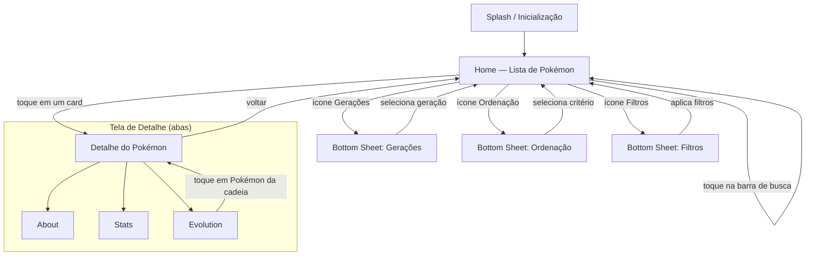
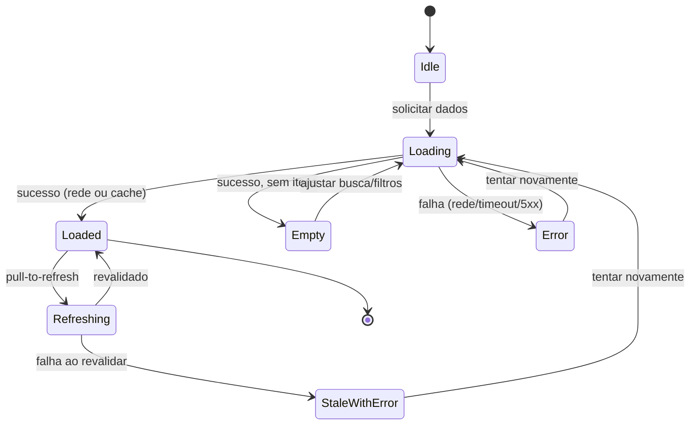
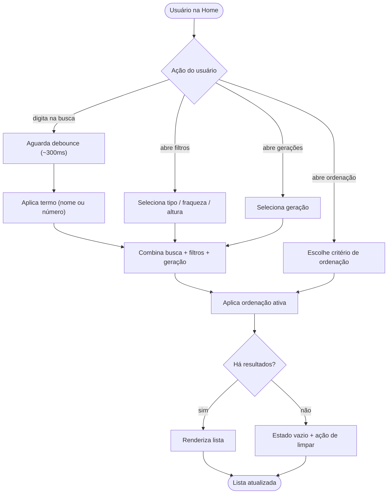
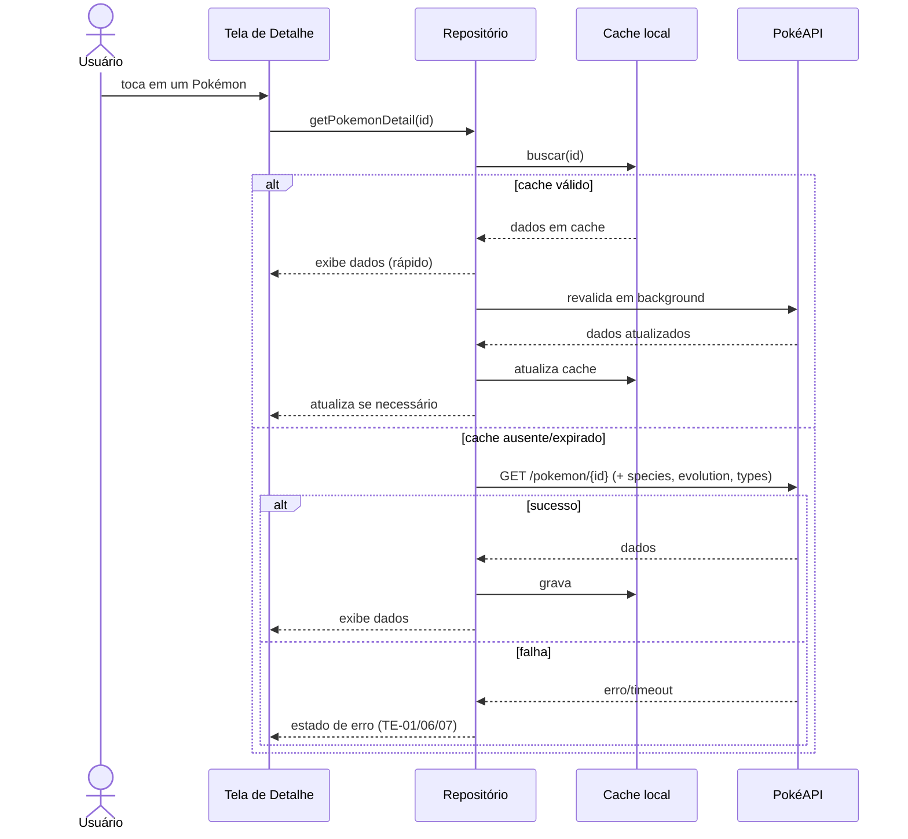
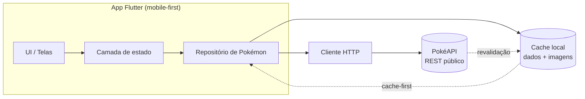
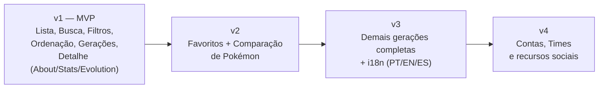

# Product Requirements Document (PRD) - Flutter Multiplataforma

| Campo                     | Valor                                                                                           |
| ------------------------- | ----------------------------------------------------------------------------------------------- |
| **Produto**               | Pokédex                                                                                         |
| **Versão do documento**   | 1.0                                                                                             |
| **Data**                  | 2026-05-24                                                                                      |
| **Autor**                 | Paulo Sabra                                                                                     |
| **Plataformas**           | Flutter Multiplataforma                                                                         |
| **Prioridade de entrega** | Mobile-first (web/desktop como adaptação responsiva)                                            |
| **Fonte de design**       | [Figma — Pokédex](https://www.figma.com/design/rpvcOZaPKfIXQNFtEDz5Xt/Pok%C3%A9dex?node-id=0-1) |
| **Fonte de dados**        | PokéAPI (REST público) + cache local                                                            |

---

## 1. Visão geral do produto

A **Pokédex** é um aplicativo de consulta enciclopédica de Pokémon, construído em Flutter para rodar a partir de uma única base de código em Mobile, Web e Desktop. O produto permite que o usuário **navegue, busque, filtre e ordene** Pokémon, e **explore detalhes completos** de cada criatura — dados de espécie, estatísticas de combate, defesas por tipo e cadeia evolutiva.

O MVP espelha fielmente o design do Figma fornecido e consome dados da **PokéAPI**, com uma camada de **cache local** para reduzir chamadas de rede, acelerar a navegação e garantir resiliência básica a falhas de conexão.

### 1.1 Problema

Fãs de Pokémon, jogadores e curiosos não têm uma referência rápida, bonita e multiplataforma para consultar dados de Pokémon de forma consistente. As fontes existentes são fragmentadas, pesadas ou voltadas a um único dispositivo.

### 1.2 Proposta de valor

Uma Pokédex **rápida, visualmente coerente com o universo Pokémon e disponível em qualquer dispositivo**, que entrega a informação certa em poucos toques, com identidade visual por tipo e navegação fluida.

### 1.3 Objetivos do produto (MVP)

1. Permitir consulta completa da **Geração I** (1ª entrega), com arquitetura preparada para as demais gerações.
2. Reproduzir com fidelidade o design do Figma em telas mobile.
3. Garantir tempo de resposta percebido baixo via cache local.
4. Tratar erros de rede e estados vazios de forma clara e amigável.

### 1.4 Métricas de sucesso

| Métrica                                                       | Meta MVP                      |
| ------------------------------------------------------------- | ----------------------------- |
| Tempo até a lista renderizar (cold start, com cache)          | < 1,5 s                       |
| Tempo de abertura da tela de Detalhe (com cache)              | < 800 ms                      |
| Taxa de erro não tratada (crash-free sessions)                | > 99,5%                       |
| Cobertura de dados exibidos vs. design do Figma               | 100% dos campos especificados |
| Sucesso de busca (consultas que retornam resultado relevante) | > 90%                         |

---

## 2. Personas

O Pokédex é, ao mesmo tempo, um produto para fãs e um **projeto de portfólio técnico**. Por isso, além dos usuários finais, ele é avaliado por profissionais de tecnologia que analisam o app em funcionamento, o repositório, a arquitetura e a experiência multiplataforma.

| Persona                           | Tipo              | Descrição                                                                                                   | Necessidade principal                                                                                                  | Prioritária no MVP |
| --------------------------------- | ----------------- | ----------------------------------------------------------------------------------------------------------- | ---------------------------------------------------------------------------------------------------------------------- | ------------------ |
| **Fã casual**                     | Usuário final     | Conhece Pokémon de forma leve, quer "dar uma olhada".                                                       | Navegar e buscar rapidamente, com visual agradável.                                                                    | Não                |
| **Jogador / estrategista**        | Usuário final     | Joga os games e quer dados de combate.                                                                      | Ver Base Stats, fraquezas, defesas de tipo e evolução.                                                                 | Não                |
| **Colecionador / curioso**        | Usuário final     | Gosta de completar e explorar a enciclopédia.                                                               | Filtrar por tipo/geração, ordenar e explorar todos.                                                                    | Não                |
| **Tech Recruiter**                | Avaliador técnico | Recrutador(a) técnico avaliando o projeto como amostra de competência.                                      | App funcional, polido e multiplataforma (link Web), README claro e fidelidade ao design — avaliável em poucos minutos. | Sim                |
| **Software Engineer e Tech Lead** | Avaliador técnico | Engenheiro(a), tech lead ou eng. manager revisando código e decisões (e papéis relacionados de tecnologia). | Código limpo e testado, arquitetura clara (MVVM + Clean), commits semânticos e documentação (PRD/Tech Spec/ADR).       | Sim                |

**Personas prioritárias do MVP:os avaliadores técnicos — **Tech Recruiter, Software Engineer e Tech Lead\*\* (definem o nível de acabamento, a fidelidade ao design, a qualidade do código e da documentação). Na prática, o MVP precisa ser, ao mesmo tempo, uma boa Pokédex e uma boa amostra de engenharia.

---

## 3. Escopo do MVP

> **Decisões estratégicas tomadas para este PRD:**
> Convenção de commits: **Conventional Commits** · Dados: **PokéAPI + cache local** · Escopo: **igual ao Figma** · Plataforma: **mobile-first**.

### 3.1 Dentro do escopo (v1)

- Tela **Home / Lista** com busca, alternância de visualização, ordenação e filtros.
- **Busca** por nome ou número da Pokédex Nacional.
- **Filtros** por tipo, fraqueza e altura (bottom sheet).
- **Ordenação** (menor número, maior número, A–Z, Z–A).
- **Gerações** (seleção de geração — Geração I disponível com dados completos no MVP).
- Tela de **Detalhe** com três abas: **About**, **Stats**, **Evolution**.
- **Cache local** dos dados consumidos da PokéAPI.
- **Tratamento de erros** de rede, timeout, recurso inexistente e estados vazios.

### 3.2 Fora do escopo (v1 — candidatos a v2+)

- Favoritar / marcar Pokémon.
- Comparação lado a lado de Pokémon.
- Autenticação / contas de usuário.
- Times (team builder) e simulação de combate.
- Notificações, gamificação e conquistas.
- Backend próprio (BFF) — o MVP consome a PokéAPI diretamente.
- Internacionalização além do idioma padrão (PT/EN a definir na v1).

---

## 4. Mapa de telas e navegação

O app é **mobile-first**: filtros, ordenação e gerações abrem como **bottom sheets** no mobile e devem se adaptar a **modais/painéis laterais** em telas largas (web/desktop).



### 4.1 Inventário de telas (origem: Figma)

| ID   | Tela                | Tipo         | Origem Figma                          |
| ---- | ------------------- | ------------ | ------------------------------------- |
| T-01 | Home / Lista        | Tela         | `Home`, `Home All`                    |
| T-02 | Filtros             | Bottom sheet | `Filters`, `Filters - Scrolled`       |
| T-03 | Ordenação           | Bottom sheet | `Sort`, `Sort - Scrolled`             |
| T-04 | Gerações            | Bottom sheet | `Generation`, `Generation - Scrolled` |
| T-05 | Detalhe — About     | Tela / aba   | `Profile #N - About`                  |
| T-06 | Detalhe — Stats     | Tela / aba   | `Profile #N - Stats`                  |
| T-07 | Detalhe — Evolution | Tela / aba   | `Profile #N - Evolution`              |

---

## 5. Requisitos funcionais

Notação: **RF-XX** (requisito funcional). Prioridade conforme MoSCoW: **MUST**, **SHOULD**, **COULD**.

### 5.1 Home / Lista (T-01)

| ID    | Requisito                                                                                                   | Prioridade |
| ----- | ----------------------------------------------------------------------------------------------------------- | ---------- |
| RF-01 | Exibir lista de Pokémon em cards contendo: número nacional (#NNN), nome, badges de tipo e imagem (artwork). | MUST       |
| RF-02 | Colorir o fundo de cada card conforme o **tipo primário** do Pokémon.                                       | MUST       |
| RF-03 | Carregar a lista de forma paginada (scroll infinito), buscando lotes adicionais conforme o usuário rola.    | MUST       |
| RF-04 | Exibir título "Pokédex" e subtítulo orientando a busca por nome ou número.                                  | MUST       |
| RF-05 | Disponibilizar barra de busca com placeholder "What Pokémon are you looking for?".                          | MUST       |
| RF-06 | Disponibilizar três ações no cabeçalho: alternar visualização, ordenação e filtros.                         | MUST       |
| RF-07 | Exibir indicador de carregamento (skeleton/placeholder) enquanto a primeira página carrega.                 | SHOULD     |
| RF-08 | Permitir alternância de visualização (ex.: densidade de card / grade vs. lista).                            | COULD      |

### 5.2 Busca

| ID    | Requisito                                                                             | Prioridade |
| ----- | ------------------------------------------------------------------------------------- | ---------- |
| RF-09 | Buscar por **nome** (parcial, case-insensitive) e por **número** da Pokédex Nacional. | MUST       |
| RF-10 | Aplicar **debounce** na digitação (≈300 ms) para evitar consultas excessivas.         | MUST       |
| RF-11 | Filtrar a lista em tempo real conforme o texto digitado.                              | MUST       |
| RF-12 | Exibir estado vazio amigável quando nenhum Pokémon corresponder à busca.              | MUST       |
| RF-13 | Permitir limpar a busca e retornar à listagem completa.                               | SHOULD     |

### 5.3 Filtros (T-02)

| ID    | Requisito                                                                        | Prioridade |
| ----- | -------------------------------------------------------------------------------- | ---------- |
| RF-14 | Filtrar por **Tipo** (Grass, Fire, Water, Electric, etc.).                       | MUST       |
| RF-15 | Filtrar por **Fraqueza** (tipos contra os quais o Pokémon é fraco).              | SHOULD     |
| RF-16 | Filtrar por **Altura** (categorias: baixa / média / alta).                       | COULD      |
| RF-17 | Permitir múltiplos filtros combinados e exibir contagem de resultados.           | SHOULD     |
| RF-18 | Permitir **limpar todos os filtros** em uma ação.                                | MUST       |
| RF-19 | Aplicar filtros e refletir o resultado imediatamente na lista ao fechar o sheet. | MUST       |

### 5.4 Ordenação (T-03)

| ID    | Requisito                                          | Prioridade |
| ----- | -------------------------------------------------- | ---------- |
| RF-20 | Ordenar por **menor número primeiro** (padrão).    | MUST       |
| RF-21 | Ordenar por **maior número primeiro**.             | MUST       |
| RF-22 | Ordenar **A–Z** (alfabético crescente por nome).   | MUST       |
| RF-23 | Ordenar **Z–A** (alfabético decrescente por nome). | MUST       |
| RF-24 | Indicar visualmente o critério de ordenação ativo. | MUST       |

### 5.5 Gerações (T-04)

| ID    | Requisito                                                                                                    | Prioridade |
| ----- | ------------------------------------------------------------------------------------------------------------ | ---------- |
| RF-25 | Listar gerações disponíveis (I, II, III, IV, …) em cards.                                                    | MUST       |
| RF-26 | Filtrar a lista pelos Pokémon da geração selecionada.                                                        | MUST       |
| RF-27 | Indicar visualmente a geração ativa.                                                                         | MUST       |
| RF-28 | No MVP, garantir dados completos para a **Geração I**; demais gerações habilitadas conforme disponibilidade. | MUST       |

### 5.6 Detalhe — About (T-05)

| ID    | Requisito                                                                                                               | Prioridade |
| ----- | ----------------------------------------------------------------------------------------------------------------------- | ---------- |
| RF-29 | Exibir cabeçalho com botão voltar, artwork, número, nome e badges de tipo, com cor de fundo do tipo primário.           | MUST       |
| RF-30 | Exibir **descrição** (flavor text) da espécie.                                                                          | MUST       |
| RF-31 | Seção **Pokédex Data**: Species, Height, Weight, Abilities (incluindo habilidade oculta) e Weaknesses (ícones de tipo). | MUST       |
| RF-32 | Seção **Training**: EV Yield, Catch Rate, Base Friendship, Base Exp, Growth Rate.                                       | MUST       |
| RF-33 | Seção **Breeding**: Gender (% ♀/♂ ou "sem gênero"), Egg Groups, Egg Cycles.                                             | MUST       |
| RF-34 | Seção **Location**: ocorrência por versão de jogo.                                                                      | SHOULD     |

### 5.7 Detalhe — Stats (T-06)

| ID    | Requisito                                                                                      | Prioridade |
| ----- | ---------------------------------------------------------------------------------------------- | ---------- |
| RF-35 | Exibir **Base Stats**: HP, Attack, Defense, Sp. Atk, Sp. Def, Speed, com barra visual e valor. | MUST       |
| RF-36 | Exibir colunas **Min** e **Max** (valores no nível 100).                                       | SHOULD     |
| RF-37 | Exibir o **Total** das estatísticas-base.                                                      | MUST       |
| RF-38 | Exibir nota explicativa sobre os intervalos (nature/EV/IV no nível 100).                       | SHOULD     |
| RF-39 | Seção **Type Defenses**: multiplicadores de dano por tipo (ex.: 2×, ½, ¼).                     | SHOULD     |

### 5.8 Detalhe — Evolution (T-07)

| ID    | Requisito                                                                | Prioridade |
| ----- | ------------------------------------------------------------------------ | ---------- |
| RF-40 | Exibir a **cadeia evolutiva** com imagem, número e nome de cada estágio. | MUST       |
| RF-41 | Exibir a **condição de evolução** entre estágios (ex.: "Level 16").      | MUST       |
| RF-42 | Permitir navegar para o Detalhe de um Pokémon ao tocá-lo na cadeia.      | SHOULD     |
| RF-43 | Tratar Pokémon **sem evolução** com estado informativo.                  | MUST       |

### 5.9 Transversais

| ID    | Requisito                                                                                        | Prioridade |
| ----- | ------------------------------------------------------------------------------------------------ | ---------- |
| RF-44 | Persistir dados consumidos em **cache local** e servi-los preferencialmente.                     | MUST       |
| RF-45 | Suportar **pull-to-refresh** para revalidar dados na lista.                                      | SHOULD     |
| RF-46 | Adaptar layout para telas largas (web/desktop): grade multi-coluna e sheets como modais/painéis. | SHOULD     |
| RF-47 | Refletir o **idioma** padrão do app de forma consistente em todos os textos.                     | SHOULD     |

---

## 6. Regras de negócio

Notação: **RN-XX** (regra de negócio).

| ID    | Regra                                                                                                                                                                                         |
| ----- | --------------------------------------------------------------------------------------------------------------------------------------------------------------------------------------------- |
| RN-01 | A **fonte de verdade** dos dados é a PokéAPI; o app não inventa nem edita dados de Pokémon.                                                                                                   |
| RN-02 | Toda resposta da PokéAPI é **persistida em cache local**. Em novas consultas, o cache é servido primeiro e a rede é usada para revalidar (estratégia _cache-first / stale-while-revalidate_). |
| RN-03 | O **número exibido** é sempre o ID da Pokédex Nacional, formatado com três dígitos e prefixo `#` (ex.: `#001`).                                                                               |
| RN-04 | A **cor de fundo** do card e do cabeçalho de detalhe é determinada pelo **tipo primário** (primeiro tipo) do Pokémon.                                                                         |
| RN-05 | Um Pokémon pode ter **1 ou 2 tipos**; ambos são exibidos como badges, na ordem retornada pela API (primário, secundário).                                                                     |
| RN-06 | A **busca por número** aceita o valor com ou sem zeros à esquerda (ex.: `1`, `01` e `001` localizam `#001`).                                                                                  |
| RN-07 | A **busca por nome** é _case-insensitive_, ignora acentos e considera correspondência parcial (prefixo e substring).                                                                          |
| RN-08 | **Filtros + busca + ordenação são cumulativos**: o resultado é a interseção dos filtros aplicada à busca, então ordenada pelo critério ativo.                                                 |
| RN-09 | A **ordenação padrão** é por menor número primeiro. Ao reabrir o app, o último critério escolhido na sessão pode ser mantido (SHOULD).                                                        |
| RN-10 | **Weaknesses / Type Defenses** derivam das relações de dano dos tipos do Pokémon (combinação dos dois tipos quando houver).                                                                   |
| RN-11 | O campo **Gender** é derivado da taxa de gênero: valor que indica "sem gênero" deve ser exibido como "Genderless"; caso contrário, exibir percentuais ♀/♂.                                    |
| RN-12 | Os valores **Min/Max** de Base Stats referem-se ao nível 100: Min = nature prejudicial, 0 EV, 0 IV; Max = nature benéfica, 252 EV, 31 IV.                                                     |
| RN-13 | A **cadeia evolutiva** é exibida na ordem da linha evolutiva, com a condição de cada transição (nível, item, troca, etc.). Pokémon sem evolução exibem mensagem própria.                      |
| RN-14 | A **paginação** da lista usa lotes (ex.: 20–30 itens). Novos lotes são solicitados ao aproximar do fim do scroll.                                                                             |
| RN-15 | No MVP, a **Geração I** é garantida com dados completos; gerações sem dados completos não devem quebrar a navegação (degradação graciosa).                                                    |
| RN-16 | O **cache tem validade (TTL)** configurável; após expirar, os dados são revalidados em segundo plano sem bloquear a UI.                                                                       |
| RN-17 | Imagens (artworks) são **cacheadas** localmente após o primeiro download.                                                                                                                     |

---

## 7. Casos de uso

Notação: **UC-XX**. Cada caso descreve ator, pré-condições, fluxo principal e fluxos alternativos/exceções.

### UC-01 — Navegar pela lista de Pokémon

- **Ator:** Usuário
- **Pré-condições:** App aberto na Home.
- **Fluxo principal:**
  1. O sistema carrega o primeiro lote de Pokémon (cache-first) e renderiza os cards.
  2. O usuário rola a lista.
  3. Ao se aproximar do fim, o sistema solicita o próximo lote e o anexa.
- **Alternativos / exceções:**
  - **A1 (sem rede e sem cache):** sistema exibe estado de erro com ação "Tentar novamente" (ver TE-01).
  - **A2 (fim da lista):** sistema interrompe a paginação e indica que não há mais itens.

### UC-02 — Buscar um Pokémon

- **Ator:** Usuário
- **Pré-condições:** Home carregada.
- **Fluxo principal:**
  1. O usuário toca na barra de busca e digita nome ou número.
  2. Após o debounce, o sistema filtra e exibe os resultados correspondentes.
  3. O usuário toca em um resultado e abre o Detalhe.
- **Alternativos / exceções:**
  - **A1 (nenhum resultado):** sistema exibe estado vazio "Nenhum Pokémon encontrado" (ver TE-04).
  - **A2 (entrada apenas numérica):** sistema interpreta como número da Pokédex Nacional.
  - **A3 (limpar busca):** sistema restaura a lista completa.

### UC-03 — Filtrar por tipo / fraqueza / altura

- **Ator:** Usuário
- **Pré-condições:** Home carregada.
- **Fluxo principal:**
  1. O usuário toca no ícone de filtros; abre o bottom sheet.
  2. O usuário seleciona um ou mais critérios.
  3. O sistema mostra a contagem de resultados.
  4. O usuário confirma/fecha; a lista reflete o resultado.
- **Alternativos / exceções:**
  - **A1 (zero resultados):** sistema exibe estado vazio com opção "Limpar filtros".
  - **A2 (limpar tudo):** sistema remove todos os filtros e restaura a lista.

### UC-04 — Ordenar a lista

- **Ator:** Usuário
- **Pré-condições:** Home carregada.
- **Fluxo principal:**
  1. O usuário toca no ícone de ordenação; abre o bottom sheet.
  2. O usuário escolhe um critério (menor nº, maior nº, A–Z, Z–A).
  3. O sistema reordena a lista e marca o critério ativo.

### UC-05 — Filtrar por geração

- **Ator:** Usuário
- **Pré-condições:** Home carregada.
- **Fluxo principal:**
  1. O usuário toca no ícone de gerações; abre o bottom sheet.
  2. O usuário seleciona uma geração.
  3. O sistema filtra a lista para a geração escolhida.
- **Alternativos / exceções:**
  - **A1 (geração sem dados completos no MVP):** sistema exibe os dados disponíveis e sinaliza limitação, sem quebrar (RN-15).

### UC-06 — Ver detalhes (About / Stats / Evolution)

- **Ator:** Usuário
- **Pré-condições:** Um Pokémon foi selecionado.
- **Fluxo principal:**
  1. O sistema abre o Detalhe na aba **About** com dados de espécie, training, breeding e location.
  2. O usuário alterna para **Stats** e vê base stats, total e type defenses.
  3. O usuário alterna para **Evolution** e vê a cadeia evolutiva com condições.
  4. O usuário toca em "voltar" e retorna à lista.
- **Alternativos / exceções:**
  - **A1 (dados parciais):** seções sem dados exibem placeholder "—" ou mensagem própria, sem quebrar a tela.
  - **A2 (recurso inexistente / 404):** sistema exibe erro de "Pokémon não encontrado" (ver TE-03).

### UC-07 — Navegar pela cadeia evolutiva

- **Ator:** Usuário
- **Pré-condições:** Detalhe aberto na aba Evolution.
- **Fluxo principal:**
  1. O usuário toca em um Pokémon da cadeia.
  2. O sistema abre o Detalhe desse Pokémon.
- **Alternativos / exceções:**
  - **A1 (Pokémon sem evolução):** sistema exibe mensagem informativa (RN-13).

### UC-08 — Atualizar dados (pull-to-refresh)

- **Ator:** Usuário
- **Pré-condições:** Home carregada.
- **Fluxo principal:**
  1. O usuário puxa a lista para baixo.
  2. O sistema revalida os dados na rede e atualiza o cache e a UI.
- **Alternativos / exceções:**
  - **A1 (falha na revalidação):** sistema mantém os dados em cache e informa que a atualização falhou (ver TE-02).

---

## 8. Tratamento de erros e estados vazios

Notação: **TE-XX** (tratamento de erro). Toda mensagem deve ser amigável, em linguagem do usuário, com **ação de recuperação** sempre que possível.

| ID    | Cenário                                            | Comportamento esperado                                                             | Ação de recuperação                               |
| ----- | -------------------------------------------------- | ---------------------------------------------------------------------------------- | ------------------------------------------------- |
| TE-01 | **Sem conexão e sem cache** (primeiro uso offline) | Exibir tela/estado de erro com ilustração e mensagem "Você está offline".          | Botão "Tentar novamente".                         |
| TE-02 | **Sem conexão, com cache válido**                  | Servir dados do cache e exibir banner discreto "Mostrando dados salvos / offline". | Revalidar automaticamente ao recuperar a conexão. |
| TE-03 | **Recurso inexistente (HTTP 404)**                 | Exibir "Pokémon não encontrado".                                                   | Voltar para a lista.                              |
| TE-04 | **Busca sem resultados**                           | Exibir estado vazio "Nenhum Pokémon encontrado para '{termo}'".                    | Limpar busca / ajustar filtros.                   |
| TE-05 | **Filtros sem resultados**                         | Exibir estado vazio com resumo dos filtros ativos.                                 | Botão "Limpar filtros".                           |
| TE-06 | **Timeout de requisição**                          | Exibir mensagem "A conexão demorou demais".                                        | Botão "Tentar novamente" com _retry_ e _backoff_. |
| TE-07 | **Erro de servidor (HTTP 5xx)**                    | Exibir "Algo deu errado no servidor".                                              | _Retry_ automático limitado; depois ação manual.  |
| TE-08 | **Limite de requisições (HTTP 429)**               | Reduzir frequência de chamadas e respeitar _backoff_; servir cache enquanto isso.  | Transparente ao usuário sempre que possível.      |
| TE-09 | **Resposta malformada / parsing**                  | Tratar com segurança, registrar log e exibir erro genérico não-bloqueante.         | Reabrir/atualizar a tela.                         |
| TE-10 | **Dado parcial** (campo ausente na API)            | Exibir placeholder "—" no campo, sem quebrar a tela.                               | N/A (degradação graciosa).                        |
| TE-11 | **Imagem indisponível**                            | Exibir placeholder (silhueta/pokébola) no lugar do artwork.                        | Recarregar imagem em segundo plano.               |

### 8.1 Princípios de tratamento de erro

- **Nunca tela em branco:** todo estado de erro tem mensagem e, quando aplicável, ação.
- **Falha graciosa:** cache e placeholders evitam que dados parciais quebrem a navegação.
- **Resiliência de rede:** _timeout_, _retry_ com _backoff_ exponencial e respeito a _rate limit_ (429).
- **Transparência sem ruído:** erros recuperáveis automaticamente não devem interromper o usuário.

### 8.2 Máquina de estados de carregamento (lista e detalhe)



---

## 9. Fluxos detalhados (Mermaid)

### 9.1 Fluxo de busca, filtro e ordenação



### 9.2 Fluxo de abertura do Detalhe (com cache)



---

## 10. Arquitetura de dados (visão de produto)

> Visão conceitual para alinhar produto e engenharia. O detalhamento técnico (camadas, gerência de estado, pacotes) vive na documentação de arquitetura do repositório.



### 10.1 Endpoints da PokéAPI usados (referência)

| Necessidade de produto                                                                         | Endpoint                       |
| ---------------------------------------------------------------------------------------------- | ------------------------------ |
| Lista paginada                                                                                 | `GET /pokemon?limit&offset`    |
| Dados base do Pokémon (tipos, stats, abilities, peso, altura, base exp)                        | `GET /pokemon/{id}`            |
| Dados de espécie (flavor text, gender rate, egg groups, capture rate, growth rate, generation) | `GET /pokemon-species/{id}`    |
| Cadeia evolutiva e condições                                                                   | `GET /evolution-chain/{id}`    |
| Relações de dano por tipo (weaknesses / defenses)                                              | `GET /type/{id}`               |
| Locais de ocorrência                                                                           | `GET /pokemon/{id}/encounters` |

---

## 11. Requisitos não-funcionais

| ID     | Requisito                                                                                                               |
| ------ | ----------------------------------------------------------------------------------------------------------------------- |
| RNF-01 | **Multiplataforma:** base de código única em Flutter rodando em iOS, Android, Web e Desktop.                            |
| RNF-02 | **Responsividade:** layout mobile-first que se adapta a telas largas (grade multi-coluna; sheets viram modais/painéis). |
| RNF-03 | **Performance:** lista com scroll fluido (60 fps alvo), imagens carregadas de forma lazy e cacheadas.                   |
| RNF-04 | **Resiliência:** funcionamento com dados em cache quando offline (após primeiro carregamento).                          |
| RNF-05 | **Acessibilidade:** contraste adequado, alvos de toque ≥ 44 px, suporte a leitor de tela nos elementos principais.      |
| RNF-06 | **Consistência visual:** fidelidade ao Figma (tipografia, espaçamentos, cores por tipo, badges).                        |
| RNF-07 | **Observabilidade:** logging de erros e eventos-chave para diagnóstico.                                                 |
| RNF-08 | **Manutenibilidade:** código modular e testável; separação clara entre UI, estado e dados.                              |
| RNF-09 | **Privacidade:** o MVP não coleta dados pessoais nem exige login.                                                       |

---

## 12. Métricas e eventos de produto (analytics)

Eventos sugeridos para medir o sucesso do produto (instrumentação na v1, respeitando RNF-09):

| Evento                | Quando dispara                        | Propriedades                               |
| --------------------- | ------------------------------------- | ------------------------------------------ |
| `list_viewed`         | Home renderiza a lista                | origem (cold/warm), itens carregados       |
| `search_performed`    | Busca retorna resultado após debounce | termo (anônimo/agregado), nº de resultados |
| `filter_applied`      | Filtro aplicado                       | tipos, fraquezas, faixa de altura          |
| `sort_changed`        | Critério de ordenação alterado        | critério                                   |
| `generation_selected` | Geração escolhida                     | geração                                    |
| `pokemon_opened`      | Detalhe aberto                        | id, tipo primário                          |
| `detail_tab_changed`  | Troca de aba no detalhe               | aba (about/stats/evolution)                |
| `evolution_navigated` | Navegação pela cadeia evolutiva       | id origem, id destino                      |
| `error_shown`         | Estado de erro exibido                | código TE, tela                            |

---

## 13. Roadmap pós-MVP (fora de escopo da v1)



| Versão | Tema        | Itens candidatos                                            |
| ------ | ----------- | ----------------------------------------------------------- |
| v2     | Engajamento | Favoritos (persistência local), comparação lado a lado.     |
| v3     | Cobertura   | Todas as gerações com dados completos, internacionalização. |
| v4     | Comunidade  | Login, times/team builder, compartilhamento.                |

---

## 14. Anexo A — Convenção de engenharia (Conventional Commits)

> Decisão registrada: o projeto adota **Conventional Commits**. Esta seção padroniza o histórico do repositório e habilita changelog/versionamento semântico automatizados.

### A.1 Formato

```
<tipo>(<escopo opcional>): <descrição no imperativo, minúscula>

[corpo opcional]

[rodapé opcional]
```

### A.2 Tipos aceitos

| Tipo       | Uso                                         |
| ---------- | ------------------------------------------- |
| `feat`     | Nova funcionalidade visível ao usuário.     |
| `fix`      | Correção de bug.                            |
| `docs`     | Documentação (inclui este PRD).             |
| `style`    | Formatação/estilo sem mudança de lógica.    |
| `refactor` | Refatoração sem mudança de comportamento.   |
| `perf`     | Melhoria de performance.                    |
| `test`     | Adição/ajuste de testes.                    |
| `build`    | Build, dependências, empacotamento.         |
| `ci`       | Pipelines de integração contínua.           |
| `chore`    | Tarefas de manutenção sem impacto em `src`. |
| `revert`   | Reversão de commit anterior.                |

### A.3 Escopos sugeridos (alinhados às telas/épicos)

`home`, `search`, `filters`, `sort`, `generations`, `detail`, `about`, `stats`, `evolution`, `cache`, `network`, `theme`, `core`.

### A.4 Exemplos

```
feat(detail): adiciona aba de evolução com condições de evolução
fix(search): corrige busca por número com zeros à esquerda
perf(list): habilita lazy loading de imagens na lista
docs(project): adiciona PRD do MVP
refactor(cache): extrai política stale-while-revalidate para o repositório
```

### A.5 Regras

- **Breaking change:** usar `!` após o tipo/escopo (ex.: `feat(core)!: ...`) e/ou rodapé `BREAKING CHANGE:`.
- **Issues:** referenciar no rodapé quando aplicável (ex.: `Refs #12`, `Closes #34`).
- **Descrição:** imperativo, minúscula, sem ponto final, ≤ ~72 caracteres na linha de assunto.
- **Sugestão de branches:** `main` (estável), `develop` (integração), `feat/*`, `fix/*`, `chore/*`.

---

## 15. Anexo B — Mapeamento de dados (tela → PokéAPI)

| Campo na UI     | Origem (PokéAPI)                     | Observação                                    |
| --------------- | ------------------------------------ | --------------------------------------------- |
| Número `#NNN`   | `pokemon.id`                         | Formatar com 3 dígitos (RN-03).               |
| Nome            | `pokemon.name`                       | Capitalizar para exibição.                    |
| Tipos / badges  | `pokemon.types[]`                    | Ordem define o tipo primário (RN-04/05).      |
| Artwork         | `pokemon.sprites` (official artwork) | Cachear (RN-17).                              |
| Descrição       | `species.flavor_text_entries`        | Selecionar idioma; higienizar quebras.        |
| Species (genus) | `species.genera`                     | Ex.: "Seed Pokémon".                          |
| Height / Weight | `pokemon.height` / `pokemon.weight`  | Converter para m / kg (e imperial).           |
| Abilities       | `pokemon.abilities[]`                | Marcar `is_hidden` como "hidden ability".     |
| Weaknesses      | `type.damage_relations`              | Combinar os dois tipos quando houver.         |
| EV Yield        | `pokemon.stats[].effort`             | Somar/normalizar.                             |
| Catch Rate      | `species.capture_rate`               | Exibir % aproximada como no design.           |
| Base Friendship | `species.base_happiness`             | Rótulo "normal/…".                            |
| Base Exp        | `pokemon.base_experience`            | —                                             |
| Growth Rate     | `species.growth_rate`                | Ex.: "Medium Slow".                           |
| Gender          | `species.gender_rate`                | -1 ⇒ "Genderless"; senão derivar ♀/♂ (RN-11). |
| Egg Groups      | `species.egg_groups[]`               | —                                             |
| Egg Cycles      | `species.hatch_counter`              | Estimar passos.                               |
| Location        | `pokemon/{id}/encounters`            | Agrupar por versão (RN/RF-34).                |
| Base Stats      | `pokemon.stats[]`                    | HP, Atk, Def, SpA, SpD, Speed + Total.        |
| Min/Max         | derivado                             | Cálculo no nível 100 (RN-12).                 |
| Type Defenses   | `type.damage_relations`              | Multiplicadores por tipo.                     |
| Evolution       | `evolution-chain`                    | Estágios + condições (RN-13).                 |

---

## 16. Glossário

| Termo                      | Definição                                                                |
| -------------------------- | ------------------------------------------------------------------------ |
| **MVP**                    | Produto Mínimo Viável — primeira versão entregável com valor.            |
| **PokéAPI**                | API REST pública com dados de Pokémon, usada como fonte de verdade.      |
| **Cache-first**            | Estratégia que serve dados locais primeiro e revalida pela rede.         |
| **Stale-while-revalidate** | Exibir dado possivelmente desatualizado enquanto se busca a versão nova. |
| **Bottom sheet**           | Painel que sobe da base da tela (filtros/ordenação/gerações no mobile).  |
| **Tipo primário**          | Primeiro tipo do Pokémon; define a cor de fundo (RN-04).                 |
| **TTL**                    | Time To Live — tempo de validade do cache.                               |
| **Conventional Commits**   | Convenção de mensagens de commit padronizada (Anexo A).                  |

---

## 17. Controle de versão do documento

| Versão | Data       | Autor       | Mudanças                                                                                                                                                                                              |
| ------ | ---------- | ----------- | ----------------------------------------------------------------------------------------------------------------------------------------------------------------------------------------------------- |
| 1.0    | 2026-05-24 | Paulo Sabra | Versão inicial do PRD do MVP, baseada no design do Figma e nas decisões: Conventional Commits, PokéAPI + cache, escopo igual ao Figma, mobile-first.                                                  |
| 1.1    | 2026-05-24 | Paulo Sabra | Adicionadas personas de **avaliadores técnicos** (Tech Recruiter e Software Engineer / Tech Lead) como personas prioritárias do MVP, refletindo o uso do projeto também como portfólio de engenharia. |
