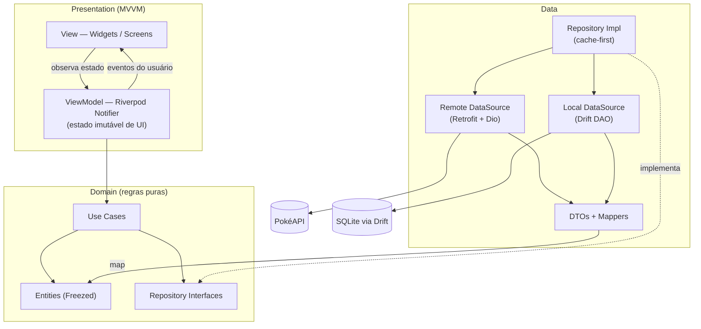
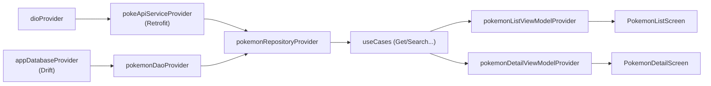
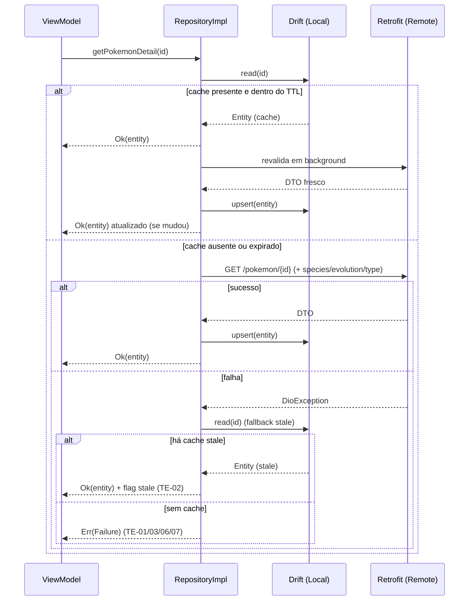
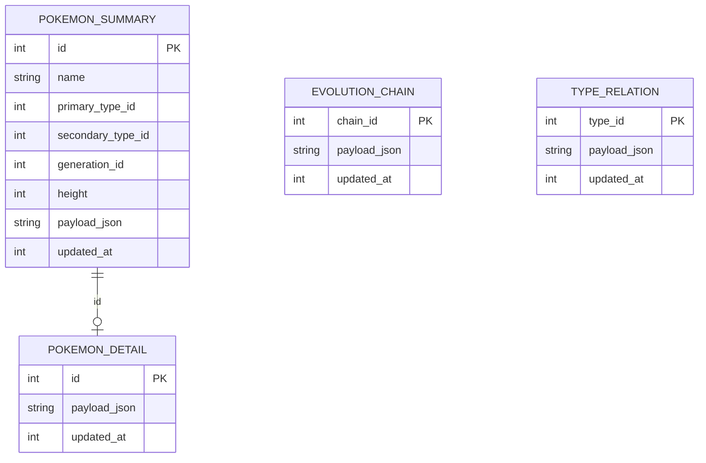
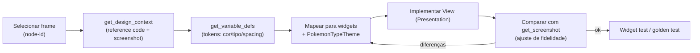
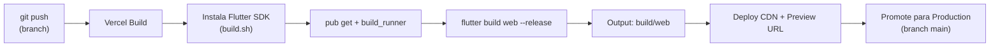
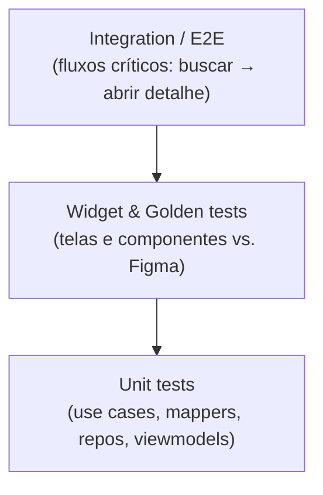

# Tech Spec — Pokédex (Flutter Multiplataforma)

| Campo                   | Valor                             |
| ----------------------- | --------------------------------- |
| **Produto**             | Pokédex                           |
| **Documento**           | Especificação Técnica (Tech Spec) |
| **Versão**              | 1.0                               |
| **Data**                | 2026-05-24                        |
| **Autor**               | Paulo Sabra                       |
| **Documento de origem** | [`PRD`](./01-prd.md)              |
| **Plataformas**         | Flutter Multiplataforma           |
| **Fonte de dados**      | PokéAPI (REST) + cache local      |

### Decisões de arquitetura (definidas com o time)

| Tema                       | Decisão                                                |
| -------------------------- | ------------------------------------------------------ |
| Arquitetura                | **MVVM + Clean Architecture** (feature-first)          |
| Gerenciamento de estado    | **Riverpod 3.x** (com code generation)                 |
| Persistência / cache local | **Drift** (SQLite tipado, reativo)                     |
| Rede e serialização        | **Dio + Retrofit + Freezed + json_serializable**       |
| Convenção de commits       | **Conventional Commits** (ver PRD, Anexo A)            |
| Deploy Web                 | **Vercel** (Flutter Web build estático + SPA rewrites) |
| Construção de telas        | **Figma MCP** (design-to-code assistido)               |

---

## 1. Objetivos técnicos e princípios

Esta Tech Spec traduz os requisitos do PRD em uma arquitetura implementável, testável e escalável, mantendo fidelidade ao design do Figma e resiliência de rede (cache-first).

Princípios norteadores:

- **Separação de responsabilidades:** UI não conhece rede nem banco; regras vivem no domínio.
- **Dependa de abstrações:** camadas superiores dependem de interfaces, não de implementações (Dependency Inversion).
- **Imutabilidade:** estados e modelos imutáveis (Freezed) para previsibilidade.
- **Cache-first:** o app prioriza dados locais e revalida em segundo plano (stale-while-revalidate), conforme RN-02 do PRD.
- **Falha graciosa:** todo erro vira um `Failure` tipado e um estado de UI tratável (sem tela branca).
- **Multiplataforma sem regressão:** mobile-first com adaptação responsiva para web/desktop.

---

## 2. Visão geral da arquitetura

Adotamos **Clean Architecture** em três camadas (Presentation, Domain, Data), com a camada de apresentação implementada no padrão **MVVM**: a _View_ (Widgets) observa um _ViewModel_ (um `Notifier`/`AsyncNotifier` do Riverpod) que expõe um **estado imutável de UI**. O ViewModel orquestra _Use Cases_ do domínio; o domínio define **contratos** (interfaces) implementados pela camada de dados.



**Regra de dependência:** as setas de dependência apontam sempre para o domínio. A camada de dados implementa as interfaces do domínio; a apresentação depende de Use Cases e Entities — nunca de DTOs ou do cliente HTTP.

---

## 3. Estrutura de pastas (feature-first)

```text
lib/
├── main.dart
├── app/
│   ├── app.dart                 # MaterialApp.router + ProviderScope
│   ├── router/                  # go_router, rotas, guards
│   └── theme/                   # ThemeData, design tokens, cores por tipo
├── core/
│   ├── network/                 # Dio, interceptors, error mapper
│   ├── database/                # Drift database, DAOs, conexões por plataforma
│   ├── error/                   # Failure, Result, exceptions
│   ├── utils/                   # formatters (#NNN), extensions
│   └── widgets/                 # componentes compartilhados (badges, cards)
└── features/
    ├── pokemon_list/            # Home + Busca
    │   ├── data/                # datasources, dtos, mappers, repo impl
    │   ├── domain/              # entities, repo interface, use cases
    │   └── presentation/        # view (screens/widgets) + viewmodel
    ├── pokemon_detail/          # About / Stats / Evolution
    ├── filters/                 # bottom sheet de filtros
    ├── sort/                    # bottom sheet de ordenação
    └── generations/             # bottom sheet de gerações
```

> **feature-first:** cada feature carrega suas três camadas. Código realmente transversal (rede, banco, tema, erros, widgets base) vive em `core/`.

### 3.1 Mapeamento feature → requisitos do PRD

| Feature          | Telas (PRD)                      | Requisitos cobertos       |
| ---------------- | -------------------------------- | ------------------------- |
| `pokemon_list`   | T-01 Home / Lista + Busca        | RF-01…RF-13, RF-44, RF-45 |
| `filters`        | T-02 Filtros                     | RF-14…RF-19               |
| `sort`           | T-03 Ordenação                   | RF-20…RF-24               |
| `generations`    | T-04 Gerações                    | RF-25…RF-28               |
| `pokemon_detail` | T-05/06/07 About/Stats/Evolution | RF-29…RF-43               |

---

## 4. Camadas detalhadas

### 4.1 Domain (puro Dart, sem Flutter)

- **Entities:** modelos de negócio imutáveis (Freezed) — `Pokemon`, `PokemonDetail`, `EvolutionChain`, `StatSet`, `TypeEffectiveness`.
- **Repository interfaces:** contratos consumidos pelos Use Cases.
- **Use Cases:** uma intenção de negócio por classe (`GetPokemonList`, `GetPokemonDetail`, `SearchPokemon`, `GetEvolutionChain`). Cada um expõe `call(...)` retornando `Result<T>`.

### 4.2 Data

- **Remote DataSource:** `PokeApiService` (Retrofit sobre Dio) — chamadas tipadas à PokéAPI.
- **Local DataSource:** DAOs do Drift — leitura/escrita do cache.
- **DTOs:** modelos de transporte (Freezed + `json_serializable`) espelhando o JSON da API.
- **Mappers:** convertem DTO ⇄ Entity e Entity ⇄ linha do banco.
- **Repository Impl:** orquestra cache-first (RN-02) e mapeia exceções em `Failure`.

### 4.3 Presentation (MVVM)

- **View:** `ConsumerWidget`/`ConsumerStatefulWidget` que apenas renderiza o estado e dispara intents.
- **ViewModel:** `@riverpod` `AsyncNotifier`/`Notifier` que detém o estado imutável da tela e expõe métodos de intenção (`loadMore`, `search`, `applyFilter`, `changeSort`, `selectGeneration`).
- **UI State:** classes Freezed por tela (ex.: `PokemonListState`) com flags de paginação, filtros e ordenação ativos.

---

## 5. Gerenciamento de estado (Riverpod 3.x)

Riverpod é a espinha dorsal de **estado + injeção de dependência**. Tudo é exposto por providers gerados com `@riverpod`.



### 5.1 Mapeamento de estado assíncrono

O Riverpod modela `loading/data/error` nativamente com `AsyncValue<T>`, casando 1:1 com a máquina de estados do PRD (seção 8.2):

| Estado de UI (PRD) | Representação                                      |
| ------------------ | -------------------------------------------------- |
| `Loading`          | `AsyncLoading`                                     |
| `Loaded`           | `AsyncData(state)`                                 |
| `Empty`            | `AsyncData(state.copyWith(items: []))`             |
| `Error`            | `AsyncError(failure, stack)`                       |
| `Refreshing`       | `AsyncData` + `state.isRefreshing == true`         |
| `StaleWithError`   | `AsyncData` (cache) + `state.refreshError != null` |

### 5.2 Contrato do ViewModel (exemplo: lista)

```dart
@freezed
class PokemonListState with _$PokemonListState {
  const factory PokemonListState({
    @Default(<Pokemon>[]) List<Pokemon> items,
    @Default(0) int offset,
    @Default(true) bool hasMore,
    @Default(false) bool isLoadingMore,
    @Default(false) bool isRefreshing,
    @Default('') String query,
    PokemonFilter? filter,
    @Default(SortCriteria.numberAsc) SortCriteria sort,
    int? generationId,
    Failure? refreshError,
  }) = _PokemonListState;
}

@riverpod
class PokemonListViewModel extends _$PokemonListViewModel {
  static const _pageSize = 24; // RN-14

  @override
  Future<PokemonListState> build() async {
    final page = await ref.read(getPokemonListProvider)(
      limit: _pageSize, offset: 0,
    );
    return switch (page) {
      Ok(:final value) => PokemonListState(items: value.items, offset: _pageSize, hasMore: value.hasMore),
      Err(:final failure) => throw failure, // vira AsyncError
    };
  }

  Future<void> loadMore() async { /* anexa próximo lote (UC-01) */ }
  void search(String query) { /* debounce + filtra (UC-02, RF-10) */ }
  void applyFilter(PokemonFilter filter) { /* UC-03 */ }
  void changeSort(SortCriteria sort) { /* UC-04 */ }
  void selectGeneration(int? id) { /* UC-05 */ }
  Future<void> refresh() async { /* pull-to-refresh (UC-08) */ }
}
```

---

## 6. Estratégia de dados e cache (Drift)

A estratégia é **cache-first com revalidação** (stale-while-revalidate), implementada no `RepositoryImpl`.



### 6.1 Esquema do banco (Drift)

Para reduzir acoplamento ao formato da PokéAPI, o cache guarda o **payload normalizado em JSON** por entidade, mais colunas indexáveis para busca/ordenação/filtro local.



```dart
class PokemonSummaries extends Table {
  IntColumn get id => integer()();                       // National Dex ID
  TextColumn get name => text()();
  IntColumn get primaryTypeId => integer()();
  IntColumn get secondaryTypeId => integer().nullable()();
  IntColumn get generationId => integer()();
  IntColumn get height => integer()();
  TextColumn get payloadJson => text()();                // Pokemon serializado
  IntColumn get updatedAt => integer()();                // epoch ms (TTL — RN-16)
  @override
  Set<Column> get primaryKey => {id};
}
```

| Tabela             | Conteúdo                           | Uso                                         |
| ------------------ | ---------------------------------- | ------------------------------------------- |
| `PokemonSummaries` | dados de card + colunas indexáveis | lista, busca (RN-06/07), filtros, ordenação |
| `PokemonDetails`   | payload completo do detalhe        | abas About/Stats                            |
| `EvolutionChains`  | cadeia evolutiva                   | aba Evolution                               |
| `TypeRelations`    | relações de dano por tipo          | weaknesses / type defenses                  |

### 6.2 Política de TTL (RN-16)

- TTL padrão configurável (sugestão: **7 dias** para dados de Pokémon, que mudam raramente).
- `updated_at` por linha define expiração; revalidação não bloqueia a UI.
- Busca, filtro e ordenação no MVP rodam **sobre o cache local** (`PokemonSummaries`) para resposta instantânea (RF-11, RN-08).
- Suporte Web do Drift via **WASM** (`drift/wasm` + worker + `sqlite3.wasm`); mobile/desktop via `NativeDatabase`. A conexão é resolvida por implementação condicional (`connection/native.dart` vs `connection/web.dart`).

---

## 7. Camada de rede (Dio + Retrofit)

### 7.1 Cliente e interceptors

```dart
@riverpod
Dio dio(DioRef ref) {
  final dio = Dio(BaseOptions(
    baseUrl: 'https://pokeapi.co/api/v2/',
    connectTimeout: const Duration(seconds: 10),
    receiveTimeout: const Duration(seconds: 15),
  ));
  dio.interceptors.addAll([
    RetryInterceptor(maxRetries: 3, backoff: BackoffStrategy.exponential), // TE-06/07
    RateLimitInterceptor(),  // respeita 429 (TE-08)
    LogInterceptor(responseBody: false),
  ]);
  return dio;
}

@riverpod
PokeApiService pokeApiService(PokeApiServiceRef ref) =>
    PokeApiService(ref.watch(dioProvider));
```

### 7.2 Serviço Retrofit (contrato remoto)

```dart
@RestApi()
abstract class PokeApiService {
  factory PokeApiService(Dio dio, {String baseUrl}) = _PokeApiService;

  @GET('/pokemon')
  Future<PokemonListResponseDto> getPokemonList(
    @Query('limit') int limit,
    @Query('offset') int offset,
  );

  @GET('/pokemon/{id}')
  Future<PokemonDto> getPokemon(@Path('id') int id);

  @GET('/pokemon-species/{id}')
  Future<PokemonSpeciesDto> getSpecies(@Path('id') int id);

  @GET('/evolution-chain/{id}')
  Future<EvolutionChainDto> getEvolutionChain(@Path('id') int id);

  @GET('/type/{id}')
  Future<TypeDto> getType(@Path('id') int id);
}
```

### 7.3 Mapa de erros (Dio → Failure → TE do PRD)

```dart
sealed class Failure {
  const Failure(this.message);
  final String message;
}
final class NetworkFailure   extends Failure { const NetworkFailure([super.m = 'offline']); }   // TE-01/02
final class TimeoutFailure   extends Failure { const TimeoutFailure([super.m = 'timeout']); }    // TE-06
final class NotFoundFailure  extends Failure { const NotFoundFailure([super.m = '404']); }       // TE-03
final class ServerFailure    extends Failure { const ServerFailure([super.m = '5xx']); }         // TE-07
final class RateLimitFailure extends Failure { const RateLimitFailure([super.m = '429']); }      // TE-08
final class ParsingFailure   extends Failure { const ParsingFailure([super.m = 'parse']); }      // TE-09
final class CacheFailure     extends Failure { const CacheFailure([super.m = 'cache']); }        // TE-01
```

| Origem                               | Failure            | TE (PRD) | UI                                 |
| ------------------------------------ | ------------------ | -------- | ---------------------------------- |
| `DioExceptionType.connectionError`   | `NetworkFailure`   | TE-01/02 | "Você está offline" / banner stale |
| `connectionTimeout`/`receiveTimeout` | `TimeoutFailure`   | TE-06    | "A conexão demorou demais" + retry |
| HTTP 404                             | `NotFoundFailure`  | TE-03    | "Pokémon não encontrado"           |
| HTTP 5xx                             | `ServerFailure`    | TE-07    | "Algo deu errado" + retry          |
| HTTP 429                             | `RateLimitFailure` | TE-08    | backoff transparente + cache       |
| `FormatException`/serialização       | `ParsingFailure`   | TE-09    | erro genérico não-bloqueante       |

---

## 8. Contratos e interfaces principais

### 8.1 `Result` (sucesso/erro tipado)

```dart
sealed class Result<T> { const Result(); }
final class Ok<T>  extends Result<T> { const Ok(this.value); final T value; }
final class Err<T> extends Result<T> { const Err(this.failure); final Failure failure; }
```

### 8.2 Entidades de domínio (Freezed)

```dart
enum PokemonTypeId { grass, poison, fire, water, electric, bug, normal, flying,
  ground, fairy, fighting, psychic, rock, ghost, ice, dragon, dark, steel }

@freezed
class Pokemon with _$Pokemon {            // card da lista (RF-01)
  const factory Pokemon({
    required int id,
    required String name,
    required List<PokemonTypeId> types,   // [primário, (secundário)] — RN-05
    required String imageUrl,
    required int generationId,
  }) = _Pokemon;
}

@freezed
class PokemonDetail with _$PokemonDetail { // aba About + Stats
  const factory PokemonDetail({
    required Pokemon summary,
    required String description,           // flavor text (RF-30)
    required String genus,                 // Species (RF-31)
    required double heightMeters,
    required double weightKg,
    required List<Ability> abilities,      // inclui hidden (RF-31)
    required List<PokemonTypeId> weaknesses,
    required Training training,            // RF-32
    required Breeding breeding,            // RF-33
    required List<LocationEntry> locations,// RF-34
    required StatSet baseStats,            // RF-35..37
    required Map<PokemonTypeId, double> typeDefenses, // RF-39
  }) = _PokemonDetail;
}

@freezed
class EvolutionChain with _$EvolutionChain {
  const factory EvolutionChain({ required List<EvolutionStage> stages }) = _EvolutionChain;
}

@freezed
class EvolutionStage with _$EvolutionStage {
  const factory EvolutionStage({
    required int id, required String name, required String imageUrl,
    String? condition,                     // ex.: "Level 16" (RF-41)
  }) = _EvolutionStage;
}
```

### 8.3 Interface de repositório (domínio)

```dart
abstract interface class PokemonRepository {
  Future<Result<PokemonPage>>     getPokemonList({required int limit, required int offset});
  Future<Result<PokemonDetail>>   getPokemonDetail(int id);
  Future<Result<EvolutionChain>>  getEvolutionChain(int id);
  Future<Result<List<Pokemon>>>   search(String query);          // RN-06/07
  Future<Result<List<Pokemon>>>   filter(PokemonFilter filter);  // RF-14..17
  Stream<List<Pokemon>>           watchCachedSummaries();        // reativo (Drift)
}
```

### 8.4 DataSources (data)

```dart
abstract interface class PokemonRemoteDataSource {  // implementado via PokeApiService
  Future<PokemonDto> fetch(int id);
  Future<PokemonListResponseDto> fetchPage(int limit, int offset);
  Future<EvolutionChainDto> fetchEvolutionChain(int id);
}

abstract interface class PokemonLocalDataSource {   // implementado via Drift DAO
  Future<PokemonDetail?> readDetail(int id);
  Future<void> upsertDetail(PokemonDetail detail, {required int updatedAt});
  Future<List<Pokemon>> querysummaries({String? q, PokemonFilter? f, required SortCriteria sort});
  Stream<List<Pokemon>> watchSummaries();
}
```

### 8.5 Use Cases

```dart
class GetPokemonList {
  GetPokemonList(this._repo);
  final PokemonRepository _repo;
  Future<Result<PokemonPage>> call({required int limit, required int offset}) =>
      _repo.getPokemonList(limit: limit, offset: offset);
}
// GetPokemonDetail, SearchPokemon, GetEvolutionChain seguem o mesmo padrão.
```

> Os DTOs (`PokemonDto`, `PokemonSpeciesDto`, `EvolutionChainDto`, `TypeDto`) usam Freezed + `json_serializable` espelhando o JSON da PokéAPI, e são convertidos para entidades pelos **mappers** (Anexo B do PRD detalha o mapeamento campo a campo).

---

## 9. Navegação e responsividade

Roteamento declarativo com **go_router**, integrado ao Riverpod e preparado para deep links (web).

```dart
final routerProvider = Provider<GoRouter>((ref) => GoRouter(
  initialLocation: '/',
  routes: [
    GoRoute(path: '/', builder: (_, __) => const PokemonListScreen()),
    GoRoute(path: '/pokemon/:id', builder: (_, s) =>
        PokemonDetailScreen(id: int.parse(s.pathParameters['id']!))),
  ],
));
```

### 9.1 Adaptação mobile-first → web/desktop

| Elemento                  | Mobile (foco)          | Web / Desktop (adaptação)                                      |
| ------------------------- | ---------------------- | -------------------------------------------------------------- |
| Lista                     | 1 coluna               | grade multi-coluna por `LayoutBuilder`/breakpoints             |
| Filtros / Sort / Gerações | `showModalBottomSheet` | `showDialog` (modal central) ou painel lateral fixo            |
| Detalhe                   | tela cheia com abas    | painel/coluna ao lado da lista (master-detail) em telas largas |
| Navegação                 | push de rota           | URL/deep-link (`/pokemon/:id`)                                 |

Breakpoints sugeridos: `compact < 600 < medium < 1024 < expanded`. Um `ResponsiveLayout` central decide bottom sheet vs. dialog (atende RF-46).

---

## 10. Tema e Design Tokens (extraídos do Figma)

Tokens lidos via Figma MCP (`get_variable_defs`). Tipografia base: **SF Pro Display** (fallback: Inter/Roboto). Centralizados em `app/theme/`.

### 10.1 Cores base

| Token                      | Hex                       | Uso                      |
| -------------------------- | ------------------------- | ------------------------ |
| Text / Black               | `#17171B`                 | texto principal, números |
| Text / Gray                | `#747476`                 | descrições/labels        |
| Text / White               | `#FFFFFF`                 | texto sobre tipo         |
| Background / Default Input | `#F2F2F2`                 | campo de busca           |
| Background / White         | `#FFFFFF`                 | fundo de telas/sheets    |
| Background / Modal         | `#000000` (com opacidade) | overlay dos sheets       |

### 10.2 Tipografia

| Token             | Estilo     | Aplicação          |
| ----------------- | ---------- | ------------------ |
| Application Title | Bold 32    | título "Pokédex"   |
| Pokemon Name      | Bold 26    | nome no detalhe    |
| Description       | Regular 16 | textos auxiliares  |
| Filter Title      | Bold 16    | títulos dos sheets |
| Pokemon Number    | Bold 12    | `#NNN`             |
| Pokemon Type      | Medium 12  | badges de tipo     |

### 10.3 Paleta por tipo (cor do badge/ícone)

| Tipo     | Hex       | Tipo   | Hex       |
| -------- | --------- | ------ | --------- |
| Bug      | `#8CB230` | Steel  | `#417D9A` |
| Dark     | `#58575F` | Water  | `#4A90DA` |
| Dragon   | `#0F6AC0` | Grass  | `#62B957` |
| Electric | `#EED535` | Fire   | `#FD7D24` |
| Fairy    | `#ED6EC7` | Poison | `#A552CC` |
| Fighting | `#D04164` | Flying | `#748FC9` |
| Ghost    | `#556AAE` | Ground | `#DD7748` |
| Ice      | `#61CEC0` | Normal | `#9DA0AA` |
| Psychic  | `#EA5D60` | Rock   | `#BAAB82` |

> Cores de **fundo do card** são tons mais claros do tipo primário (ex.: `Background Type / Grass #8BBE8A`, `Fire #FFA756`). Categorias de **altura** (filtro): Short `#FFC5E6`, Medium `#AEBFD7`, Tall `#AAACB8`. Recomenda-se gerar um `PokemonTypeTheme` mapeando `PokemonTypeId → (cor, corDeFundo, ícone)` para aplicar RN-04 de forma centralizada.

```dart
// app/theme/pokemon_type_theme.dart
const pokemonTypeColors = <PokemonTypeId, Color>{
  PokemonTypeId.grass: Color(0xFF62B957),
  PokemonTypeId.fire:  Color(0xFFFD7D24),
  PokemonTypeId.water: Color(0xFF4A90DA),
  // ... demais tipos
};
```

---

## 11. Construção das telas com Figma MCP

Fluxo design-to-code assistido: para cada tela, extrair contexto/tokens do nó correspondente e gerar os widgets Flutter aderentes ao tema.



### 11.1 Mapa de frames Figma → telas Flutter

| Tela Flutter                          | Frame Figma            | `node-id`  |
| ------------------------------------- | ---------------------- | ---------- |
| `PokemonListScreen` (Home)            | Home                   | `268:0`    |
| `PokemonListScreen` (scroll completo) | Home All               | `268:1037` |
| `FiltersSheet`                        | Filters                | `268:63`   |
| `FiltersSheet` (rolado)               | Filters - Scrolled     | `268:1739` |
| `SortSheet`                           | Sort                   | `268:176`  |
| `GenerationsSheet`                    | Generation             | `268:248`  |
| `PokemonDetailScreen` — About         | Profile #1 - About     | `268:320`  |
| `PokemonDetailScreen` — Stats         | Profile #1 - Stats     | `268:378`  |
| `PokemonDetailScreen` — Evolution     | Profile #1 - Evolution | `268:513`  |

### 11.2 Diretrizes de fidelidade

- Não copiar valores absolutos de posição; usar `Row`/`Column`/`Flex`/`Wrap` e os tokens da seção 10.
- Reaproveitar componentes (`PokemonCard`, `TypeBadge`, `StatBar`, `SectionHeader`) — espelham os componentes/instâncias do Figma (`Badge / Grass`, `Text Field / Default`).
- Validar cada tela contra `get_screenshot` do frame antes de marcar como concluída.

---

## 12. Deploy da versão Web na Vercel

A versão Web é um build estático do Flutter (`build/web`) publicado como SPA na Vercel, com **rewrites** para roteamento client-side (go_router).



### 12.1 `vercel.json`

```json
{
  "$schema": "https://openapi.vercel.sh/vercel.json",
  "buildCommand": "bash build.sh",
  "outputDirectory": "build/web",
  "framework": null,
  "rewrites": [{ "source": "/(.*)", "destination": "/index.html" }],
  "headers": [
    {
      "source": "/(.*)",
      "headers": [
        {
          "key": "Cache-Control",
          "value": "public, max-age=0, must-revalidate"
        }
      ]
    }
  ]
}
```

### 12.2 `build.sh` (instala Flutter no build da Vercel)

```bash
#!/usr/bin/env bash
set -euo pipefail

if [ ! -d "flutter" ]; then
  git clone https://github.com/flutter/flutter.git --depth 1 -b stable
fi
export PATH="$PATH:$(pwd)/flutter/bin"

flutter --version
flutter config --enable-web
flutter pub get
dart run build_runner build --delete-conflicting-outputs
flutter build web --release   # renderer: canvaskit (fidelidade) — ajustar conforme versão do Flutter
```

### 12.3 Notas e alternativas

- **SPA rewrites** são obrigatórios: sem eles, acessar `/pokemon/25` diretamente retorna 404.
- A PokéAPI envia CORS aberto, então o consumo direto do browser funciona; ainda assim, o cache (Drift WASM) reduz chamadas.
- Limites de tempo/tamanho de build na Vercel: se o clone do SDK pesar, alternativas são **(a)** GitHub Actions que builda e publica o `build/web` estático na Vercel, ou **(b)** runtime/comunidade de Flutter para Vercel.
- Definir **variáveis de ambiente** (ex.: `BASE_HREF`, `API_BASE_URL`) no painel da Vercel quando necessário.
- A revalidação de cache do app é independente do cache da CDN; manter `index.html` sem cache agressivo evita servir build antigo.

---

## 13. Estratégia de testes



| Nível      | Alvo                                                                           | Ferramentas                              |
| ---------- | ------------------------------------------------------------------------------ | ---------------------------------------- |
| Unit       | Use cases, mappers DTO⇄Entity, política cache-first, lógica de busca/ordenação | `flutter_test`, `mocktail`               |
| Widget     | `PokemonCard`, `TypeBadge`, `StatBar`, sheets                                  | `flutter_test`, `ProviderScope` override |
| Golden     | Fidelidade visual das telas vs. Figma                                          | `golden_toolkit`/`alchemist`             |
| Integração | UC-01 (lista+paginação), UC-02 (busca), UC-06 (detalhe)                        | `integration_test`                       |

Metas: cobrir 100% dos **mappers** e da **política de cache** (maior risco de bug). ViewModels testados via `ProviderContainer` com repositórios falsos.

---

## 14. CI/CD e qualidade

Pipeline (ex.: GitHub Actions) por PR:

1. `flutter pub get`
2. `dart run build_runner build --delete-conflicting-outputs` (code-gen: Freezed/json/Retrofit/Riverpod/Drift)
3. `dart format --set-exit-if-changed .`
4. `flutter analyze` (lints: `flutter_lints` + regras de import entre camadas)
5. `flutter test --coverage`
6. Em `main`: build/deploy Web na Vercel (seção 12)

Qualidade de histórico: **Conventional Commits** (PRD, Anexo A) habilitam changelog/versionamento automatizados; sugerido `commitlint` + hook de pré-commit. Branches: `main`, `develop`, `feat/*`, `fix/*`, `chore/*`.

---

## 15. Dependências principais (pubspec)

| Categoria   | Pacotes                                                                                            |
| ----------- | -------------------------------------------------------------------------------------------------- |
| Estado / DI | `flutter_riverpod`, `riverpod_annotation`, `riverpod_generator`, `build_runner`                    |
| Rede        | `dio`, `retrofit`, `retrofit_generator`                                                            |
| Modelos     | `freezed`, `freezed_annotation`, `json_serializable`, `json_annotation`                            |
| Banco local | `drift`, `drift_dev`, `sqlite3_flutter_libs` (mobile/desktop), `drift/wasm` + `sqlite3.wasm` (web) |
| Navegação   | `go_router`                                                                                        |
| Imagens     | `cached_network_image` (mobile/desktop) / cache equivalente na web                                 |
| Utils       | `intl` (formatação), `connectivity_plus` (estado de rede para TE-02)                               |
| Testes      | `flutter_test`, `mocktail`, `golden_toolkit`/`alchemist`, `integration_test`                       |

---

## 16. Riscos e decisões (mini-ADRs)

| #     | Decisão                                   | Motivo                                                    | Trade-off / risco                                               |
| ----- | ----------------------------------------- | --------------------------------------------------------- | --------------------------------------------------------------- |
| ADR-1 | MVVM + Clean Architecture feature-first   | testabilidade, escala e clareza de fronteiras             | boilerplate inicial maior                                       |
| ADR-2 | Riverpod 3.x (code-gen)                   | DI + estado async (`AsyncValue`) coeso e testável         | curva de aprendizado do code-gen                                |
| ADR-3 | Drift para cache                          | SQL tipado/reativo, cobre web (WASM) e desktop            | setup web (worker/wasm) exige cuidado                           |
| ADR-4 | Dio + Retrofit + Freezed                  | rede tipada, interceptors (retry/429) e modelos imutáveis | dependência de geração de código                                |
| ADR-5 | Cache-first / stale-while-revalidate      | resiliência e performance percebida (PRD RN-02)           | risco de exibir dado levemente desatualizado (mitigado por TTL) |
| ADR-6 | Deploy Web via build de Flutter na Vercel | pipeline único a partir do repo                           | tempo de build (clone do SDK) — alternativas na seção 12.3      |

Riscos abertos: suporte web do Drift (validar WASM no alvo), limites de build da Vercel, e mudança do flag de _web renderer_ entre versões do Flutter (validar na versão fixada).

---

## 17. Controle de versão do documento

| Versão | Data       | Autor       | Mudanças                                                                                                                                                                |
| ------ | ---------- | ----------- | ----------------------------------------------------------------------------------------------------------------------------------------------------------------------- |
| 1.0    | 2026-05-24 | Paulo Sabra | Versão inicial do Tech Spec a partir do PRD, com decisões: MVVM + Clean Architecture, Riverpod, Drift, Dio+Retrofit+Freezed; workflow Figma MCP e deploy Web na Vercel. |
