# 12 Princípios de Desenvolvimento de Software — Aplicação ao Pokédex

| Campo                    | Valor                                                      |
| ------------------------ | ---------------------------------------------------------- |
| **Produto**              | Pokédex                                                    |
| **Documento**            | Aplicação dos 12 Princípios de Desenvolvimento de Software |
| **Versão**               | 1.0                                                        |
| **Data**                 | 2026-05-24                                                 |
| **Autor**                | Paulo Sabra                                                |
| **Documentos de origem** | [`PRD`](./01-prd.md) · [`TECH SPEC`](./02-tech-spec.md)    |

> **Propósito.** Este documento mostra **como** os 12 princípios moldam a construção da Tech Spec do Pokédex. Cada princípio é aplicado de forma concreta, ancorado nas decisões já tomadas (MVVM + Clean Architecture, Riverpod, Drift, Dio + Retrofit + Freezed, PokéAPI + cache, Conventional Commits, deploy Web na Vercel e construção de telas via Figma MCP) e nos requisitos do PRD (RF/RN/TE). Ao final de cada princípio há o **checkpoint** com a resposta para o projeto.

---

## Visão geral — os 12 princípios em 4 dimensões

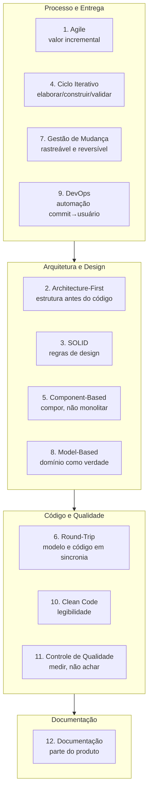

| #   | Princípio             | Aderência ao Pokédex | Âncora principal                           |
| --- | --------------------- | -------------------- | ------------------------------------------ |
| 1   | Agile                 | Alta                 | Escopo MVP "igual ao Figma" (PRD §3)       |
| 2   | Architecture-First    | Alta                 | MVVM + Clean (Tech Spec §2)                |
| 3   | SOLID                 | Alta                 | Contratos/interfaces (Tech Spec §8)        |
| 4   | Ciclo Iterativo       | Alta                 | Roadmap por sprints                        |
| 5   | Component-Based       | Alta                 | Widgets/tokens do Figma (Tech Spec §10–11) |
| 6   | Round-Trip            | Alta                 | Code-gen (Freezed/Retrofit/Drift/Riverpod) |
| 7   | Gestão de Mudança     | Alta                 | Conventional Commits (PRD Anexo A)         |
| 8   | Model-Based           | Alta                 | Entidades de domínio (Tech Spec §8.2)      |
| 9   | DevOps                | Média/Alta           | CI + deploy Vercel (Tech Spec §12, §14)    |
| 10  | Clean Code            | Alta                 | flutter_lints, Effective Dart              |
| 11  | Controle de Qualidade | Alta                 | Pirâmide de testes (Tech Spec §13)         |
| 12  | Documentação          | Alta                 | PRD + Tech Spec + este documento           |

---

## 1 · Agile — Entregar valor incrementalmente

**O que significa aqui.** Quebrar o produto em fatias verticais que entregam valor sozinhas, separando MVP de iterações futuras.

**Como aplicamos no Pokédex.** O escopo do MVP foi deliberadamente fixado como "igual ao Figma" (PRD §3.1) e o que não é essencial foi empurrado para v2+ (favoritos, comparação, contas — PRD §3.2, §13). Cada fatia é uma jornada completa de usuário, não uma camada técnica isolada.

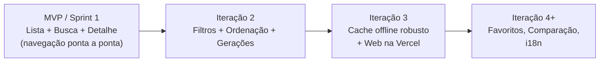

- **Fatia mínima vendável:** abrir o app, ver a lista (Geração I), buscar e abrir o detalhe — já é útil e demonstrável.
- **Evitar abstração especulativa:** construímos apenas o necessário para o MVP; a arquitetura (Princípio 2) permite acrescentar v2 sem reescrita.

**Checkpoint — este incremento pode ir sozinho para produção e gerar valor?** Sim: a fatia "Lista + Busca + Detalhe" é uma Pokédex funcional por si só.

---

## 2 · Architecture-First — Definir a estrutura antes do código

**O que significa aqui.** A estrutura (camadas, fronteiras e contratos) é decidida antes de qualquer linha de implementação — exatamente o que a Tech Spec faz.

**Como aplicamos no Pokédex.** Definimos **MVVM + Clean Architecture feature-first** (Tech Spec §2–§4), a estratégia de estado (Riverpod), a de dados (cache-first com Drift) e a navegação (go_router) **antes** de implementar. Abaixo, a visão de **contêineres (C4 — Nível 2)**.

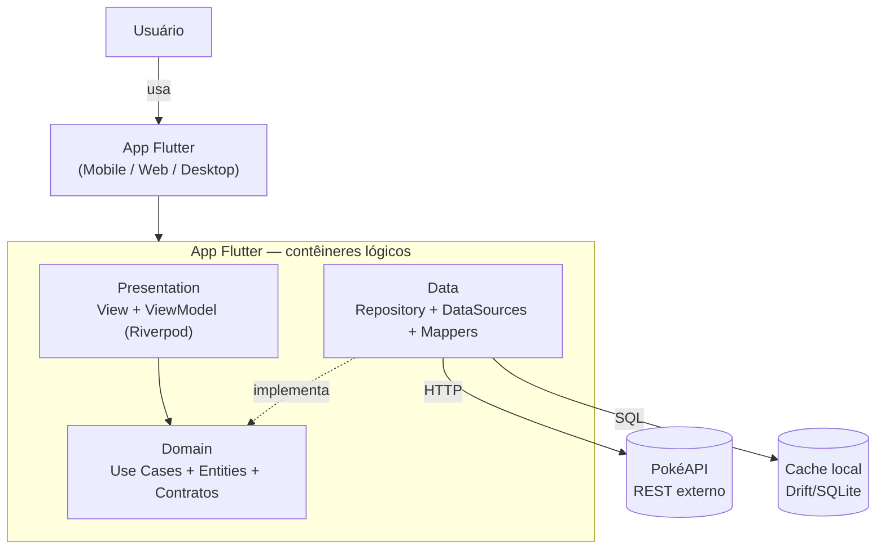

**Regra de dependência:** tudo aponta para o domínio; a apresentação nunca conhece DTOs ou o cliente HTTP. Decisões não óbvias viram **ADRs** (este documento adota o template do skill; ver Princípio 7 e Tech Spec §16).

**Checkpoint — esta arquitetura sobrevive a uma mudança de requisito sem reescrita estrutural?** Sim: trocar fonte de dados (ex.: adicionar um BFF) afeta só a camada Data; adicionar favoritos é uma nova feature isolada.

---

## 3 · SOLID — Cinco regras inegociáveis de design

**Como aplicamos no Pokédex** (ancorado nos contratos da Tech Spec §8):

| Letra | Princípio             | Aplicação concreta                                                                                                                              |
| ----- | --------------------- | ----------------------------------------------------------------------------------------------------------------------------------------------- |
| **S** | Single Responsibility | Cada Use Case tem uma intenção (`GetPokemonList`, `SearchPokemon`…). O ViewModel cuida de estado de UI; o Repository, de orquestração de dados. |
| **O** | Open/Closed           | Novos critérios de ordenação/filtro entram por extensão (novos tipos/estratégias), sem alterar o que já funciona.                               |
| **L** | Liskov                | Qualquer implementação de `PokemonRepository` (real, fake de teste, futura com BFF) substitui a interface sem quebrar contrato.                 |
| **I** | Interface Segregation | `PokemonRemoteDataSource` e `PokemonLocalDataSource` são separados; a apresentação depende só de Use Cases.                                     |
| **D** | Dependency Inversion  | Domínio define interfaces; Data as implementa; a injeção é feita por providers do Riverpod.                                                     |

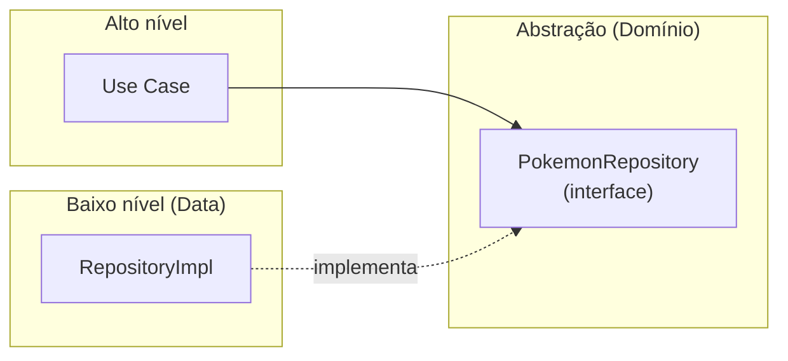

**Checkpoint — esta unidade pode ser testada isoladamente sem mockar metade do sistema?** Sim: ViewModels e Use Cases são testados com um `PokemonRepository` falso, sem rede nem banco.

---

## 4 · Ciclo de vida iterativo — Construir em ciclos

**O que significa aqui.** Trabalho em ciclos repetidos de elaborar → construir → validar → adaptar; cada ciclo entrega código + testes + documentação atualizada.

**Como aplicamos no Pokédex.** Roadmap organizado em sprints curtas, cada uma com Definition of Done que inclui testes e docs (Princípios 11 e 12).

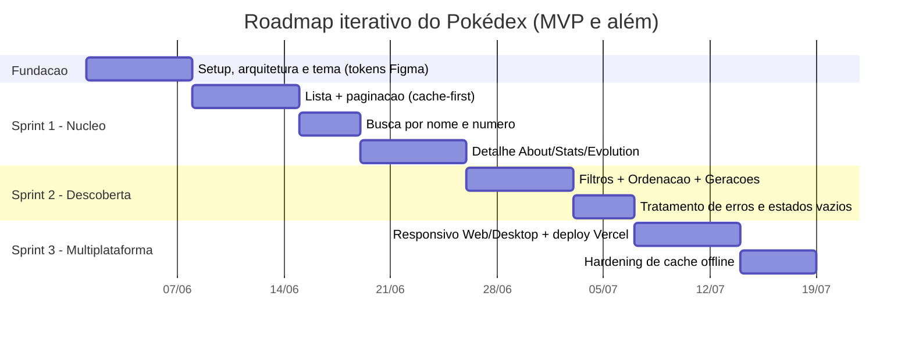

Ao fim de cada ciclo medimos o que mudou (velocidade, bugs, cobertura) e adaptamos o próximo (Princípio 11).

**Checkpoint — o que aprendemos nesta iteração que muda a próxima?** Cada sprint encerra com retro curta; ex.: se a paginação da PokéAPI exigir ajustes de cache, a Sprint 2 absorve antes de novos recursos.

---

## 5 · Component-Based — Compor, não monolitar

**O que significa aqui.** Sistema como composição de componentes independentes e reutilizáveis, cada um com contrato público e internos encapsulados; favorecer composição sobre herança.

**Como aplicamos no Pokédex.** A UI é montada por widgets _stateless_ compostos, alinhados aos componentes/instâncias do Figma (`Badge / Grass`, `Text Field / Default`) e aos design tokens (Tech Spec §10–11). Cada componente carrega seus próprios testes (golden/widget).

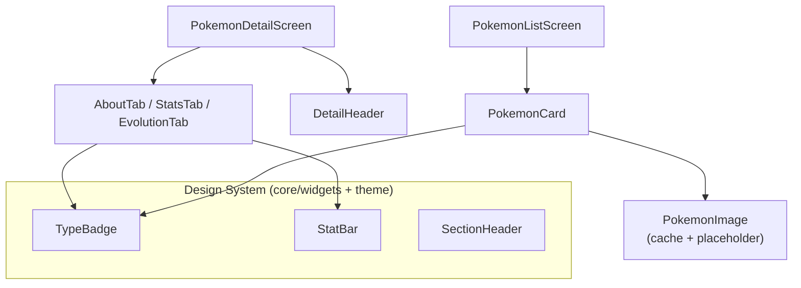

- **Reuso:** `TypeBadge` e `PokemonTypeTheme` aplicam a cor por tipo (RN-04) em qualquer tela.
- **Substituível:** trocar `PokemonImage` (estratégia de cache de imagem por plataforma) não afeta o `PokemonCard`.

**Checkpoint — este componente pode ser reutilizado em outro projeto sem arrastar dependências?** Os componentes do Design System dependem só de Flutter + tokens, não de rede/banco.

---

## 6 · Round-Trip Engineering — Modelo e código em sincronia

**O que significa aqui.** Mudança em uma camada propaga para todas as afetadas; usar geração de código para automatizar a ponte (zero atualizações manuais).

**Como aplicamos no Pokédex.** A stack escolhida é fortemente baseada em **code generation**: Freezed + json_serializable (modelos/DTOs), Retrofit (cliente HTTP), Drift (banco) e Riverpod (providers). Uma mudança de contrato dispara `build_runner` e regenera os artefatos.

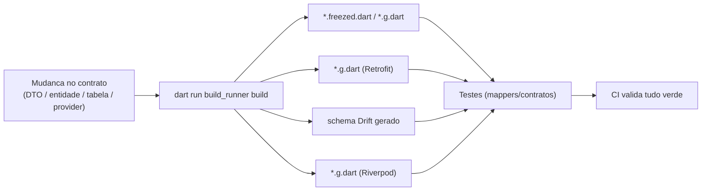

**Impacto rastreado (exemplo):** adicionar o campo _Egg Cycles_ (RF-33) toca: DTO de espécie → mapper → entidade `Breeding` → cache (payload) → UI da aba About → teste do mapper. A geração cobre os modelos; os pontos manuais ficam explícitos no PR.

**Checkpoint — se eu mudar o modelo, quantos lugares precisam de atualização manual? Meta: zero.** Com code-gen, modelos/serialização/banco/providers são regenerados; só a regra de mapeamento de negócio é manual e protegida por teste.

---

## 7 · Gestão de Mudança — Rastrear, revisar, reverter

**O que significa aqui.** Toda mudança é rastreável, revisada por pares, reversível e protegida por CI verde.

**Como aplicamos no Pokédex.** **Conventional Commits** (PRD Anexo A) + branches (`main`, `develop`, `feat/*`, `fix/*`, `chore/*`) + PR obrigatório com CI. Commits semânticos alimentam o CHANGELOG (Princípio 12).

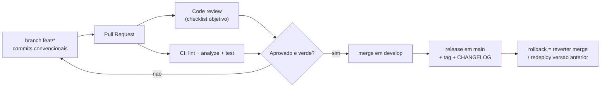

- **Mudanças de risco** (ex.: troca de estratégia de cache) podem ir atrás de _feature flag_ e validação canário antes de habilitar para todos.
- **Reversibilidade:** deploy Web na Vercel mantém builds anteriores; reverter é promover a versão anterior.

**Checkpoint — se isto quebrar a produção às 3h da manhã, conseguimos reverter em menos de 15 min?** Sim: revert do merge + redeploy do build anterior na Vercel.

---

## 8 · Model-Based Evolution — Evoluir a partir do modelo de domínio

**O que significa aqui.** O modelo de domínio é a fonte de verdade do negócio (independente de framework, banco e API). Perguntamos "o modelo suporta isto?" antes de "como codificar?".

**Como aplicamos no Pokédex.** As entidades (Tech Spec §8.2) expressam o vocabulário do produto (PRD Anexo B). O domínio é Dart puro, sem Flutter/Dio/Drift.

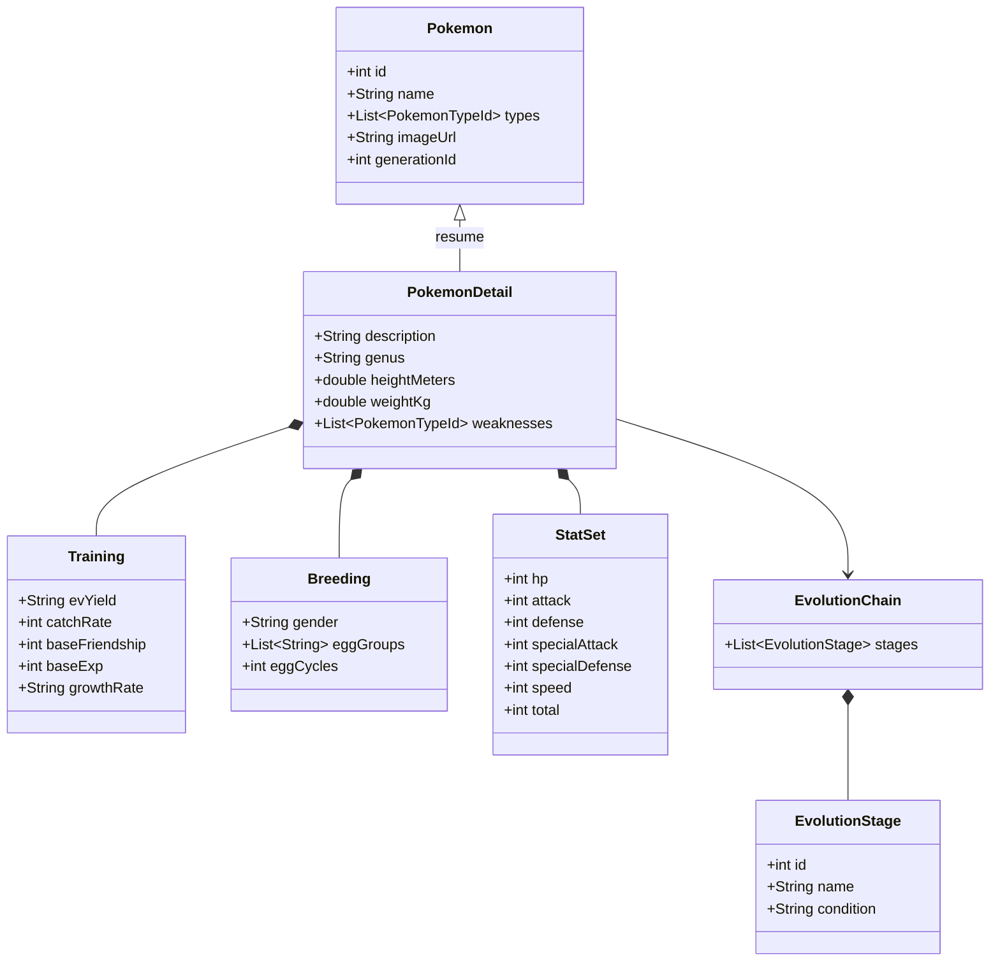

Fluxos complexos (carregamento/cache) são desenhados como **máquina de estados** antes de implementar (PRD §8.2).

**Checkpoint — um especialista de negócio não-técnico entende este modelo?** Sim: os termos (tipo, fraqueza, evolução, base stats, egg groups) são do universo Pokémon, não jargão técnico.

---

## 9 · DevOps — Automatizar tudo entre o commit e o usuário

**O que significa aqui.** Pipeline mínimo: lint → analyze → test → build → deploy. Monitoração em produção.

**Como aplicamos no Pokédex.** CI por PR (Tech Spec §14) e deploy Web automatizado na Vercel (Tech Spec §12). Mobile/desktop preparados para Fastlane/Codemagic em iteração posterior.

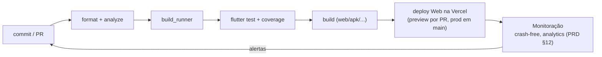

**Checkpoint — do commit ao dispositivo do usuário, quantos passos manuais existem? Meta: zero.** Para a Web: zero após merge em `main` (preview e produção automáticos). Mobile/desktop: meta para iteração de DevOps.

---

## 10 · Clean Code — Otimizar para leitura

**Como aplicamos no Pokédex:**

| Regra                                 | Aplicação                                                                                                                                                      |
| ------------------------------------- | -------------------------------------------------------------------------------------------------------------------------------------------------------------- |
| Nomes revelam intenção                | `fetchPokemonPage()`, `PokemonListViewModel`, `mapDtoToPokemon()` — nunca `getData()`.                                                                         |
| Funções curtas, um nível de abstração | ViewModels delegam para Use Cases; mappers fazem uma conversão.                                                                                                |
| Zero tolerância                       | sem código comentado, números mágicos (ex.: `pageSize` é constante nomeada), funções com 3+ parâmetros sem objeto de config (`PokemonFilter`, `SortCriteria`). |
| Convenções do ecossistema             | **Effective Dart** + `flutter_lints`, zero _warnings_ na CI.                                                                                                   |
| Boy Scout Rule                        | cada PR deixa o trecho tocado mais limpo do que estava.                                                                                                        |

**Checkpoint — um novo membro entende este código em 5 minutos sem perguntar?** A organização feature-first + nomes intencionais + camadas previsíveis tornam o caminho óbvio (tela → viewmodel → use case → repo).

---

## 11 · Controle de Qualidade — Medir, não achar

**O que significa aqui.** Qualidade é dado. Pirâmide de testes + métricas + _gates_ de CI.

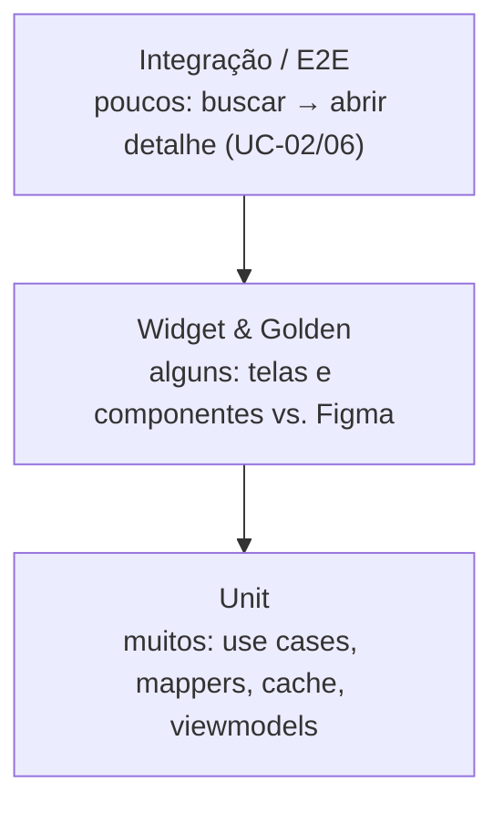

| Métrica                  | Meta                       | Gate de CI                   |
| ------------------------ | -------------------------- | ---------------------------- |
| Cobertura (domínio/data) | ≥ 80%                      | bloqueia merge se abaixo     |
| Complexidade ciclomática | ≤ 10 por método            | revisão obrigatória se acima |
| Crash-free sessions      | ≥ 99,5% (PRD §1.4)         | monitorado em produção       |
| Lint / analyze           | 0 warnings                 | bloqueia merge               |
| Fidelidade ao Figma      | 100% dos campos (PRD §1.4) | golden tests                 |

**Checkpoint — temos evidência numérica de que este release é melhor que o anterior?** Sim: cobertura, crash-free e contagem de _warnings_ comparáveis entre releases.

---

## 12 · Documentação — Docs fazem parte do produto

**O que significa aqui.** Documentação mínima viável vive no repo, versionada e validada na CI.

**Como aplicamos no Pokédex.** A documentação já forma uma cadeia coerente, do "porquê" ao "como":

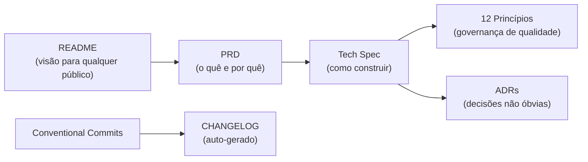

- **README:** clone → build → test em um dia (a detalhar quando o código existir).
- **ADRs:** decisões não óbvias no template do skill (ver exemplo abaixo).
- **Comentários** explicam o "porquê", nunca o "o quê".
- **Diagramas** versionados em Mermaid e validados na CI (como neste documento).

**Checkpoint — se o time inteiro sair amanhã, alguém continua só pela documentação?** Sim: PRD + Tech Spec + este documento + ADRs cobrem o quê, como e por quê.

### Exemplo de ADR (template do skill)

> **ADR-001: Cache-first com Drift (SQLite)**
> **Status:** Aceito · **Data:** 2026-05-24 · **Deciders:** Tech Lead
>
> **Contexto.** O app consome a PokéAPI (rede) e precisa de resposta rápida, resiliência a falhas (PRD TE-01/02) e suporte multiplataforma (incl. Web).
>
> **Decisão.** Adotar Drift como cache local com estratégia _cache-first / stale-while-revalidate_ (Tech Spec §6).
>
> **Consequências.** Positivas: performance percebida, funcionamento offline após 1º uso, queries locais para busca/filtro. Negativas: setup Web via WASM exige cuidado; risco de dado levemente desatualizado (mitigado por TTL). Riscos: maturidade do Drift na Web — mitigar com testes no alvo antes da Sprint 3.

---

## Trade-offs assumidos (tensões entre princípios)

Nenhum princípio é violado em silêncio. As tensões reais deste projeto:

| Tensão                                   | Princípios em conflito | Decisão e justificativa                                                                                    | Dívida / quando tratar                    |
| ---------------------------------------- | ---------------------- | ---------------------------------------------------------------------------------------------------------- | ----------------------------------------- |
| Documentação extensa vs. velocidade ágil | 12 ↔ 1                 | Priorizamos docs **de decisão** (PRD/Tech Spec/ADR) e adiamos docs de código para quando o código existir. | README técnico detalhado na Sprint 1.     |
| Architecture-first vs. entrega iterativa | 2 ↔ 4                  | Definimos a arquitetura mínima necessária ao MVP; evitamos camadas especulativas (sem BFF agora).          | Reavaliar BFF se surgir necessidade (v3). |
| Code-gen (round-trip) vs. simplicidade   | 6 ↔ 10                 | Aceitamos o custo de `build_runner` pela sincronia automática e menos bugs de serialização.                | Documentar o passo de geração no README.  |
| Cache-first vs. dado sempre fresco       | (qualidade/UX)         | Servir cache e revalidar; TTL controla obsolescência (RN-16).                                              | Ajustar TTL conforme uso real.            |
| Paridade multiplataforma vs. foco mobile | 1 ↔ 5                  | Mobile-first agora; Web/Desktop como adaptação responsiva (Sprint 3).                                      | Golden tests por breakpoint na Sprint 3.  |

---

## Scorecard de conformidade (baseline da Tech Spec)

| #   | Princípio             | Status        | Evidência                                     |
| --- | --------------------- | ------------- | --------------------------------------------- |
| 1   | Agile                 | ✅ Definido   | MVP fatiado, v2+ adiada (PRD §3, §13)         |
| 2   | Architecture-First    | ✅ Definido   | MVVM + Clean, C4 (Tech Spec §2)               |
| 3   | SOLID                 | ✅ Definido   | Contratos e interfaces (Tech Spec §8)         |
| 4   | Ciclo Iterativo       | ✅ Definido   | Roadmap por sprints (este doc)                |
| 5   | Component-Based       | ✅ Definido   | Design System + tokens (Tech Spec §10–11)     |
| 6   | Round-Trip            | ✅ Definido   | Code-gen (Tech Spec §6, §15)                  |
| 7   | Gestão de Mudança     | ✅ Definido   | Conventional Commits + git flow (PRD Anexo A) |
| 8   | Model-Based           | ✅ Definido   | Entidades de domínio (Tech Spec §8.2)         |
| 9   | DevOps                | 🟡 Parcial    | CI + Web/Vercel definidos; mobile CI pendente |
| 10  | Clean Code            | 🟡 A garantir | regras definidas; verificável só com código   |
| 11  | Controle de Qualidade | 🟡 A garantir | metas e gates definidos; medir ao codar       |
| 12  | Documentação          | ✅ Forte      | PRD + Tech Spec + este doc + ADR              |

Legenda: ✅ definido na especificação · 🟡 planejado, verificável na fase de implementação.

---

## Controle de versão do documento

| Versão | Data       | Autor       | Mudanças                                                                                                                |
| ------ | ---------- | ----------- | ----------------------------------------------------------------------------------------------------------------------- |
| 1.0    | 2026-05-24 | Paulo Sabra | Aplicação inicial dos 12 princípios à Tech Spec do Pokédex, com diagramas Mermaid, trade-offs, scorecard e ADR exemplo. |

---

> **Princípios que guiaram este documento:** todos os 12 foram mapeados ao projeto, com ênfase em **Architecture-First (2)**, **Agile/Iterativo (1, 4)** e **Documentação (12)** — coerente com o objetivo de governar a construção da Tech Spec antes de escrever código.
