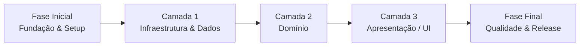
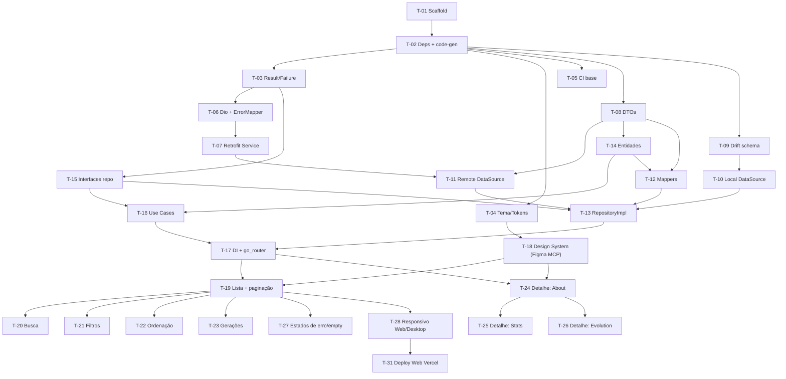
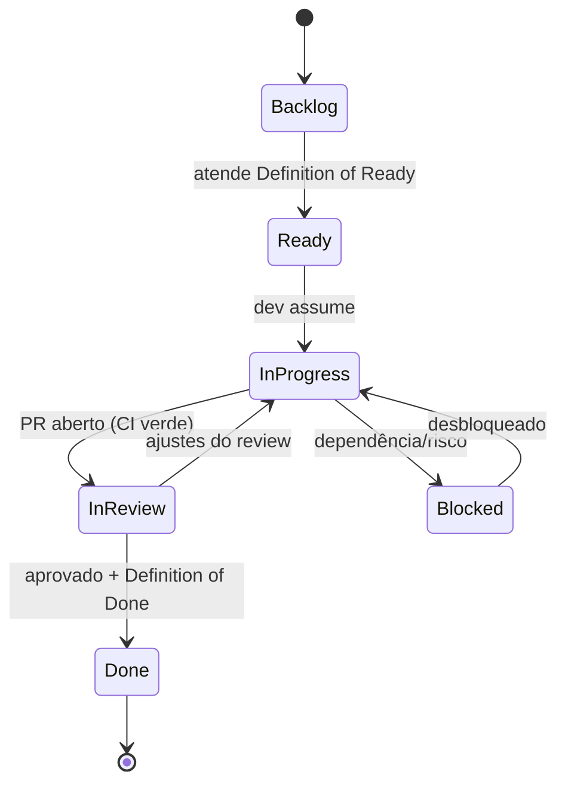
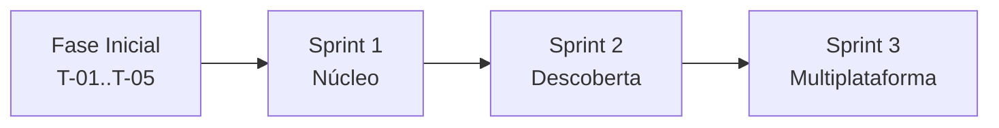

# Backlog de Implementação — Pokédex (Flutter)

| Campo                    | Valor                                                                                                                                        |
| ------------------------ | -------------------------------------------------------------------------------------------------------------------------------------------- |
| **Produto**              | Pokédex                                                                                                                                      |
| **Documento**            | Backlog de implementação (tarefas sequenciais por camada)                                                                                    |
| **Versão**               | 1.0                                                                                                                                          |
| **Data**                 | 2026-05-24                                                                                                                                   |
| **Autor**                | Paulo Sabra                                                                                                                                  |
| **Documentos de origem** | [`PRD`](./01-prd.md) · [`TECH SPEC`](./02-tech-spec.md) · [`12 PRINCIPLES OF SOFTWARE DEVELOPMENT`](./03-principles-software-development.md) |

> **Como ler este backlog.** As tarefas estão ordenadas para um fluxo **bottom-up**: primeiro **Fundação**, depois **Infraestrutura/Dados**, depois **Domínio**, depois **UI** e, por fim, **Qualidade & Release**. Cada tarefa tem ID sequencial, camada, prioridade (MoSCoW), estimativa (story points Fibonacci), tipo de commit sugerido (Conventional Commits), dependências e **critérios de aceite** verificáveis ligados aos requisitos do PRD (RF/RN/TE).

### Convenções

- **ID:** `T-NN` (sequencial). **Prioridade:** MUST / SHOULD / COULD.
- **Estimativa:** pontos (1, 2, 3, 5, 8). **Commit:** prefixo Conventional Commits + escopo.
- **Critério de aceite:** caixas de verificação objetivas; a tarefa só fecha com todas marcadas + Definition of Done.

### Nota do Agile Master sobre sequenciamento

A ordem pedida (Dados → Domínio → UI) é mantida. A única dependência que "aponta para frente" é arquitetural: o **RepositoryImpl** e os **Mappers** (camada de dados) consomem as **entidades** e **interfaces** do domínio. Por isso, esses dois contratos enxutos do domínio (T-14 e T-15) são escritos logo no início da implementação como tarefas habilitadoras; o restante do domínio (use cases) é detalhado na sua camada. O DAG de dependências abaixo reflete a verdade.

---

## Ordem de construção por camadas

## DAG de dependências (caminho crítico)

## Ciclo de vida de cada tarefa

### Definition of Ready (DoR)

Uma tarefa entra em desenvolvimento quando: tem critérios de aceite claros, dependências resolvidas, requisito do PRD referenciado e escopo cabível em uma sprint.

### Definition of Done (DoD)

Uma tarefa fecha quando: código + testes + documentação atualizados; `flutter analyze` sem warnings; cobertura dentro da meta (Tech Spec §11/§13); critérios de aceite marcados; PR revisado e CI verde; commit no padrão Conventional Commits.

---

## Fase Inicial — Fundação & Setup

### T-01 · Inicializar projeto Flutter multiplataforma e estrutura feature-first

- **Camada:** Fundação · **Prioridade:** MUST · **Estimativa:** 2 · **Commit:** `chore(setup)` · **Depende de:** —
- **Descrição:** Criar o projeto Flutter habilitando iOS, Android, Web e Desktop; criar a estrutura de pastas `app/`, `core/`, `features/` conforme Tech Spec §3.
- **Critérios de aceite:**
  - [ ] App roda em Android/iOS, Web e ao menos um alvo Desktop (`flutter run` sem erros).
  - [ ] Estrutura de pastas feature-first criada (`app/`, `core/`, `features/`).
  - [ ] `README` mínimo com passos de build (semente do Princípio 12).

### T-02 · Configurar dependências, code generation e lints

- **Camada:** Fundação · **Prioridade:** MUST · **Estimativa:** 2 · **Commit:** `chore(deps)` · **Depende de:** T-01
- **Descrição:** Adicionar pacotes (Tech Spec §15), configurar `build_runner` e regras de lint (`flutter_lints` + Effective Dart).
- **Critérios de aceite:**
  - [ ] `dart run build_runner build --delete-conflicting-outputs` executa sem erros.
  - [ ] `flutter analyze` retorna 0 warnings (Princípio 10).
  - [ ] `dart format` aplicado e padronizado.

### T-03 · Núcleo de erros — `Result<T>` e `Failure`

- **Camada:** Fundação (core/error) · **Prioridade:** MUST · **Estimativa:** 2 · **Commit:** `feat(core)` · **Depende de:** T-02
- **Descrição:** Implementar o tipo `Result<T>` (Ok/Err) e a hierarquia `Failure` (Network/Timeout/NotFound/Server/RateLimit/Parsing/Cache) — Tech Spec §7.3/§8.1.
- **Critérios de aceite:**
  - [ ] `Result<T>` cobre sucesso e erro tipados.
  - [ ] Cada `Failure` mapeia 1:1 a um código TE do PRD (TE-01…TE-09).
  - [ ] Testes unitários cobrem a construção/igualdade dos tipos.

### T-04 · Tema base e design tokens (PokemonTypeTheme)

- **Camada:** Fundação (app/theme) · **Prioridade:** MUST · **Estimativa:** 3 · **Commit:** `feat(theme)` · **Depende de:** T-02
- **Descrição:** Centralizar tokens extraídos do Figma (Tech Spec §10): cores de texto/fundo, tipografia SF Pro Display e o mapa `PokemonTypeId → (cor, corDeFundo, ícone)` (RN-04).
- **Critérios de aceite:**
  - [ ] `ThemeData` definido com tipografia e cores base do Figma.
  - [ ] `PokemonTypeTheme` cobre os 18 tipos com as cores especificadas.
  - [ ] Tema aplicado globalmente; troca de cor por tipo testada em um widget de exemplo.

### T-05 · Pipeline de CI base

- **Camada:** Fundação (DevOps) · **Prioridade:** MUST · **Estimativa:** 2 · **Commit:** `ci` · **Depende de:** T-02
- **Descrição:** CI por PR: `format` → `analyze` → `test` (Tech Spec §14, Princípio 9).
- **Critérios de aceite:**
  - [ ] PR dispara o pipeline automaticamente.
  - [ ] Falha de lint/format/teste bloqueia o merge (gate de qualidade).
  - [ ] Badge/relatório de status visível no repositório.

---

## Camada 1 — Infraestrutura & Dados

### T-06 · Cliente HTTP (Dio) + interceptors + ErrorMapper

- **Camada:** Dados · **Prioridade:** MUST · **Estimativa:** 3 · **Commit:** `feat(network)` · **Depende de:** T-03
- **Descrição:** Configurar Dio (base URL, timeouts) com interceptors de retry/backoff, rate-limit (429) e logging; mapear `DioException → Failure` (Tech Spec §7).
- **Critérios de aceite:**
  - [ ] Timeouts de conexão/recebimento configurados (TE-06).
  - [ ] Retry com backoff exponencial para falhas transitórias (TE-06/07).
  - [ ] 429 respeita backoff e não estoura erro ao usuário (TE-08).
  - [ ] Cada tipo de `DioException` é convertido no `Failure` correto (testes unitários).

### T-07 · Serviço Retrofit — `PokeApiService`

- **Camada:** Dados · **Prioridade:** MUST · **Estimativa:** 3 · **Commit:** `feat(network)` · **Depende de:** T-06
- **Descrição:** Definir o cliente tipado da PokéAPI (endpoints de lista, pokémon, espécie, evolução e tipo) — Tech Spec §7.2 / PRD §10.1.
- **Critérios de aceite:**
  - [ ] Endpoints `/pokemon`, `/pokemon/{id}`, `/pokemon-species/{id}`, `/evolution-chain/{id}`, `/type/{id}` implementados.
  - [ ] Geração do cliente via `retrofit_generator` sem erros.
  - [ ] Paginação por `limit`/`offset` suportada (RN-14).

### T-08 · DTOs (Freezed + json_serializable)

- **Camada:** Dados · **Prioridade:** MUST · **Estimativa:** 5 · **Commit:** `feat(data)` · **Depende de:** T-02
- **Descrição:** Modelar DTOs espelhando o JSON da PokéAPI (Pokémon, Species, EvolutionChain, Type) — base para o mapeamento do PRD Anexo B.
- **Critérios de aceite:**
  - [ ] `fromJson` cobre os campos usados nas telas (PRD Anexo B).
  - [ ] DTOs são imutáveis (Freezed) e tolerantes a campos ausentes (TE-10).
  - [ ] Testes de desserialização com payloads reais de exemplo da PokéAPI.

### T-09 · Banco Drift — database, conexões por plataforma e tabelas de cache

- **Camada:** Dados · **Prioridade:** MUST · **Estimativa:** 5 · **Commit:** `feat(cache)` · **Depende de:** T-02
- **Descrição:** Definir o `AppDatabase` (Drift), conexões `NativeDatabase` (mobile/desktop) e WASM (web), e tabelas de cache (Tech Spec §6.1).
- **Critérios de aceite:**
  - [ ] Tabelas `PokemonSummaries`, `PokemonDetails`, `EvolutionChains`, `TypeRelations` criadas com `updated_at` (TTL — RN-16).
  - [ ] Conexão funciona em mobile/desktop e na Web (WASM) — validado no alvo.
  - [ ] Migração inicial versionada.

### T-10 · Local DataSource (DAOs)

- **Camada:** Dados · **Prioridade:** MUST · **Estimativa:** 5 · **Commit:** `feat(cache)` · **Depende de:** T-09
- **Descrição:** DAOs para upsert/leitura do cache e queries locais de busca/filtro/ordenação (RN-06/07/08).
- **Critérios de aceite:**
  - [ ] Busca por nome (case-insensitive, sem acento, parcial) e por número (com/sem zeros à esquerda) — RN-06/07.
  - [ ] Filtro por tipo/fração e ordenação (número asc/desc, A–Z/Z–A) executados no cache — RF-14…RF-24.
  - [ ] Stream reativo de summaries para a lista.
  - [ ] Testes com banco em memória.

### T-11 · Remote DataSource

- **Camada:** Dados · **Prioridade:** MUST · **Estimativa:** 2 · **Commit:** `feat(data)` · **Depende de:** T-07, T-08
- **Descrição:** Encapsular o `PokeApiService`, expondo métodos que retornam DTOs e propagam `Failure` no erro.
- **Critérios de aceite:**
  - [ ] Métodos para página, detalhe, espécie, evolução e tipo.
  - [ ] Erros convertidos via ErrorMapper (T-06).
  - [ ] Testes com `PokeApiService` mockado.

### T-12 · Mappers (DTO⇄Entity / Entity⇄cache)

- **Camada:** Dados (fronteira) · **Prioridade:** MUST · **Estimativa:** 5 · **Commit:** `feat(data)` · **Depende de:** T-08, T-14
- **Descrição:** Converter DTO→Entity (e Entity↔linha do cache) aplicando regras do PRD Anexo B/RN (formatos, gênero, min/max, weaknesses).
- **Critérios de aceite:**
  - [ ] Número formatado `#NNN` (RN-03); tipo primário define cor (RN-04/05).
  - [ ] Gênero derivado de `gender_rate` (RN-11); Min/Max calculados no nível 100 (RN-12).
  - [ ] Weaknesses/Type Defenses combinam os tipos (RN-10).
  - [ ] **Cobertura de testes dos mappers = 100%** (maior risco — Princípio 11).

### T-13 · RepositoryImpl — cache-first / stale-while-revalidate

- **Camada:** Dados (fronteira) · **Prioridade:** MUST · **Estimativa:** 8 · **Commit:** `feat(data)` · **Depende de:** T-10, T-11, T-12, T-15
- **Descrição:** Implementar `PokemonRepository` orquestrando cache-first com revalidação e TTL (Tech Spec §6 / RN-02/16).
- **Critérios de aceite:**
  - [ ] Cache válido é servido primeiro; revalidação ocorre em background (RN-02).
  - [ ] Sem rede e com cache: retorna stale + sinaliza (TE-02); sem cache: retorna `Failure` (TE-01).
  - [ ] TTL expira e revalida sem bloquear a UI (RN-16).
  - [ ] Testes cobrem todos os ramos da máquina de decisão (cache hit/miss/stale/erro).

---

## Camada 2 — Domínio

### T-14 · Entidades de domínio (Freezed)

- **Camada:** Domínio · **Prioridade:** MUST · **Estimativa:** 3 · **Commit:** `feat(domain)` · **Depende de:** T-08
- **Descrição:** Modelar entidades puras (sem Flutter/Dio/Drift): `Pokemon`, `PokemonDetail`, `Training`, `Breeding`, `StatSet`, `EvolutionChain`, `EvolutionStage`, enum `PokemonTypeId` (Tech Spec §8.2).
- **Critérios de aceite:**
  - [ ] Entidades imutáveis cobrindo todos os campos exibidos nas telas (RF-29…RF-43).
  - [ ] Domínio não importa pacotes de framework/infra (Princípio 8).
  - [ ] Vocabulário alinhado ao PRD Anexo B (entendível por não-técnico).

### T-15 · Interfaces de repositório (contratos)

- **Camada:** Domínio · **Prioridade:** MUST · **Estimativa:** 2 · **Commit:** `feat(domain)` · **Depende de:** T-03
- **Descrição:** Definir `PokemonRepository` e os contratos de datasource consumidos pelos use cases (Tech Spec §8.3/§8.4).
- **Critérios de aceite:**
  - [ ] Métodos para lista paginada, detalhe, evolução, busca e filtro retornando `Result<T>`.
  - [ ] Stream reativo de summaries declarado no contrato.
  - [ ] Nenhuma dependência de implementação concreta (Princípio 3 — DIP).

### T-16 · Use Cases

- **Camada:** Domínio · **Prioridade:** MUST · **Estimativa:** 3 · **Commit:** `feat(domain)` · **Depende de:** T-14, T-15
- **Descrição:** `GetPokemonList`, `GetPokemonDetail`, `GetEvolutionChain`, `SearchPokemon`, `FilterPokemon` — uma intenção por classe (Princípio 3 — SRP).
- **Critérios de aceite:**
  - [ ] Cada use case expõe `call(...)` e delega ao repositório.
  - [ ] Regras de combinação busca+filtro+ordenação respeitam RN-08.
  - [ ] Testes unitários com repositório falso (sem rede/banco).

### T-17 · Composição do app — DI (Riverpod) + roteamento (go_router)

- **Camada:** Domínio/Integração · **Prioridade:** MUST · **Estimativa:** 3 · **Commit:** `feat(core)` · **Depende de:** T-13, T-16
- **Descrição:** Expor providers (`@riverpod`) para Dio, serviço, banco, datasources, repositório e use cases; configurar `ProviderScope` e o `go_router` (rotas `/` e `/pokemon/:id`) — Tech Spec §5/§9.
- **Critérios de aceite:**
  - [ ] Grafo de providers resolve sem ciclos (Tech Spec §5 figura).
  - [ ] Rotas de lista e detalhe funcionam, incl. deep link `/pokemon/:id` na Web.
  - [ ] Overrides de provider disponíveis para testes.

---

## Camada 3 — Apresentação / UI (MVVM)

> **Abordagem com Figma MCP (incremental).** Não há uma transposição única de todo o projeto. O Figma MCP é usado **tela a tela**: cada tarefa puxa o frame específico (node-id da Tech Spec §11.1) com `get_design_context` e `get_variable_defs`, constrói o widget aplicando os tokens do tema, e valida a fidelidade contra `get_screenshot` antes de fechar. Uma tarefa inicial extrai os **componentes compartilhados** (Design System); as demais consomem esses componentes e acrescentam estado/dados.

### T-18 · Design System e fundação de UI (via Figma MCP)

- **Camada:** UI · **Prioridade:** MUST · **Estimativa:** 5 · **Commit:** `feat(ui)` · **Depende de:** T-04
- **Descrição:** Extrair, com o Figma MCP, as instâncias/componentes recorrentes do design (`Badge / *`, `Text Field / Default`, barras de stat) e construir o kit base reutilizável: `PokemonCard`, `TypeBadge`, `StatBar`, `SectionHeader`, `SearchField`, `AppBottomSheet`. **Não** transpõe telas inteiras — entrega os blocos que as telas reusarão (Princípio 5).
- **Critérios de aceite:**
  - [ ] Componentes base implementados a partir das instâncias do Figma (`get_design_context`).
  - [ ] Cor por tipo aplicada via `PokemonTypeTheme` (RN-04); sem cores/medidas hardcoded fora do tema.
  - [ ] **Golden tests** de cada componente comparados ao frame (`get_screenshot`).
  - [ ] Componentes parametrizados, sem lógica de dados.

### T-19 · Tela Home — Lista + paginação (frame `Home` via Figma MCP)

- **Camada:** UI · **Prioridade:** MUST · **Estimativa:** 5 · **Commit:** `feat(pokemon-list)` · **Depende de:** T-17, T-18
- **Descrição:** Construir `PokemonListScreen` + `PokemonListViewModel` a partir do frame `Home` (node `268:0`, lista completa `268:1037`): cabeçalho, lista de cards, scroll infinito, skeleton e pull-to-refresh (RF-01…RF-08, RF-45).
- **Critérios de aceite:**
  - [ ] Cards exibem #NNN, nome, badges e imagem com fundo por tipo (RF-01/02).
  - [ ] Scroll infinito carrega próximos lotes (RF-03/RN-14); skeleton no 1º carregamento (RF-07).
  - [ ] Pull-to-refresh revalida e atualiza cache (UC-08); falha mantém cache (TE-02).
  - [ ] Fidelidade da tela validada contra `get_screenshot` do node `268:0`.

### T-20 · Busca (no frame `Home`)

- **Camada:** UI · **Prioridade:** MUST · **Estimativa:** 3 · **Commit:** `feat(pokemon-list)` · **Depende de:** T-19
- **Descrição:** Campo de busca por nome/número com debounce e estados, conforme o frame `Home` (UC-02, RF-09…RF-13).
- **Critérios de aceite:**
  - [ ] Debounce ~300 ms antes de filtrar (RF-10).
  - [ ] Resultados em tempo real; busca numérica trata zeros à esquerda (RN-06).
  - [ ] Estado vazio "Nenhum Pokémon encontrado para '{termo}'" (TE-04) com ação de limpar.

### T-21 · Filtros (bottom sheet — frame `Filters` via Figma MCP)

- **Camada:** UI · **Prioridade:** MUST · **Estimativa:** 5 · **Commit:** `feat(filters)` · **Depende de:** T-19
- **Descrição:** Sheet de filtros por tipo, fraqueza e altura, construído a partir do frame `Filters` (node `268:63`), com contagem e limpar tudo (RF-14…RF-19).
- **Critérios de aceite:**
  - [ ] Filtro por tipo aplica e reflete na lista ao fechar (RF-14/19).
  - [ ] Múltiplos filtros combinam (interseção) com contagem de resultados (RF-17/RN-08).
  - [ ] "Limpar filtros" restaura a lista (RF-18); zero resultados mostra estado vazio (TE-05).
  - [ ] Fidelidade validada contra `get_screenshot` do node `268:63`.

### T-22 · Ordenação (bottom sheet — frame `Sort` via Figma MCP)

- **Camada:** UI · **Prioridade:** MUST · **Estimativa:** 2 · **Commit:** `feat(sort)` · **Depende de:** T-19
- **Descrição:** Sheet de ordenação (menor/maior número, A–Z, Z–A) a partir do frame `Sort` (node `268:176`), com indicação do ativo (RF-20…RF-24).
- **Critérios de aceite:**
  - [ ] Os 4 critérios reordenam a lista corretamente (RF-20…RF-23).
  - [ ] Critério ativo é destacado (RF-24); padrão = menor número (RN-09).
  - [ ] Fidelidade validada contra `get_screenshot` do node `268:176`.

### T-23 · Gerações (bottom sheet — frame `Generation` via Figma MCP)

- **Camada:** UI · **Prioridade:** MUST · **Estimativa:** 3 · **Commit:** `feat(generations)` · **Depende de:** T-19
- **Descrição:** Sheet de gerações em grade a partir do frame `Generation` (node `268:248`); filtra por geração (RF-25…RF-28).
- **Critérios de aceite:**
  - [ ] Lista de gerações em cards; geração ativa destacada (RF-25/27).
  - [ ] Selecionar filtra a lista; Geração I completa no MVP (RF-26/28).
  - [ ] Geração sem dados completos degrada sem quebrar (RN-15/UC-05 A1).

### T-24 · Detalhe — Header + abas + About (frame `Profile - About` via Figma MCP)

- **Camada:** UI · **Prioridade:** MUST · **Estimativa:** 5 · **Commit:** `feat(detail)` · **Depende de:** T-17, T-18
- **Descrição:** `PokemonDetailScreen` com header (voltar, artwork, #, nome, badges, cor do tipo) e aba About, a partir do frame `Profile #1 - About` (node `268:320`) — RF-29…RF-34.
- **Critérios de aceite:**
  - [ ] Header colorido pelo tipo primário (RF-29/RN-04).
  - [ ] Seções Pokédex Data, Training, Breeding e Location exibidas (RF-31…RF-34).
  - [ ] Campos ausentes exibem "—" sem quebrar (TE-10).
  - [ ] Fidelidade validada contra `get_screenshot` do node `268:320`.

### T-25 · Detalhe — Stats (frame `Profile - Stats` via Figma MCP)

- **Camada:** UI · **Prioridade:** MUST · **Estimativa:** 3 · **Commit:** `feat(detail)` · **Depende de:** T-24
- **Descrição:** Aba Stats a partir do frame `Profile #1 - Stats` (node `268:378`): base stats com barras, Min/Max, Total e Type Defenses (RF-35…RF-39).
- **Critérios de aceite:**
  - [ ] HP/Atk/Def/SpA/SpD/Speed com barra e valor; Total exibido (RF-35/37).
  - [ ] Colunas Min/Max no nível 100 (RF-36/RN-12).
  - [ ] Type Defenses com multiplicadores por tipo (RF-39).

### T-26 · Detalhe — Evolution (frame `Profile - Evolution` via Figma MCP)

- **Camada:** UI · **Prioridade:** MUST · **Estimativa:** 3 · **Commit:** `feat(detail)` · **Depende de:** T-24
- **Descrição:** Aba Evolution a partir do frame `Profile #1 - Evolution` (node `268:513`): cadeia com imagem/número/nome e condições; navegação entre estágios (RF-40…RF-43).
- **Critérios de aceite:**
  - [ ] Cadeia evolutiva com condição de cada transição (RF-40/41).
  - [ ] Tocar um estágio abre o detalhe correspondente (RF-42/UC-07).
  - [ ] Pokémon sem evolução mostra mensagem informativa (RF-43/RN-13).

### T-27 · Estados de erro e vazio globais

- **Camada:** UI · **Prioridade:** MUST · **Estimativa:** 3 · **Commit:** `feat(ui)` · **Depende de:** T-19
- **Descrição:** Widgets reutilizáveis de erro/offline/vazio com ação de recuperação, integrados às telas (PRD §8). Sem frame dedicado no Figma — seguem o tom visual do Design System.
- **Critérios de aceite:**
  - [ ] Offline sem cache mostra "Você está offline" + "Tentar novamente" (TE-01).
  - [ ] Banner de dados salvos quando offline com cache (TE-02).
  - [ ] Nenhuma tela em branco em qualquer estado de erro (PRD §8.1).

### T-28 · Responsividade Web/Desktop

- **Camada:** UI · **Prioridade:** SHOULD · **Estimativa:** 5 · **Commit:** `feat(ui)` · **Depende de:** T-19…T-26
- **Descrição:** Adaptar o layout (já fiel ao Figma no mobile) para telas largas: grade multi-coluna e sheets como modais/painéis (RF-46, Tech Spec §9.1).
- **Critérios de aceite:**
  - [ ] Breakpoints definem o nº de colunas da lista.
  - [ ] Filtros/Ordenação/Gerações viram modal/painel em telas largas.
  - [ ] Detalhe em master-detail quando há espaço; golden tests por breakpoint.

---

## Fase Final — Qualidade & Release

### T-29 · Testes de integração / E2E

- **Camada:** Qualidade · **Prioridade:** SHOULD · **Estimativa:** 5 · **Commit:** `test` · **Depende de:** T-19…T-26
- **Descrição:** Cobrir fluxos críticos (Tech Spec §13): buscar → abrir detalhe (UC-02/06) e paginação (UC-01).
- **Critérios de aceite:**
  - [ ] Teste E2E de busca + abertura de detalhe passa em CI.
  - [ ] Pirâmide respeitada (muitos unit, alguns widget, poucos E2E).
  - [ ] Cobertura domínio/data ≥ 80% (Princípio 11).

### T-30 · Observabilidade e analytics

- **Camada:** Qualidade · **Prioridade:** SHOULD · **Estimativa:** 3 · **Commit:** `feat(core)` · **Depende de:** T-19
- **Descrição:** Instrumentar eventos do PRD §12 e logging de erros, respeitando privacidade (RNF-09).
- **Critérios de aceite:**
  - [ ] Eventos `list_viewed`, `search_performed`, `pokemon_opened`, `error_shown` etc. emitidos.
  - [ ] Erros tratados são logados com código TE.
  - [ ] Nenhum dado pessoal coletado (RNF-09).

### T-31 · Deploy da versão Web na Vercel

- **Camada:** Release/DevOps · **Prioridade:** MUST · **Estimativa:** 3 · **Commit:** `ci` · **Depende de:** T-28
- **Descrição:** Configurar `vercel.json` (SPA rewrites), `build.sh` (instala Flutter, builda web) e variáveis de ambiente (Tech Spec §12).
- **Critérios de aceite:**
  - [ ] Push em `main` publica produção; PR gera preview.
  - [ ] Acesso direto a `/pokemon/25` funciona (rewrites SPA).
  - [ ] Build reprodutível documentado no README.

### T-32 · Documentação final e CHANGELOG

- **Camada:** Documentação · **Prioridade:** SHOULD · **Estimativa:** 2 · **Commit:** `docs` · **Depende de:** T-31
- **Descrição:** README técnico (clone→build→test), CHANGELOG automático (Conventional Commits) e ADRs (Princípio 12).
- **Critérios de aceite:**
  - [ ] README permite a um novo dev rodar o projeto em um dia.
  - [ ] CHANGELOG gerado a partir dos commits.
  - [ ] ADRs das decisões não óbvias registrados em `docs/project/`.

---

## Mapa de sprints (alinhado ao roadmap do 12-Princípios)

| Sprint                         | Foco                                                  | Tarefas                            |
| ------------------------------ | ----------------------------------------------------- | ---------------------------------- |
| **Fase Inicial — Fundação**    | Base do projeto                                       | T-01 … T-05                        |
| **Sprint 1 — Núcleo**          | Dados + Domínio + Design System + Lista/Busca/Detalhe | T-06 … T-20, T-24 … T-26           |
| **Sprint 2 — Descoberta**      | Filtros, Ordenação, Gerações, Erros                   | T-21, T-22, T-23, T-27, T-29, T-30 |
| **Sprint 3 — Multiplataforma** | Responsivo + Deploy Web + Docs                        | T-28, T-31, T-32                   |

### Resumo de esforço

| Camada                 | Tarefas        | Pontos      |
| ---------------------- | -------------- | ----------- |
| Fundação               | T-01…T-05      | 11          |
| Infraestrutura & Dados | T-06…T-13      | 36          |
| Domínio                | T-14…T-17      | 11          |
| UI                     | T-18…T-28      | 42          |
| Qualidade & Release    | T-29…T-32      | 13          |
| **Total**              | **32 tarefas** | **113 pts** |

> Estimativas são relativas (planning poker) e devem ser recalibradas pela velocity real do time ao fim da Sprint 1 (Princípio 4 — adaptar a cada ciclo).

---

## Controle de versão do documento

| Versão | Data       | Autor       | Mudanças                                                                                                                                                                                                      |
| ------ | ---------- | ----------- | ------------------------------------------------------------------------------------------------------------------------------------------------------------------------------------------------------------- |
| 1.0    | 2026-05-24 | Paulo Sabra | Backlog inicial: 32 tarefas sequenciais por camada (Fundação → Dados → Domínio → UI → Release), com critérios de aceite, dependências, estimativas e mapa de sprints.                                         |
| 1.1    | 2026-05-24 | Paulo Sabra | Camada 3 (UI) replanejada para uso **incremental** do Figma MCP — cada tela é construída a partir do seu frame (node-id), sem transposição única do projeto. DAG, sprints e esforço atualizados (32 tarefas). |
